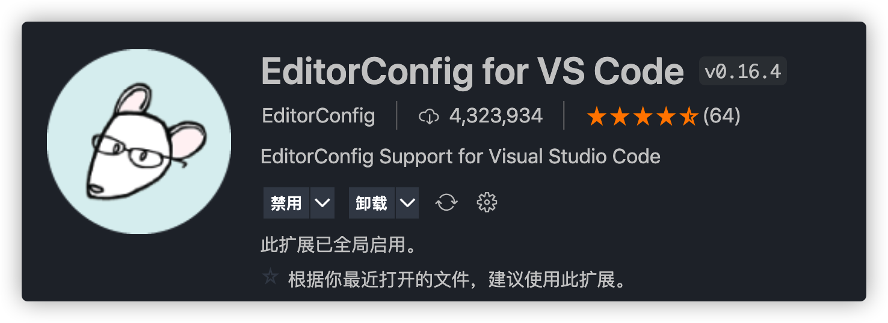
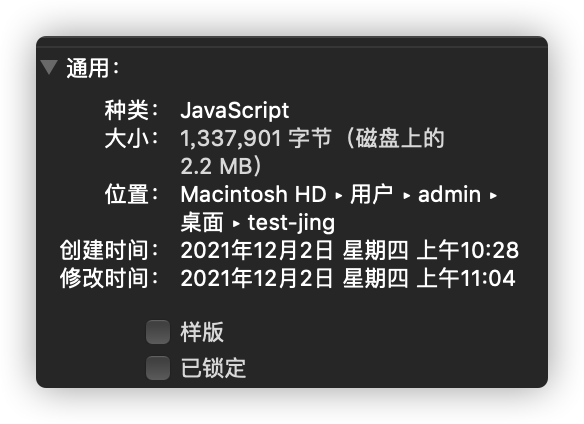
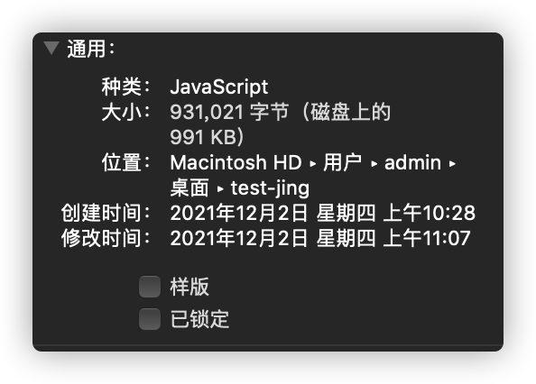
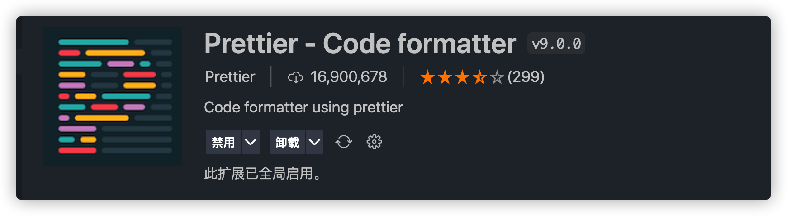
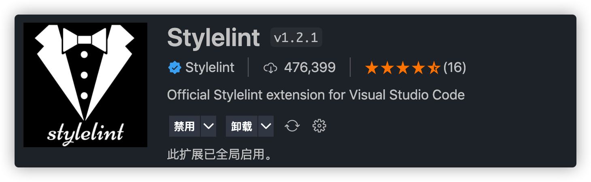

# 代码风格、代码质量与代码提交

## 1、代码风格

多人共同开发一个项目的很大问题就是每个开发者代码风格都有所差异，随着版本不断迭代，接手这个项目的开发维护人员不断更换，造成同一个项目里出现多种代码风格。比如阿闯、阿海、阿涛（排名不分先后）三个开发者的风格如下：

```js
// 阿闯 紧凑型
const add = (a, b) => {
  return a + b;
};

// 阿海 规范型
const add = (a, b) => {
  return a + b;
};

// 阿涛 松紧皆可型
const add = (a, b) => {
  return a + b;
};
```

虽然在你打开这个文件之后，可以格式化一遍变成自己喜欢的风格，但是这样会造成不必要的代码更改。（不建议在没有修改原有功能逻辑的情况下修改别人的代码）

### 1.1、EditorConfig 统一代码编辑器编码风格(Editor Coding Style)。

`.editorconfig` 是**跨编辑器**维护一致编码风格的配置文件，有的编辑器会默认集成读取该配置文件的功能，但是 vscode 需要安装相应的扩展 [EditorConfig For vs Code](https://marketplace.visualstudio.com/items?itemName=EditorConfig.EditorConfig) 。



安装完此扩展后，在 vscode 中使用快捷键 `ctrl+shift+p` 打开命令台，输入 `Generate .editorcofig` 即可快速生成 `.editorconfig` 文件，当然，有时候 vscode 抽风找不到命令也是可能的，手动创建该文件也是没有问题的。

该文件的配置特别简单，就少许的几个配置，比如我建议的配置如下：

```js
# EditorConfig is awesome: https://EditorConfig.org
# top-most EditorConfig file
root = true
[*]
indent_style = tab
tab_width = 4
end_of_line = lf
charset = utf-8
trim_trailing_whitespace = true
insert_final_newline = true
max_line_length = 100

[*.md]
trim_trailing_whitespace = false
```

以下是上述配置的简单介绍：

- indent_style ：缩进风格，可选配置有 tab 和 space 。（采用 tab 还是 space 稍后具体讲下）

- tab_width ：tab 大小，可设定为 1-8 的数字，比如设定为 4 ，那就是一个 tab 相当于 4 个空格。

- charset ：编码格式，通常都是选 utf-8 。

- trim_trailing_whitespace ：去除多余的空格，比如你不小心在尾巴多打了个空格，它会给你自动去掉。

- insert_final_newline ：在尾部插入一行，个人很喜欢这个风格，当最后一行代码很长的时候，你又想对该行代码比较靠后的位置编辑时，不要太好用哦，建议大家也开上。(还有防止有些读取文件的功能等待那个让它退出的换行符)

- end_of_line ：换行符，可选配置有 lf ，cr ，crlf ，会有三种的原因是因为各个操作系统之间的换行符不一致，这里有历史原因（有兴趣的同学自行了解吧），许多有名的开源库都是使用 lf ，所以我也跟跟风吧。

- 因为 markdown 语法中，我想要换行需要在上一行多打 2 个以上的空格，故 .md 文件中把去除多余空格关掉了。

缩进采用 tab 还是 space 各有原因，采用 tab 缩进的文件占用空间会有所减小，因为不管缩进多宽，始终是一个换行符。采用空格的话会产生多个空格符。以下是 30000 行代码分别采用 tab 和 space 缩进的文件大小，较小的是 tab。




但是好像（未仔细考证）在文件压缩层面，采用 space 的文件压缩效果更好。

### 小结

EditorConfig 解决了编辑器配置层面的编码风格一致性问题。然而关于代码风格的部分并未涉及，比如是否「需要在语句末尾添加分号」，「字符串使用单引号还是双引号包裹」，「多行对象的书写规范」等等。

### 1.2、Prettier：统一代码风格(Code Formatter)

​ 每位开发者的代码书写风格或多或少都有不同，比如一些开发者喜欢加分号，一些开发者认为基于 JS 引擎识别能力根本没有必要写分号。在 Prettier 之前，对于代码风格的争论似乎永无定论。统一规范便能终止争论，开发者不用再纠结于如何设计代码样式，代码修改将集中于功能逻辑而非代码样式。

#### Prettier 配置文件

Prettier 使用 `cosmiconfig` 支持配置文件，`cosmiconfig` 是一种常用的配置文件读取工具，按照下述顺序沿文件树寻找配置文件，找到则停止：

- package.json 中的 prettier 字段
- .prettierrc 文件
- .prettierrc.json 文件
- .prettierrc.js 文件
- .prettierrc.toml 文件

选择上述任一方式进行自定义配置 Prettier，如不存在配置文件，Prettier 将依照默认值处理。

#### Prettier 常用配置项

```json
{
  "printWidth": 80,
  // 打印宽度，默认是 80 列

  "tabWidth": 2,
  // 缩进所占列数，默认是 2 列

  "useTabs": false,
  // 缩进风格是否是Tab，默认是 false ，使用空格缩进

  "semi": true,
  // 在语句末尾添加分号，默认是 true

  "singleQuote": false,
  // 使用单引号，默认是 false

  "quoteProps": "as-needed",
  // 对象中的属性使用引号，
  // "as-needed" 只对需要的属性加引号，
  // "consistent" 同一对象中属性引号保持统一，有福同享，有难同当
  // "preserve" 强制使用引号。
  // 默认为 as-needed

  "jsxSingleQuotes": false, // JSX中使用单引号，默认是 false

  "trailingComma": "es5",
  // 多行时是否结尾添加逗号
  // "es5" ES5中允许逗号的容器中添加逗号，比如 objects/arrays
  // "all" 尽可能添加逗号
  // "none" 不允许添加逗
  // 默认值是 "es5"

  "bracketSpacing": true,
  // 是否保留对象内侧两端的空格，比如 { foo: bar } 和 {foo:bar} 的区别

  "jsxBracketSameLine": false,
  // 多行 JSX 的元素是否能和属性同行，默认是 false

  "arrowParens": "always"
  // 箭头函数参数使用圆括号包裹 比如 (x) => x 和 x => x 的区别
  // "always" 总是包裹
  // "avoid" 尽可能避免包裹
}
```

#### Prettier 推荐配置

- `.prettierrc.js`
- 为啥采用 .js 的方式后文介绍。

```js
module.exports = {
  tabWidth: 4,
  semi: true,
  singleQuote: true,
  jsxSingleQuote: true,
  bracketSpacing: true,
  printWidth: 120,
  arrowParens: 'avoid'
};
```

- 有了配置文件后，怎么用来格式化代码呢？

- 1、采用命令行形式格式化某些文件（package.json 下 scripts 加上下行）

  ```js
  "format": "prettier --config ./.prettierrc --write -l \"src/**/*.{vue,js,less}\"",
  ```

- 2、采用 Prettier 的插件和 vscode 配合实现保存文件后自动格式化。

你所需要做的是先安装扩展 [Prettier - Code formatter](https://marketplace.visualstudio.com/items?itemName=esbenp.prettier-vscode) ：



安装成功后， 在项目的根目录新建一个 `.vscode` 文件夹，在此文件夹下再建一个 `settings.json` 文件。该文件里面的配置优先于 vscode 全局的 `settings.json` ，这样别人下载了你的项目进行开发，也不会因为全局 `setting.json` 的配置不同而导致 `Prettier` 或之后会说到的 `ESLint` 、 `StyleLint` 失效。接下来在该文件内输入以下代码：

```json
{
  // 指定哪些文件不参与搜索
  "search.exclude": {
    "**/node_modules": true,
    "dist": true,
    "yarn.lock": true
  },
  "editor.formatOnSave": true, // 保存后格式化
  "[javascript]": {
    "editor.defaultFormatter": "esbenp.prettier-vscode"
  },
  "[javascriptreact]": {
    "editor.defaultFormatter": "esbenp.prettier-vscode"
  },
  "[typescript]": {
    "editor.defaultFormatter": "esbenp.prettier-vscode"
  },
  "[typescriptreact]": {
    "editor.defaultFormatter": "esbenp.prettier-vscode"
  },
  "[json]": {
    "editor.defaultFormatter": "esbenp.prettier-vscode"
  },
  "[html]": {
    "editor.defaultFormatter": "esbenp.prettier-vscode"
  },
  "[markdown]": {
    "editor.defaultFormatter": "esbenp.prettier-vscode"
  },
  "[css]": {
    "editor.defaultFormatter": "esbenp.prettier-vscode"
  },
  "[less]": {
    "editor.defaultFormatter": "esbenp.prettier-vscode"
  }
}
```

`"editor.formatOnSave"` 的作用是在我们保存文件时，会自动执行一次代码格式化，而我们该怎么使用格式化工具？接下来的代码便是对不同文件类型设置的默认的格式化工具。简简单单、明明白白，我相信在座的各位应该都一看便知吧。当然也需要安装 prettier 包。

```sh
npm i prettier -D
```

### 1.3、避免 EditorConfig 和 Prettier 的重复配置

我们发现**Prettier 和 EditorConfig 共享了部分相同的配置选项，而我们不希望同步维护两份重复的配置** (比如关于缩进的配置)。Prettier 的最新版本通过处理 `.editorconfig` 文件来决定使用的配置。限于以下几种选项：

```js
end_of_line;
indent_style;
indent_size / tab_width;
max_line_length;
```

这些选项会被映射为 `Prettier` 的相关配置选项 (如果没有在 `prettier` 的配置文件再被定义的话)：

```js
'endOfLine';
'useTabs';
'tabWidth';
'printWidth';
```

## 2、代码质量

### 1、ESLint：JavaScript 代码检查工具(Code Linter)

Prettier 专注于统一代码样式，而 ESLint 专注于找到代码存在的问题避免错误。JavaScript 本身是一门动态弱类型语言，原始状态下没有语法检查工具支持，开发者只能在运行代码时发现错误，不断“试错”。ESLint 填补了这个缺口，在开发者书写代码时提示代码存在的问题，甚至在能力范围以内加以修正。

- 安装 eslint

```sh
npm install eslint -D
```

装完 eslint 之后可以使用 `npx eslint init`初始化一个 eslint 配置项，这是一个交互式的生成配置文件方式。你也可以手动自己创建文件，然后自己配置。ESLint 并没有使用 `cosmiconfig` 维护配置文件，而是以下述顺序排序优先级。在找到配置文件后会继续向上查找，找到 `root: true` 的文件为止，然后合并所有文件的配置对象。这种模式的优点在于自动实现按目录层级继承。

- `.eslintrc.js`
- `.eslintrc.cjs`
- `.eslintrc.yaml`
- `.eslintrc.yml`
- `.eslintrc.json`

下面是我采用 `npx eslint init`,生成的一份配置文件，稍作修改。

```js
/*
 * @Author: wangzhihao
 * @Date: 2021-12-01 16:47:49
 * @LastEditors: wangzhihao
 * @LastEditTime: 2021-12-02 19:35:32
 */
module.exports = {
  root: true,
  env: {
    browser: true,
    es2021: true,
    node: true
  },
  globals: {
    // jing: true,// 全局变量
  },
  extends: ['plugin:vue/essential', 'airbnb-base'],
  parserOptions: {
    ecmaVersion: 10, // 编译JavaScript版本
    sourceType: 'module'
  },
  settings: {
    'import/resolver': {
      node: {
        extensions: ['.vue', '.js', '.ts', '.json']
      }
    }
  },
  plugins: ['vue'],
  rules: {
    'no-tabs': 0, // 关闭不使用 tab
    // indent: ['warn', 4, { SwitchCase: 1 }], // eslint 配置缩进
    indent: ['warn', 'tab', { SwitchCase: 1 }], // eslint 配置缩进用 tab
    'no-console': 0, // 关闭不能 console
    'implicit-arrow-linebreak': 0 // 箭头函数不能换行
  }
};
```

各个属性字段的作用可在 [Configuring ESLint](https://eslint.bootcss.com/docs/user-guide/configuring) 仔细了解。extends 、plugins 之间的关系有点意思，简单来说，plugins 是别人写好的校验规则，但是没有给这些规则定义严重程度。extends 的是开发者推荐的规则严重程度。

到这里 `eslint`就能帮我们校验代码了，和之前 prettier 一样，也可以通过命令行的方式来帮我们校验同时修复一部分代码。

```json
"lint:fix": "eslint --ext .js,.vue src --fix",
```

但是我们想保存的时候就自动校验修复代码该怎么操作呢？只需两步：

- 1、安装 `eslint `的插件。


- 2、打开之前创建的 `.vscode/settings.json` 中添加以下代码：

```json
{
  "eslint.validate": ["javascript", "javascriptreact", "typescript", "typescriptreact"],
  "editor.codeActionsOnSave": {
    "source.fixAll.eslint": true
  }
}
```

这样我们保存代码后 eslint 就会帮我们自动修复代码了。上面的 eslint 配置文件其实是有点问题的，有可能会造成 `eslint` 和 `prettier`冲突，比如在 `.eslintrc.js` 中某个 `extends` 的配置设置了缩进大小为 `4` ，但是我 `.prettierrc` 中我设置的缩进为 `2` ，那就会出现我们保存时，先是 `eslint` 的自动修复缩进大小为 `4` ，这个时候 `prettier` 不开心了，又强制把缩进改为了 `2` ，好了， `eslint` 更不开心了，代码直接爆红！怎么解决这个问题呢？解决方案如下：

官方提供的很好的解决方案，安装 [eslint-config-prettier](https://github.com/prettier/eslint-config-prettier)、[eslint-plugin-prettier](https://github.com/prettier/eslint-plugin-prettier) 这两个包。然后在 eslint 配置文件加入下面配置，并移除任何代码格式化相关的规则。

```js
{
  extends: [
    // other extends ...
    'plugin:prettier/recommended',
  ],
  plugins: [
    // other plugins,
    'prettier'
  ],
}
```

`eslint-config-prettier` 这个包会**关闭所有可能和 Prettier 冲突的 ESLint 规则**。

### 我们来明确一下 **各司其职** 的原则：

- **EditorConfig** 将负责统一各种编辑器的配置，所有和编辑器相关的配置 （行尾、缩进样式、缩进距离...）
- **Prettier** 作为 `代码格式化` 工具。
- `代码质量` 方面的语法检查，用 **ESLint** 来做。（**_不应该让 eslint 配置代码格式化相关的规则_**）。

### 2、StyleLint：样式代码检查工具(Code Linter)

经过上面的一顿操作，我们的 js 或 ts 等代码已经能有良好的代码风格了，但是不要忘了还有样式文件。其实有一个和 `eslint`类似的一个对样式文件做代码质量检测的工具库 `stylelint`。可以评估下有没有必要接入这个工具。接入步骤如下：

- 装包

```sh
npm i stylelint stylelint-config-prettier stylelint-config-rational-order stylelint-config-standard stylelint-declaration-block-no-ignored-properties stylelint-order -D
```

- 在项目根目录新建配置文件`stylelint.js`，输入以下内容。

```js
module.exports = {
  // 继承已经集成好的标准
  // stylelint-config-rational-order 用于按照以下顺序将相关属性声明进行分组来对它们进行排序
  // 1.Positioning   2.Box Model    3.Typography    4.Visual    5.Animation    6.Misc
  extends: ['stylelint-config-standard', 'stylelint-config-rational-order', 'stylelint-config-prettier'],
  plugins: ['stylelint-order', 'stylelint-declaration-block-no-ignored-properties'],
  rules: {
    'comment-empty-line-before': null,
    'declaration-empty-line-before': null,
    'function-name-case': 'lower',
    'no-descending-specificity': null,
    'no-invalid-double-slash-comments': null,
    'block-no-empty': null,
    'value-keyword-case': null,
    'rule-empty-line-before': [
      'always',
      { severity: 'warning', except: ['after-single-line-comment', 'first-nested'] }
    ],
    'selector-class-pattern': null,
    'font-family-no-missing-generic-family-keyword': null
  },
  ignoreFiles: ['node_modules/**/*', 'build/**/*', 'dist/**/*']
};
```

简单介绍下配置上的三个属性：

- `extends` ：其实和 `eslint` 的类似，都是扩展，使用 `stylelint` 已经预设好的一些规则。
- `rules` ：就是具体的规则，如果默认的你不满意，可以自己决定某个规则的具体形式。与`eslint`不同的是，这里 null 是代表关闭规则，具体可以参考官方文档http://stylelint.cn/user-guide/about-rules/，`stylelint`内置的所有规则在官网已列出http://stylelint.cn/user-guide/rules/（不包括插件）。每个规则也可以像 `eslint` 一样配置严重程度，**severity** 字段配置 `error`、`warning`。
- `ignoreFiles` ：不像 `eslint` 需要新建 ignore 文件， `stylelint` 配置就支持忽略配置字段，我们先添加 `node_modules` 和 `build` ，之后有需要大家可自行添加。

与 `eslint` 一样，想要在编辑代码时有错误提示以及自动修复功能，我们需要 vscode 安装一个扩展：



并且在 `.vscode/settings.json` 中增加以下代码：

```json
{
  "css.validate": false,
  "less.validate": false,
  "scss.validate": false,

  "editor.codeActionsOnSave": {
    "source.fixAll.stylelint": true
  }
}
```

上面装的社区一些优秀的 `stylelint extends` 和 `stylelint plugins` ：

- [stylelint-config-rational-order](https://github.com/constverum/stylelint-config-rational-order) 用于按照以下顺序将相关属性声明进行分组来对它们进行排序

```
1.Positioning   2.Box Model    3.Typography    4.Visual    5.Animation    6.Misc
```

至于 css 属性为啥还需要写作顺序，那就是浏览器渲染页面的问题了。大家应该也都知道，提倡的写作顺序如下：

```css
.declaration-order {
  /* 1.Positioning 位置属性 */
  position: absolute;
  top: 0;
  right: 0;
  bottom: 0;
  left: 0;
  z-index: 10;

  /* 2.Box Model 盒子属性 */
  display: block;
  float: right;
  width: 100px;
  height: 100px;
  margin: 10px;
  padding: 10px;

  /* 3.Typography 文字属性 */
  color: #888;
  font: normal 16px Helvetica, sans-serif;
  line-height: 1.3;
  text-align: center;

  /* 4.Visual 视觉属性 */
  background-color: #eee;
  border: 1px solid #888;
  border-radius: 4px;
  opacity: 1;

  /* 5.Animation Misc 其他 */
  transition: all 1s;
  user-select: none;
}
```

- [stylelint-declaration-block-no-ignored-properties](https://github.com/kristerkari/stylelint-declaration-block-no-ignored-properties) 用于提示我们写的矛盾样式，比如下面的代码中 `width` 是会被浏览器忽略的，这可以避免我们犯一些低级错误～

```css
 {
  display: inline;
  width: 100px;
}
```

- 和`eslint`一样，`stylelint-config-prettier` 是处理 `stylelint` 和 `prettier` 格式化冲突的包。

## 3、代码提交

在项目开发过程中，每次提交前我们都要对代码进行格式化以及 `eslint` 和 `stylelint` 的规则校验，以此来强制规范我们的代码风格，以及防止隐性 BUG 的产生。那么有什么办法只对我们 git 缓存区最新改动过的文件进行以上的格式化和 lint 规则校验呢？答案就是[ lint-staged](https://github.com/okonet/lint-staged) 。我们还需要另一个工具 [husky](https://github.com/typicode/husky) ，它会提供一些钩子，比如执行 `git commit` 之前的钩子 `pre-commit` ，借助这个钩子我们就能执行 `lint-staged` 所提供的代码文件格式化及 lint 规则校验！

```sh
npm i husky lint-staged -D
```

`package.json`里面加入以下配置：

```json
"husky": {
		"hooks": {
			"pre-commit": "lint-staged",
		}
	},
	"lint-staged": {
		"*.{ts,tsx,js}": [
			"eslint --config .eslintrc.js"
		],
		"*.{ts,tsx,js,json,html,yml,css,less,scss,md}": [
			"prettier --write"
		]
	},
```

## 将 eslint、prettier、stylelint 集成到 npm 包

```sh
npm i @jingjing20/eslint-vue @jingjing20/stylelint @jingjing20/prettier-config -D
```

## 采用 lerna 统一管理发布包
