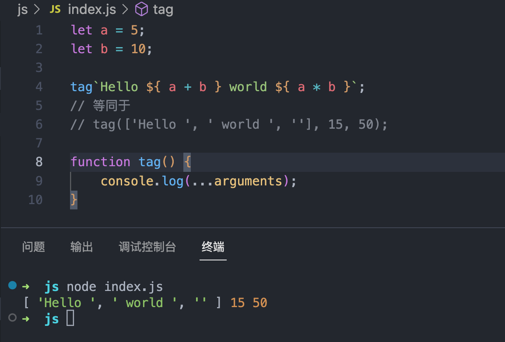
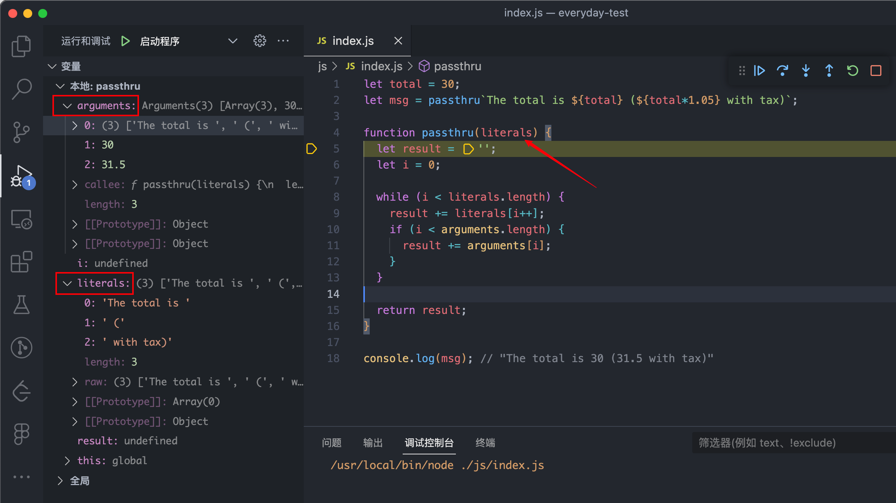

# ES6 相关

::: info 声明

- 记录一下阮一峰 es6 中的精华

:::

## 字符串的扩展

### 标签模板

- 模板字符串可以紧跟在一个函数名后面，该函数将被调用来处理这个模板字符串。这被称为 <span style="color:#8470FF">标签模板（tagged template）</span>

- 标签模板其实不是模板，而是函数调用的一种特殊形式。 **“标签”** 指的就是函数，紧跟在后面的模板字符串就是它的参数。

- 但是，如果模板字符里面有变量，就不是简单的调用了，而是会将模板字符串先处理成多个参数，再调用函数。

- 看个 🌰

```js
let a = 5;
let b = 10;

tag`Hello ${a + b} world ${a * b}`;
// 等同于
// tag(['Hello ', ' world ', ''], 15, 50);

function tag() {
  console.log(...arguments);
}
```

- 🌰 执行结果如下图所示：



::: info 分析一下

- tag 函数的第一个参数是一个数组，该数组的成员是模板字符串中那些没有变量替换的部分

- tag 函数的其他参数，都是模板字符串各个变量被替换后的值。由于本例中，模板字符串含有两个变量，因此 `tag` 会接受到 `15` 和 `50` 两个参数。

- tag 函数所有参数的实际值如下。

  - 第一个参数: `['Hello ', ' world ', '']`
  - 第二个参数: `15`
  - 第三个参数: `50`

也就是说 `tag` 函数实际上以下面的形式调用。

```js
tag(['Hello ', ' world ', ''], 15, 50);
```

:::

- 我们怎么把参数弄成正常的呢？可以由<span style="color:#8470FF">函数的第一个参数是一个数组，该数组的成员是模板字符串中那些没有变量替换的部分</span>这个特性得到迭代方法

- 再来看个 🌰

```js
let total = 30;
let msg = passthru`The total is ${total} (${total * 1.05} with tax)`;

function passthru(literals) {
  let result = '';
  let i = 0;

  while (i < literals.length) {
    result += literals[i++]; // 关键点
    if (i < arguments.length) {
      result += arguments[i]; // 关键点 注意下标 i
    }
  }

  return result;
}

console.log(msg); // "The total is 30 (31.5 with tax)"
```

- 调试一下就看着很清楚了


