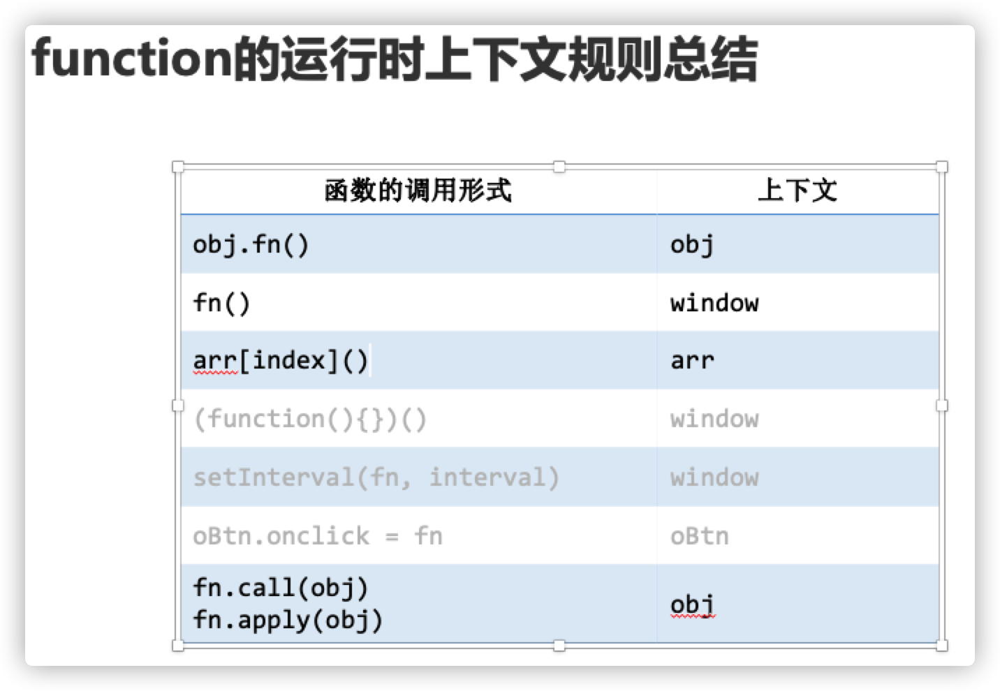

### 🔥字节跳动面试官—麻烦你搞个方法出来🌈使得以下程序最后能输出 success
## 前言
**本文会以详细讲解一道** <font color="FireBrick">**字节面试题**</font>
**的方式，循序渐进完全搞定 js 中 this 指向优先级的问题。** ⛹️‍♂️⛹️‍♂️
js 中的 this 指向问题应该是一个讨论了很久的话题了，关于这个话题的文章，在掘金也有很多。但是，可能之前看到的文章不怎么适合自己，每次看完都还是似懂非懂、没有多少头绪。前几天幸得我的老学长—— [猛哥](https://juejin.im/user/58ad9da68fd9c50067049cab) 的交流之后，好像对这个问题理解的更深了些，写篇文章总结一下。🌈

::: tip 提示
只要你仔细认真看完这篇文章，不管你是 js 新手、还是大佬，我保证你一定会有收获的！如果一丢丢收获都没有，你可以揍我！️👀
:::

## 话不多说上题先
- 请手写实现 ES5 中 `Function` 原型的 `bind`（即手写下面代码块中的myBind） 方法，使得以下程序最后能输出 `'success'`。

```js
function Animal(name, color) {
  this.name = name;
  this.color = color;
}
Animal.prototype.say = function () {
  return `I'm a ${this.color} ${this.name}`;
};
const Cat = Animal.myBind(null, 'cat');
const cat = new Cat('white');
if (cat.say() === 'I\'m a white cat' &&
  cat instanceof Cat && cat instanceof Animal) {
  console.log('success');
}
```
::: tip 莫慌
先来看看解题需要了解的一些问题 慢慢来 不要慌张🌈
:::

## 相关知识
### 要理解这道题，必须先掌握一些相关知识
### 一、js 中 this 的指向
- 在 ES5 中， this 的指向始终是一个原则：this 的指向并不是在创建的时候就可以确定的，在 es5 中， <font color="FireBrick">**this 永远指向 最后调用它的那个对象** </font>。

#### 举几个例子证明一下上述观点
one
```js
var name = "globalName";
function a() {
  var name = "jingjing";
  console.log(this.name)
}
a();    //globalName
```
根据刚刚上面那个原则： <font color="FireBrick">**this 永远指向 最后调用它的那个对象** </font> 可以得到答案。我们看最后调用 a 的地方是在哪里？在最后一行代码`a()`; 它前面没有调用的对象，那么就是默认的全局对象 `window`，所以`console.log(this.name)`就变成了`console.log(window.name)`,结果输出的是 `globalName`（👉非严格模式下👈）。

#### two
```js
var name = "globalName";
var a = {
  name: "jingjing",
  jing: function () {
    console.log(this.name);  // jingjing
  }
}
window.a.jing();
```
我又要重复上面那句话了😁。 <font color="FireBrick">**this 永远指向 最后调用它的那个对象** </font>可以得到答案。我们看最后调用 fn() 函数 的地方是在哪里？或者说函数 fn() 左边这个`.`的左边的对象是哪个？显然是对象 a，所以`console.log(this.name)`就变成了`console.log(a.name)`,结果输出的是`jingjing`。

#### three
```js
var name = "globalName";
var a = {
  name: "jingjing",
  jing: function () {
    console.log(this.name);  // globalName
  }
}
var hao = a.jing
hao();
```
🎈 这里我们虽然将 a 对象的 jing 方法赋值给变量 hao 了，但是注意！！！🔍这一步没有调用执行 jing 方法！。代码最后一行 `hao()` 才被 `window`调用执行了 `jing()`方法。 所以`console.log(this.name)`就变成了`console.log(window.name)`,结果输出的是 `globalName`。再拿出这个原则：**this 永远指向最后调用它的那个对象**。🌈🌈🌈


### 二、this 的四种绑定规则
在 JavaScript 中，this 指向的绑定规则有以下四种：
- 默认绑定（非严格模式情况下，this 指向 `window`, 严格模式下，this指向 `undefined`。）
- 隐式绑定（如果函数调用时，前面存在调用它的对象，那么this就会隐式绑定到这个对象上）
- 显式绑定（函数通过 `call()`、`apply()`、`bind()`调用，this 指向被绑定的对象。）
- new 绑定（函数被 `new` 调用，`this` 指向由 `new` 新构造出来的这个对象。）

***
#### 上文对前两种已经有所理解，现在我们来聚光到后两种。
#### 显式绑定
这种绑定方式就是使用 `Function.prototype` 中的三个方法 `call()`， `apply()`，和 `bind()` 了。这三个函数，都可以改变函数的 this 指向到指定的对象，不同之处在于：
- `call()` 和 `apply()` 都是 <font color="FireBrick">**立即执行函数**</font> ，但是它们接受的参数的形式不同，具体如下：

```js
call(this, arg1, arg2, ...)
apply(this, [arg1, arg2, ...])
```
- 而 `bind()` 则是 <font color="FireBrick">**返回一个新的包装函数**</font>，而不是立刻执行。`bind()`会创建一个新函数。当这个新函数被调用时，`bind()` 的第一个参数将作为它运行时的 `this`，之后的一序列参数将会在传递的实参前传入作为它的参数。
```js
bind(this, arg1, arg2, ...)
```

***

#### new 绑定
使用new来调用函数，或者说发生构造函数调用时，会自动执行下面的操作。
- 1．创建（或者说构造）一个全新的对象。
- 2．这个新对象会被执行[[Prototype]]连接。
- 3．这个新对象会绑定到函数调用的this。
- 4．如果函数没有返回其他对象，那么new表达式中的函数调用会自动返回这个新对象。

在 JavaScript 中，new 操作符并不像其他面向对象的语言一样，而是一种模拟出来的机制。在 JavaScript 中，所有的函数都可以被 new 调用，这时候这个函数一般会被称为 “构造函数”，实际上并不存在所谓“构造函数”，更确切的理解应该是对于函数的 “构造器调用模式”。
##### 以上关于 new 绑定来源于你不知道的js上卷 2.2绑定规则。
***

### 三、绑定规则的优先级
<font color="FireBrick">**new 绑定 > 显式绑定 > 隐式绑定 > 默认绑定**</font>

结论如上，下面给一些例子证明这个结论。
```!
毫无疑问，默认绑定的优先级是四条规则中最低的，所以我们可以先不考虑它。
```
#### one

```js
function jing() {
  console.log(this.a);
}

var obj1 = {
  a: 10,
  foo: jing
};

var obj2 = {
  a: 20,
  foo: jing
};

obj1.foo();   //10
obj2.foo();   //20

obj1.foo.call(obj2);   //20
obj2.foo.call(obj1);   //10
```
由这个运行结果可知，上面代码块倒数两行通过 call() 方法改变了 this 的指向。所以可以得到 **显式绑定 > 隐式绑定** 这个结论。

#### two
```js
function jing() {
  this.a = 'hao';
}

let obj = {
  a: 'jing'
};
// 1、bind
const Bar = jing.bind(obj);
// 2、new
const bar = new Bar();
console.log(obj.a, '--', bar.a) //jing -- hao
```
上面代码块倒数第三行通过 `bind()` 方法改变了 `this` 的指向`obj`，由上面这个 `bar.a` 打印输出结果为 `hao` 可知，倒数第二行代码改变了`this`指向 `jing()`，所以可以得到 **new绑定 > 显式绑定**。

所以最后可以有此结论：
<font color="FireBrick">**new 绑定 > 显式绑定 > 隐式绑定 > 默认绑定**</font>
***

### 四、手写一个简易版的 bind()

#### 代码如下：
```js
Function.prototype.myBind = function (thisObj, ...arg1) {
  // 1、这里 ...arg1 是第一次传的参数
  let fn = this;
  // 这里用 fn 记下调用对象
  function jingbind(...arg2) {
    // 2、这里 ...arg2 是下一次传的参数
    const args = arg1.concat(arg2);
    // 谁调用 bind，最终拼好的参数就传给谁
    return fn.apply(thisObj, args);
  }
  return jingbind;
  // bind() 返回一个未执行的函数
}
```
#### 有了一个手写的 `myBind()`，我们再写一个测试代码来试试效果：

```js
function sum(a, b, c) {
  return a + b + c;
}

const sum10 = sum.myBind(null, 10);
let jing = sum10(20, 30);
console.log(jing)   //60
```
🙌🙌经过测试，成功输出正确结果。那我们现在可以试试我们刚刚实现的 `myBind()` 方法能不能解决文章顶部抛出来的面试题！想想都让人很兴奋！！🙋‍♂️🙋‍♂️

## 解题过程
把上面那个方法和给出的题目放在一起，执行一下试试。
```js
Function.prototype.myBind = function (thisObj, ...arg1) {
  if (typeof this !== "function") {
    throw new TypeError("not a function");
  }
  // 1、这里 ...arg1 是第一次传的参数
  let fn = this;
  // 这里用 fn 记下调用对象
  function jingbind(...arg2) {
    // 2、这里 ...arg2 是下一次传的参数
    const args = arg1.concat(arg2);
    // 谁调用 bind，最终拼好的参数就传给谁
    return fn.apply(thisObj, args);
  }
  return jingbind;
  // bind() 返回一个未执行的函数
}

function Animal(name, color) {
  this.name = name;
  this.color = color;
}
Animal.prototype.say = function () {
  return `I'm a ${this.color} ${this.name}`;
};
const Cat = Animal.myBind(null, 'cat');
const cat = new Cat('white');
console.log(cat.say())  //这句代码是作者解题调试加上去的
if (cat.say() === 'I\'m a white cat' &&
  cat instanceof Cat && cat instanceof Animal) {
  console.log('success');
}
```
很遗憾、也很正常，报错了。错误信息截图如下：


- 报错信息显示说 `cat.say() is not a function`，那它为什么不是一个方法呢？
- 我们去代码中找下这个 `cat.say()`，一步一步往上追。
- 这个 `cat` 是哪里来的？是从 `Cat` 上 `new` 出来的实例，那这个 `Cat` 又是从哪里来的呢？是由 `Animal.myBind` 生成的，你调用了 `myBind()` 我给你返回的。那 `myBind()`返回了什么呢？它返回的是 `jingbind()`。所以最后我们能得到`Cat === jingbind()`，即可以得到 `cat === new jingbind()`。
- 那我们发现我们写的这个 `jingbind()` 函数里面没有定义一个 `say()` 方法啊， 这个 `say()` 方法定义在 `Animal.prototype`上面。
- 也就是说原本 `Animal.prototype` 上面有一个 `say()` 方法，但是经过我们写的 `myBind()` 方法处理后，把`Animal.prototype`搞丢了。
- 所以我们必须给它加上去，那怎么加呢？修改的 `myBind()` 代码如下：

```js
Function.prototype.myBind = function (thisObj, ...arg1) {
  if (typeof this !== "function") {
    throw new TypeError("not a function");
  }
  // 1、这里 ...arg1 是第一次传的参数
  let fn = this;
  // 这里用 fn 记下调用对象
  function jingbind(...arg2) {
    // 2、这里 ...arg2 是下一次传的参数
    const args = arg1.concat(arg2);
    // 谁调用 bind，最终拼好的参数就传给谁
    return fn.apply(thisObj, args);
  }
  jingbind.prototype = fn.prototype;    //只添加了这一行代码
  return jingbind;
  // bind() 返回一个未执行的函数
}
```
再执行一下试试


😎😎😎
- 代码不报错说明原型已经加上去了。
- 但是这个输出结果说明我们刚成功把原型加上去，又发现我们没有正常传参数进去。🤕🤕🤕
- 因为 this 没有绑定到 cat 上去


#### 这里就涉及到前面讲到的 js 中 this 绑定规则的优先级问题了。我们写的 `myBind()` 函数里面没有做优先级的判断 ***（<font color="Darkorange">换句话说就是没有对不同的 this 绑定规则做出相应的 this 绑定</font>）。***

***

### 把 myBind() 变完美

我们对 `myBind()` 方法再做出一些改变如下：

```js
Function.prototype.myBind = function (thisObj, ...arg1) {
  if (typeof this !== "function") {
    throw new TypeError("not a function");
  }
  // 1、这里 ...arg1 是第一次传的参数
  let fn = this;
  // 这里用 fn 记下调用对象
  function jingbind(...arg2) {
    // 2、这里 ...arg2 是下一次传的参数
    const args = arg1.concat(arg2);
    // 谁调用 bind，最终拼好的参数就传给谁
    let isjing = this instanceof jingbind;  //判断是否是 new 调用
    return fn.apply(isjing ? this : thisObj, args);
  }
  jingbind.prototype = fn.prototype;
  return jingbind;
  // bind() 返回一个未执行的函数
}
```
- `instanceof` 的作用不必多说
- 我们利用`instanceof`判断是不是通过 new 调用的，如果是 new 调用的 我们就要把 this 绑定到实例上去。
- 如果不是 new 调用的，我们就让 this 绑定到 `myBind()` 函数的第一个参数——`thisObj`，这样处理一下我们应该能拿到想要的结果吧🤐🤐

```!
再来测试一下🥱
```


最后的最后，我们把这个方法搞出来了。💦💦💦

## 最后
- 此题来源于我的老学长 [猛哥](https://juejin.im/user/58ad9da68fd9c50067049cab) 的面试题，非作者的面试题（还是🥦💪）。
- 我猛哥说了，认真仔细把这题搞清楚了，js 的 this 相关问题差不多都能理解了。
- 上述各种观点都是作者写的，不懂得也是看书籍总结的。
- 作者是一名入门前端不久的学生，所以文章可能会有一些错误，如果有大佬看到指出纠正一下，让大白多一个学习机会，那才是真大佬😜


## this 两种体系

- 1、function定义的函数采用运行时上下文，函数如何被调用决定了this的指向。
- 2、箭头函数是定义时上下文，定义时终身定死this指向。

```js
function fun1(fn, a, b, c) {
    arguments[0]();
}
function fun2(q, w, e, r, t) {
    console.log(this.length); // fun1函数实参 1
    console.log(this.callee.length); // fun1函数形参 4
    console.log(arguments.length); //fun2函数实参 0
    console.log(arguments.callee.length); //fun2函数形参 5
}
fun1(fun2);

```

- 上题中的 `arguments[0]();` 其实就是下图中的第三种情况。




