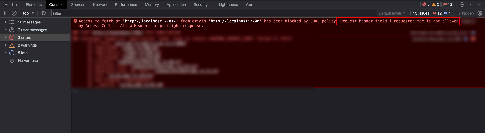

# 跨域相关

## 什么是跨域

**跨域 Cross-Origin** 是指在浏览器环境下，当一个网页的 `JavaScript` 代码试图访问不同源 `origin` 的资源时所产生的安全限制。在这里，"源" 是指一个网页的协议、主机和端口的组合，也就是网页的来源地址。

跨域问题是由于浏览器的**同源策略 Same-Origin Policy**所引起的。同源策略是一种安全策略，它限制了一个网页在浏览器中从一个不同源的网页获取资源或与其进行交互。

具体来说，以下情况会触发跨域问题：

- <span style="color:#8470FF">**协议不同**</span> ：如果两个网页的协议不同，例如一个是 `HTTP`，另一个是 `HTTPS`，就会产生跨域问题。

- <span style="color:#8470FF">**主机不同**</span>：如果两个网页的主机部分（域名或 `IP` 地址）不同，就会产生跨域问题。

- <span style="color:#8470FF">**端口不同**</span>：如果两个网页的端口不同，就会产生跨域问题。

当浏览器中的 `JavaScript` 代码尝试从一个网页获取数据、发起 `AJAX` 请求、或者访问其他网页的内容时，如果目标资源的协议、主机、端口任何一个与当前网页不同，浏览器就会拒绝这种跨域行为。

## 跨域解决方案

解决跨域问题涉及多种方法，这里列举几种常用的解决方案：

### CORS（跨域资源共享）

**CORS（跨域资源共享）**: `CORS` 是一种由服务器设置的机制，允许服务器在响应中声明允许哪些源可以访问其资源。通过在服务器端配置相应的 `CORS` 头部，可以解决跨域问题。常见的 `CORS` 头部包括 `Access-Control-Allow-Origin`、`Access-Control-Allow-Methods`、`Access-Control-Allow-Headers` 等。使用 `CORS`，服务器可以明确告知浏览器允许跨域访问，从而允许跨域请求。

#### 什么情况下需要 CORS？

- 由 XMLHttpRequest 或 Fetch API 发起的跨源 HTTP 请求。
- Web 字体（CSS 中通过 @font-face 使用跨源字体资源）
- webGL 贴图、drawImage 等 canvas 操作、css background-image 等。

#### CORS 原理

::: info 概念
跨源资源共享标准新增了一组 HTTP 标头字段，允许服务器声明哪些源站通过浏览器有权限访问哪些资源。另外，规范要求，对那些可能对服务器数据产生副作用的 HTTP 请求方法（特别是 GET 以外的 HTTP 请求，或者搭配某些 MIME 类型的 POST 请求），浏览器必须首先使用 OPTIONS 方法发起一个预检请求（preflight request），从而获知服务端是否允许该跨源请求。服务器确认允许之后，才发起实际的 HTTP 请求。在预检请求的返回中，服务器端也可以通知客户端，是否需要携带身份凭证（例如 Cookie 和 HTTP 认证相关数据）。
:::

#### 简单请求

- 简单请求不会触发预检请求
- 若请求满足所有下述条件，则该请求可视为简单请求：

1. 使用以下 HTTP 方法之一：

   - `GET`
   - `HEAD`
   - `POST`

2. `Content-Type` 头部只能为以下几种之一：

   - `application/x-www-form-urlencoded`
   - `multipart/form-data`
   - `text/plain`

3. 请求中的头部信息（Headers）只能是简单请求头，简单请求头包括：
   - `Accept`
   - `Accept-Language`
   - `Content-Language`
   - `Last-Event-ID`
   - `Content-Type`（仅限于上述几种特定的值）
   - `Range`（只允许简单的范围标头值 如 bytes=256- 或 bytes=127-255）

> Firefox 还没有将 Range 实现为安全的请求标头。参见 [bug 1733981](https://fetch.spec.whatwg.org/#simple-range-header-value)。

4. 如果请求是使用 `XMLHttpRequest` 对象发出的，在返回的 `XMLHttpRequest.upload` 对象属性上没有注册任何事件监听器；也就是说，给定一个 `XMLHttpRequest` 实例 `xhr`，没有调用 `xhr.upload.addEventListener()`，以监听该上传请求。

5. 请求中没有使用 `ReadableStream` 对象。

#### 预检请求

- 非简单请求会触发预检请求

- 发送预检请求 `Preflight request` 是在使用跨域资源共享 `CORS` 时的一种行为。当客户端（通常是浏览器）执行跨域请求时，即请求的目标域与当前页面所在的域不一致时，浏览器会先发送一个预检请求来确认服务器是否支持跨域请求。

- 预检请求是一个 `OPTIONS` 请求，用于向服务器查询是否允许发送实际的请求（例如 `GET`、`POST`）以及请求所包含的自定义头部等信息。预检请求的目的是保护服务器资源的安全性，确保服务器知道允许哪些跨域请求。

##### 预检请求发生的情况如下：

- <span style="color:#8470FF">**自定义头部**</span>：如果在请求中使用了自定义的头部信息（例如使用 `X-Requested-With` 或 `Authorization` 等头部），浏览器会发送预检请求来确认服务器是否支持这些头部。

::: tip 实例💥💥💥

我在公司的微前端项目本地开发中发现的一个实际问题：主应用是 `http://localhost:7700`，子应用是 `http://localhost:7701`，当我在主应用中加载子应用时控制台就会报跨域的错误信息，错误信息如下图所示。

:::



::: info 分析

产生这个报错问题的原因如下：

- 首先 `qiankun` 主应用 `http://localhost:7700` 加载子应用 `http://localhost:7701` 因为端口不一样导致了跨域问题
- 同时因为主应用中执行了公司的 `SDK` ，`SDK` 会在请求头中添加 `l-requested-mac` 等头部信息，所有接口都会加上，全部都不是简单请求了
- 而子应用 `http://localhost:7701` 中的 `webpack` 中的 `devServer` 下的 `headers` 中并没有配置 `Access-Control-Allow-Headers` 的值
- 所以浏览器就会报跨域的错误信息了。

解决方法也很简单，在 `headers` 中加下 `Access-Control-Allow-Headers: *` 就可以了。

:::

- 非简单请求：对于非简单请求，例如使用 `POST`、`PUT`、`DELETE` 等方法，或者 `Content-Type` 为 `application/json` 等特殊情况，浏览器也会发送预检请求。

- 跨域请求允许规则：如果服务器配置了 `CORS` 规则，并设置了 `Origin` 允许列表，当请求的 `Origin` 不在允许列表中时，浏览器也会发送预检请求。

##### 预检请求的过程如下：

- 浏览器先发送一个 `OPTIONS` 请求（预检请求）到目标服务器。

- 服务器收到预检请求后，根据请求的头部信息和跨域配置，判断是否允许实际请求。

- 如果服务器允许实际请求，会在响应中包含相应的 `CORS` 头部信息，并发送给浏览器。

- 浏览器根据预检请求的响应确认服务器是否支持跨域请求。如果服务器确认支持，浏览器才会发送实际的请求。

::: info 注意

需要注意的是，预检请求会在实际请求之前发送，因此可能会<span style="color:#8470FF">**增加一些额外的网络请求**</span>。在开发中，如果涉及跨域请求，可以适当设置服务器的 `CORS` 配置来避免频繁的预检请求。

:::

### JSONP

- `JSONP` 是一种通过添加 `<script>` 标签动态加载数据的方法。由于 `<script>` 标签的跨域特性，`JSONP` 可以绕过浏览器的同源策略。服务器端需要支持 `JSONP` 请求，并在响应中返回包裹在函数调用中的 JSON 数据。然后，前端可以通过定义一个回调函数来接收返回的数据。

- 主要就是利用了 `script` 标签的`src`没有跨域限制来完成的。

#### 实例如下：

```js
<script type='text/javascript'>
    window.jsonpCallback = function (res) {
        console.log(res)
    }
</script>
<script src='http://localhost:8080/jsonp?id=1&cb=jsonpCallback' type='text/javascript'></script>
```

- 注意的点就是回调函数的名称需要前后端确认好，如这里的 `cb`。

```js
const Koa = require('koa');
const app = new Koa();
const items = [
  { id: 1, title: 'title1' },
  { id: 2, title: 'title2' }
];

app.use(async (ctx, next) => {
  if (ctx.path === '/api/jsonp') {
    const { cb, id } = ctx.query;
    const title = items.find((item) => item.id == id)['title'];
    ctx.body = `${cb}(${JSON.stringify({ title })})`;
    return;
  }
});
app.listen(8080, () => {
  console.log('listen 8080...');
});
```

[参考链接](https://www.jianshu.com/p/88bb82718517)

### Nginx 代理

- **Nginx 代理**: 如果您在使用 `Nginx` 作为 `Web` 服务器，可以通过配置 `Nginx` 代理来解决跨域问题。设置代理服务器来转发请求并将响应返回给前端，就可以绕过跨域限制。

## html 能实现跨域的标签

- ``：用于显示图像。可以加载来自其他域的图像并在页面上显示。

- `<script>`：用于加载外部 JavaScript 文件。可以引入其他域上的 JavaScript 脚本文件，并在页面中使用。

- `<link>`：用于加载外部样式表。可以引入其他域上的 CSS 文件，以应用样式到页面上。

- `<audio>`：用于嵌入音频内容。可以加载其他域上的音频文件并在页面上播放。

- `<video>`：用于嵌入视频内容。可以加载其他域上的视频文件并在页面上播放。

- `<iframe>`：用于嵌入另一个文档。可以加载其他域上的网页并在页面中嵌入显示。

::: info 注意
这些标签在浏览器中有相应的安全例外，允许加载和展示来自其他域的资源。
但是，请注意，虽然这些标签允许在页面上展示跨域资源
但对于执行一些读取操作（例如使用`getImageData`方法）或执行一些需要敏感权限的操作，仍然会受到同源策略的限制。
为了更好地处理跨域资源，确保安全性和符合同源策略的要求，可以考虑使用服务器端代理或配置跨域资源共享（CORS）来实现跨域请求。
:::
