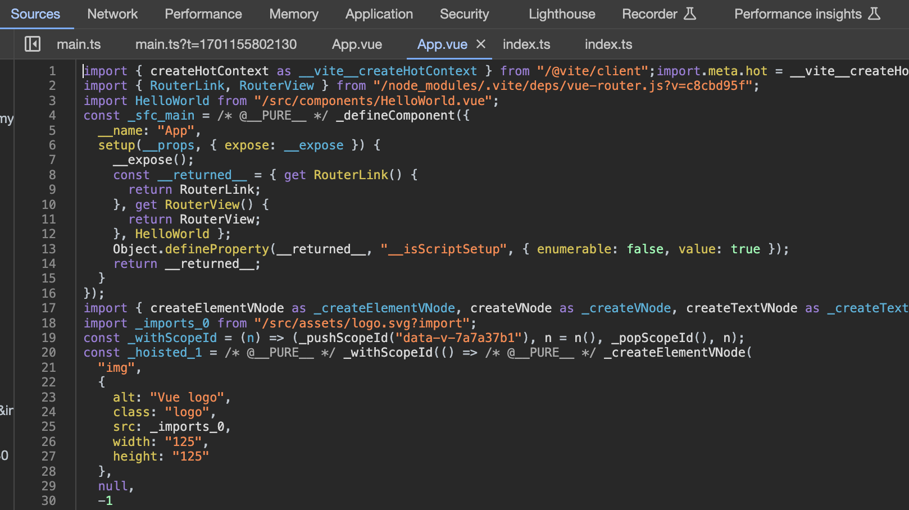
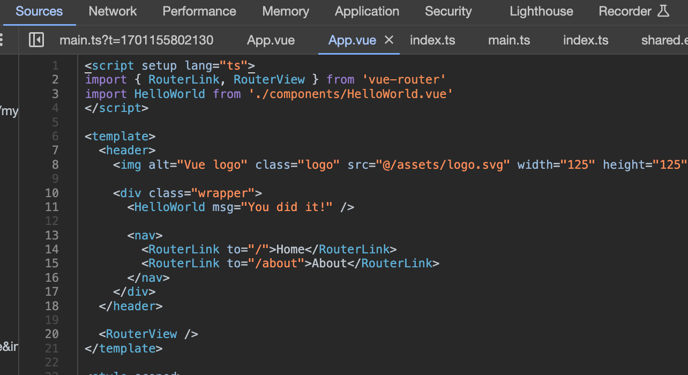

# VSCode Chrome Debugger 配置详解

## launch & attach

- 创建 Chrome Debug 配置有两种方式：launch 和 attach 它们只是 request 的配置不同

```json
{
  "configurations": [
    {
      "name": "Attach to Chrome",
      "port": 9222,
      "request": "attach", // "launch" | "attach"
      "type": "chrome",
      "webRoot": "${workspaceFolder}/test-vue-debug"
    },
    {
      "name": "Launch Chrome",
      "request": "launch", // "launch" | "attach"
      "type": "chrome",
      "url": "http://localhost:5173",
      "webRoot": "${workspaceFolder}/test-vue-debug"
    }
  ]
}
```

- 我们在调试的时候就是把浏览器跑起来，访问目标网页
- 这时候会有一个 `ws` 的调试服务，我们用 `frontend` 的 `ws` 客户端连接上这个 `ws` 服务，就可以进行调试了。

- `launch` 的意思是把 `url` 对应的网页跑起来，指定调试端口，然后 `frontend` 自动 `attach` 到这个端口。
- 但如果你已经有一个在调试模式跑的浏览器了，那就可以直接连接上，这时候就使用 `attach` 这种方式了

## runtimeArgs

- 启动 `Chrome` 的时候，可以指定启动参数
- 比如想要每次打开网页都调起开发者工具，就可以加一个 `--auto-open-devtools-for-tabs` 的启动参数

```json
{
  "configurations": [
    {
      "name": "Chrome Debug",
      "request": "launch", // "launch" | "attach"
      "type": "chrome",
      "url": "http://localhost:5173",
      "webRoot": "${workspaceFolder}/test-vue-debug",
      "runtimeArgs": ["--auto-open-devtools-for-tabs"]
    }
  ]
}
```

- 如果想要无痕模式启动，也就是不加载插件，没有登录状态，加一个 `--incognito` 启动参数就可以了

```json
{
  "configurations": [
    {
      "name": "Chrome Debug",
      "request": "launch", // "launch" | "attach"
      "type": "chrome",
      "url": "http://localhost:5173",
      "webRoot": "${workspaceFolder}/test-vue-debug",
      "runtimeArgs": ["--auto-open-devtools-for-tabs", "--incognito"]
    }
  ]
}
```

## sourceMapPathOverrides

- 我们写的项目代码都是经过编译打包然后在浏览器运行的



- 但是我们在调试的时候却可以调试源码，这是通过 `sourcemap` 做到的，一般调试工具默认都会开启 `sourcemap`



- 但有的时候 `sourcemap` 到的文件路径在本地里找不到

`sourceMapPathOverrides` 是一项用于配置调试时源映射路径的选项。当你在使用 `TypeScript、Babel` 或其他将高级语言编译为 `JavaScript` 的工具时，生成的 `JavaScript` 代码可能与源代码的结构和位置不同。这时就需要使用源映射（source maps）来将运行时的 `JavaScript` 代码映射回源代码，以便进行更方便的调试。

`sourceMapPathOverrides` 的作用是允许你指定如何调整源映射路径，以匹配你的项目结构。这在处理复杂的项目结构或使用了模块化工具时特别有用。

- 以下是 `sourceMapPathOverrides` 的一些常见配置示例和详解：

```json
"sourceMapPathOverrides": {
  "webpack:///./*": "${webRoot}/*",
  "webpack:///src/*": "${webRoot}/*",
  "webpack:///./~/*": "${webRoot}/node_modules/*"
}
```

- **"webpack:///./_": "${webRoot}/_"**:

  - 匹配以 "webpack:///" 开头的所有路径，并将其映射到 `${webRoot}/*`。`${webRoot}` 是你项目的根目录，这样可以确保源映射正确地指向你的源代码文件。

- **"webpack:///src/_": "${webRoot}/_"**:

  - 匹配以 "webpack:///src/" 开头的所有路径，并将其映射到 `${webRoot}/*`。这对于将源代码放在 "src" 目录下的项目很有用。

- **"webpack:///./~/_": "${webRoot}/node_modules/_"**:
  - 匹配以 "webpack:///./~/" 开头的所有路径，并将其映射到 `${webRoot}/node_modules/*`。这对于处理模块化工具生成的源映射路径很有用，确保正确地映射到你的项目中的 `node_modules` 目录。

## file

- 除了启动开发服务器然后连上 url 调试之外，VSCode Debugger 也可以直接指定某个文件调试，这样会启动静态服务器提供服务

```json
{
  "configurations": [
    {
      "name": "Chrome Debug",
      "request": "launch", // "launch" | "attach"
      "type": "chrome",
      "url": "http://localhost:5173",
      "webRoot": "${workspaceFolder}/test-vue-debug",
      "file": "${workspaceFolder}/test-vue-debug/index.html"
    }
  ]
}
```

- 要修改调试的内容必须把 `url` 映射到本地文件才行
- 所以有这样一个 `pathMapping` 的配置

```json
{
  "configurations": [
    {
      "name": "Chrome Debug",
      "request": "launch", // "launch" | "attach"
      "type": "chrome",
      "url": "http://localhost:5173",
      "webRoot": "${workspaceFolder}/test-vue-debug",
      "file": "${workspaceFolder}/test-vue-debug/index.html",
      "pathMapping": {
        "/static/js/": "${workspaceFolder}/test-vue-debug/src/"
      }
    }
  ]
}
```
