# docker

## 什么是 docker

- `Docker` 是一种容器技术，它可以在操作系统上创建多个相互隔离的容器。容器内可以独立安装软件、运行服务。

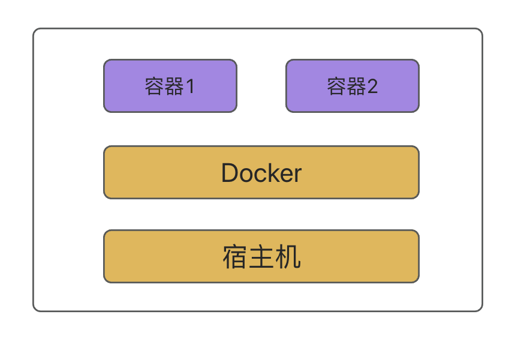

- 但是，这个容器和宿主机还是有关联的，比如可以把宿主机的端口映射到容器内的端口、宿主机某个目录挂载到容器内的目录。

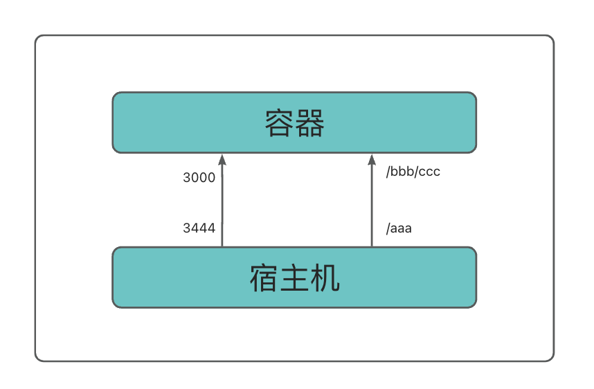

- 比如映射了 `3444` 端口，那容器内 `3000` 端口的服务，就可以在宿主机的 `3444` 端口访问了。

- 比如挂载了 `/aaa` 到容器的 `/bbb/ccc`，那容器内读写 `/bbb/ccc` 目录的时候，改的就是宿主机的 `/aaa` 目录，反过来，改宿主机 `/aaa` 目录，容器内的 `/bbb/ccc` 也会改，这俩同一个。

- 这分别叫做端口映射、数据卷 `volume` 挂载。

- 这个容器是通过镜像起来的，通过 `docker run image-name`

```sh
docker run -p 3444:3000 -v /aaa:/bbb/ccc --name xxx-container xxx-image
```

- 通过 `xxx-image` 镜像跑起来一个叫做 `xxx-container` 的容器。

- `-p` 指定端口映射，映射宿主机的 `3444` 到容器的 `3000` 端口。

- `-v` 指定数据卷挂载，挂载宿主机的 `/aaa` 到容器的 `/bbb/ccc` 目录。

- 这个镜像是通过 `Dockerfile` 经过 `build` 产生的。

流程示意图：

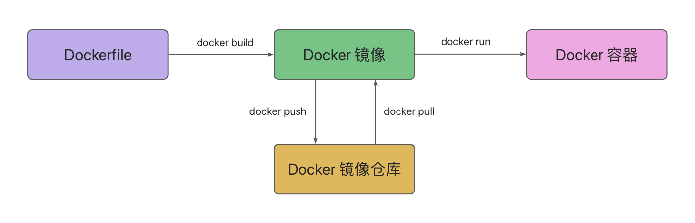

::: tip 镜像和容器怎么使用？

一般在项目里维护 `Dockerfile` ，然后执行 `docker build` 构建出镜像、`push` 到镜像仓库，部署的时候 `pull` 下来用 `docker run` 跑起来。

:::

## 安装 docker

- 上官网下载桌面端安装包，安装即可。官网地址：https://www.docker.com/

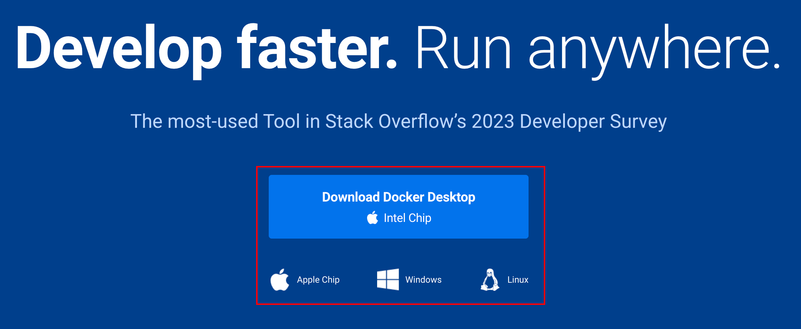

- 安装完成后，会在桌面上出现一个 `Docker` 图标，双击打开，会出现一个控制台。
- 在控制台里，可以看到镜像、容器、网络、卷等信息。

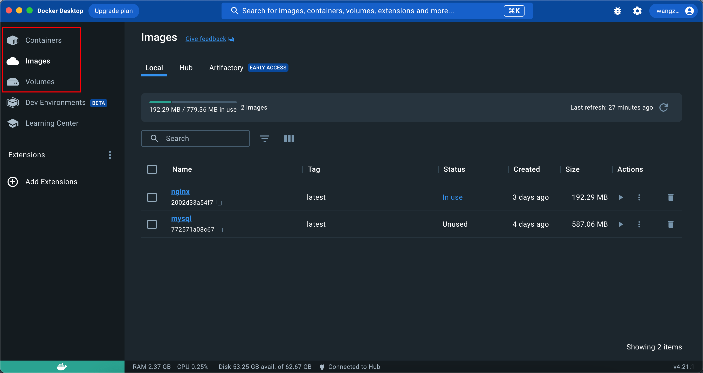

## 来个简单的例子

- 用 nest 新建一个项目，然后在项目根目录下新建一个 `dockerfile` 文件。

```shell
FROM node:18

WORKDIR /app

COPY package.json .

COPY *.lock .

RUN npm config set registry https://registry.npmmirror.com/

RUN npm install

COPY . .

RUN npm run build

EXPOSE 3000

CMD [ "node", "./dist/main.js" ]
```

- FROM `node:18` 是继承 `node:18` 基础镜像。

- `WORKDIR /app` 是指定当前目录为 `/app`

- `COPY` 复制宿主机的 `package.json` 和 `lock` 文件到容器的当前目录，也就是 `/app` 下

- `RUN` 是执行命令，这里执行了 `npm install`。

- 然后再复制其余的文件到容器内。

- `EXPOSE` 指定容器需要暴露的端口是 `3000`

- `CMD` 指定容器跑起来时执行的命令是 `node ./dist/main.js`

## 构建镜像命令

- 然后在项目根目录下执行 `docker build` 构建镜像。

```shell
docker build -t dockerfile-test:first .
```

- `-t` 是指定名字和标签，这里镜像名为 `dockerfile-test` 标签为 `first`
- 最后面的 `.` 指的是构建路径为当前根目录，默认会在当前目录下找 `dockerfile` 文件，如果不是当前目录，可以指定 `dockerfile` 文件的路径。

- 构建完成后，可以在 `docker desktop` 里看到刚刚构建的镜像。

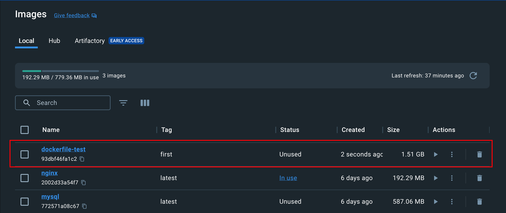

- 现在这个镜像有点大，有 `1.5G`。

## 运行容器命令

- 先把刚刚构建的镜像跑起来看看。

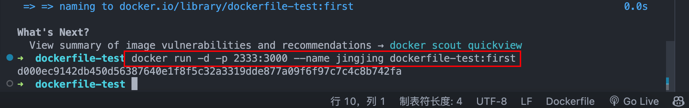

```shell
docker run -d -p 2333:3000 --name jingjing dockerfile-test:first
```

- `-d` 是后台运行。

- `-p` 指定端口映射，映射宿主机的 `2333` 端口到容器的 `3000` 端口。

- `--name` 指定容器名

- 最后面的 `dockerfile-test:first` 是指定镜像名和标签。

- 运行完成后，可以在 `docker desktop` 里看到刚刚运行的容器。

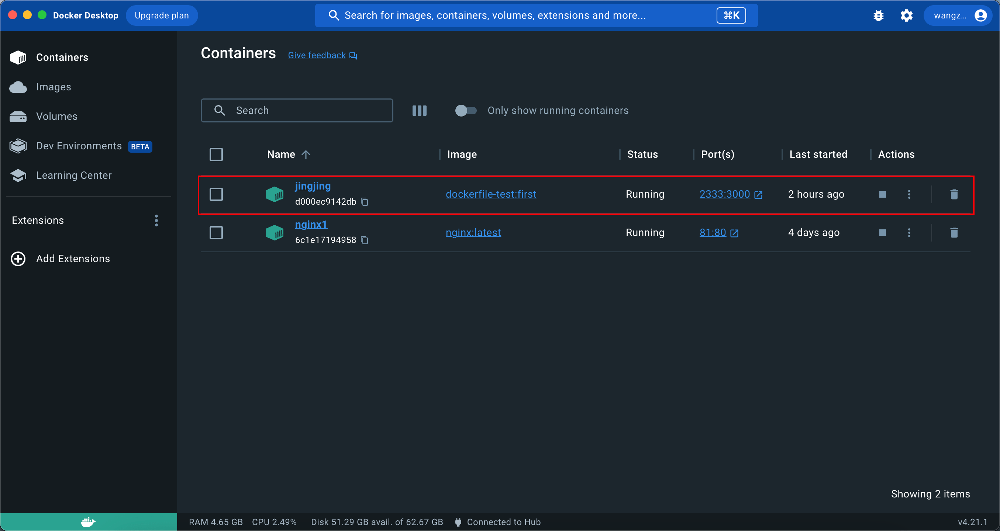

- 然后在浏览器里访问 `localhost:2333` 就可以看到 `hello world` 了。

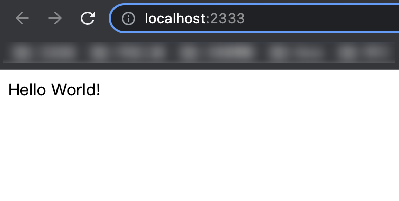

- 这就是 Dockerfile 构建成镜像，然后通过容器跑起来的流程。

- 现在这个镜像有点大，有 `1.5G`，怎么减小镜像体积呢？

## 技巧一：使用 alpine 镜像，而不是默认的 linux 镜像【减小体积】

- `docker` 容器内跑的是 `linux` 系统，各种镜像的 `dockerfile` 都会继承 `linux` 镜像作为基础镜像。

- 比如我们刚刚创建的那个镜像，点开详情可以看到它的镜像继承关系：

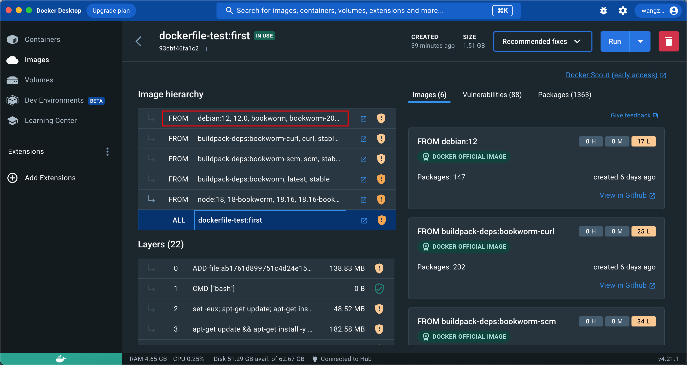

- 可以看到最终还是继承了 `debian` 的 `Linux` 镜像，这是一个 `linux` 发行版。

- 但其实这个 `linux` 镜像可以换成更小的版本，也就是 alpine。

- 它裁剪了很多不必要的 `linux` 功能，使得镜像体积大幅减小了。

- 修改一下上述 `dockerfile` 内容, 使用 `alpine` 的镜像：

```shell
FROM node:18   改成   FROM node:18-alpine3.14
```

- `node:18-alpine3.14` 是使用 `18` 版本的 `node` 镜像，它底层使用 `alpine 3.14` 的基础镜像。

- 重新 `build` 一下镜像【换个名字】

```shell
docker build -t dockerfile-test:second .
```

- 可以打开 `docker desktop` 看到 `second` 这个镜像会比 `first` 这个镜像体积减少大约 `900M`

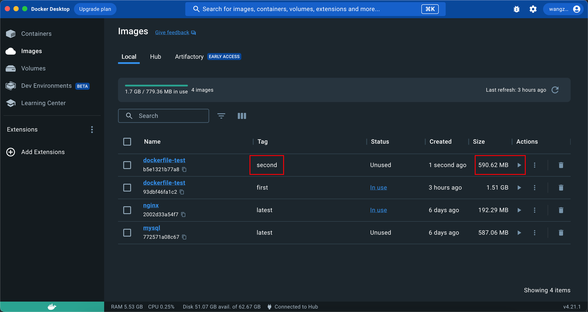

- 可以点开 `second` 这个镜像的继承关系，可以看到它最终继承的是 `alpine` 的 `linux` 镜像。

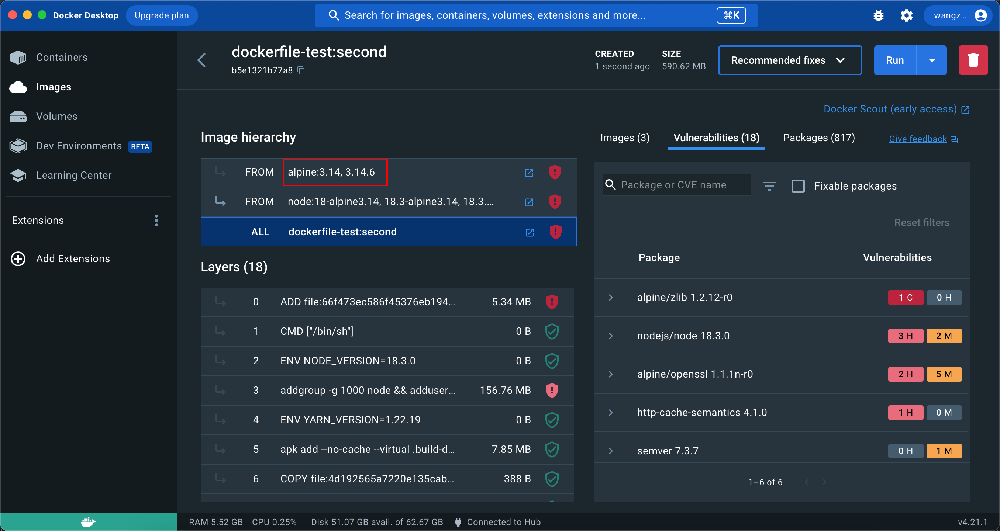

- 虽然 `alpine` 镜像体积小，但是它的 `linux` 功能比较少，所以在使用的时候，可能会遇到一些问题。
- 但是一般来说，如果不是特别复杂的项目，使用 `alpine` 镜像是没有问题的。
- 这里可以重新运行一下 `second` 这个镜像，看看效果。

```shell
docker run -d -p 2334:3000 --name jingjing dockerfile-test:second
```

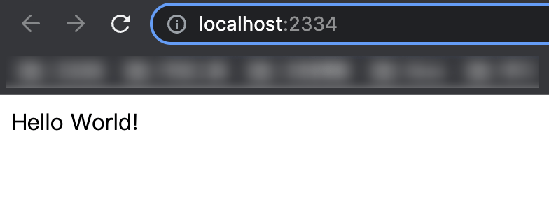

- 然后在浏览器里访问 `localhost:2334` 就可以看到 `hello world` 了。

## 技巧二：docker 的缓存机制【加快构建速度】

```sh
FROM node:18-alpine3.14

WORKDIR /app

COPY package.json .

COPY *.lock .

RUN npm config set registry https://registry.npmmirror.com/

RUN npm install

COPY . .

RUN npm run build

EXPOSE 3000

CMD [ "node", "./dist/main.js" ]

```

- 观察这个 `dockerfile` ，发现里面有两次 `copy` 文件的操作。

- 为什么先复制 `package.json` 进去，安装依赖之后再复制其他文件，直接全部复制进去不就行了？

- 不是的，这两种写法的效果不同。 `docker` 是分层存储的，`dockerfile` 里的每一行指令是一层，会做缓存。

- 每次 `docker build` 的时候，只会从变化的层开始重新构建，没变的层会直接复用。

- 也就说现在这种写法，如果 `package.json` 没变，那么就不会执行 `npm install`，直接复用之前的。

- 那如果一开始就把所有文件复制进去呢？

- 那不管 `package.json` 变没变，任何一个文件变了，都会重新 `npm install`，这样没法充分利用缓存，性能不好。

- 我们来实际试试看就知道了，现在重新跑 `docker build`，不管跑多少次，速度都很快，因为文件没变，直接用了镜像缓存。

```shell
docker build -t dockerfile-test:second .
```

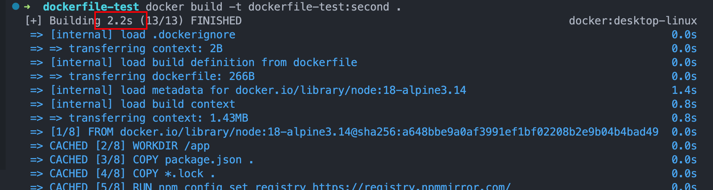

- 现在我们改下 `README.md` ，然后重新跑一下 `docker build`，看看效果。

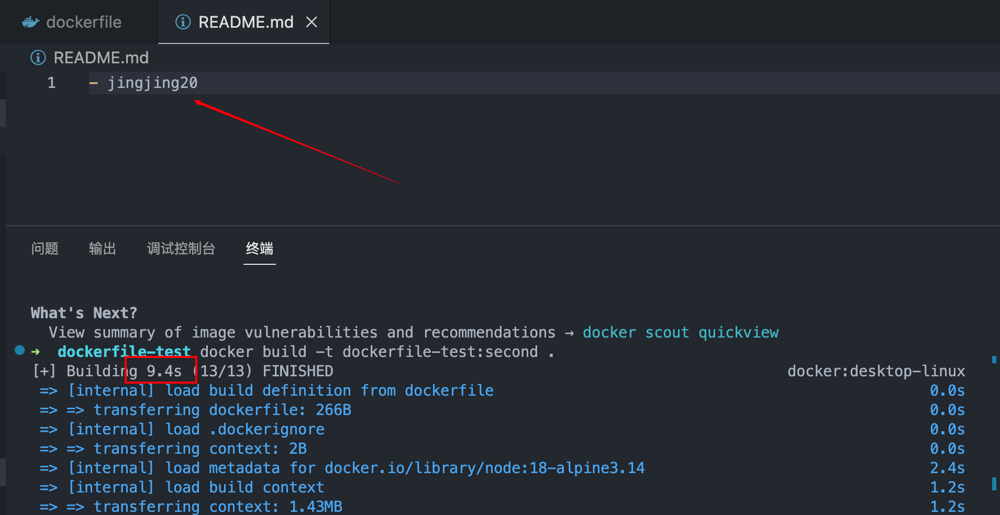

- 现在花了 `9.5s`，其实是没有重新 `npm install` 的。

- 然后改下 `package.json`，然后重新跑一下 `docker build`，看看效果。

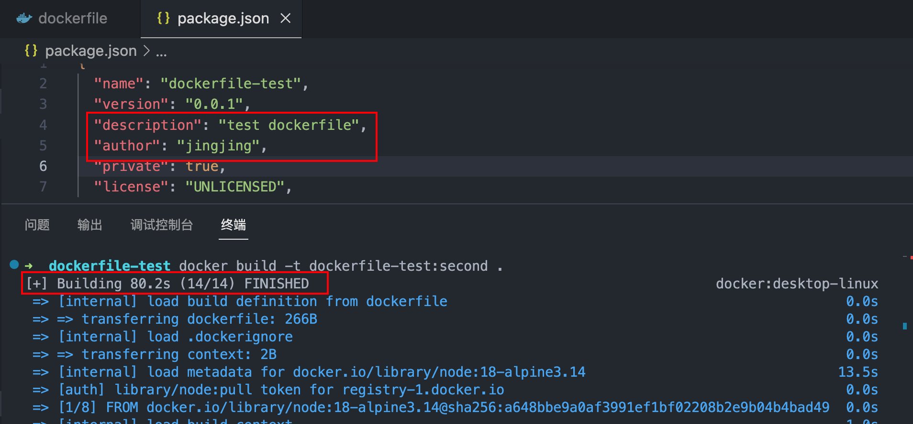

- 现在花了 `80s` ，时间明显多了很多，过程中你可以看到在 `npm install` 那层停留了很长时间。

## 技巧三：使用多阶段构建【减小体积】

- 还有一个问题就是源码和很多构建的依赖是不需要的，但是现在都保存在了镜像里。

- 实际上我们只需要构建出来的 `./dist` 目录下的文件还有运行时的依赖。

- 这时可以采用多阶段构建：

::: info 多阶段构建
多阶段构建是一种用于减小 `Docker` 镜像大小的技术。
它通过将构建过程分成多个阶段来实现，每个阶段都可以使用不同的基础镜像和构建步骤，
最终只将必要的文件和依赖包复制到最终镜像中，从而减小镜像的体积。

:::

- 我们来看看如何使用多阶段构建，先把 `dockerfile` 改成下面这样：

```sh

FROM node:18-alpine3.14 as build-stage

WORKDIR /app

COPY package.json .

RUN npm config set registry https://registry.npmmirror.com/

RUN npm install

COPY . .

RUN npm run build

# production stage

FROM node:18-alpine3.14 as production-stage

COPY --from=build-stage /app/dist /app
COPY --from=build-stage /app/package.json /app/package.json

WORKDIR /app

RUN npm config set registry https://registry.npmmirror.com/

RUN npm install --production

EXPOSE 3000

CMD [ "node", "/app/main.js" ]

```

- `FROM` 后面添加一个 `as` 来指定当前构建阶段的名字。

- 通过 `COPY --from=xxx` 可以从上个阶段复制文件过来。

- 然后 `npm install` 的时候添加 `--production`，这样只会安装 `dependencies` 的依赖。

- `docker build` 之后，只会留下最后一个阶段的镜像。

- 也就是说，最终构建出来的镜像里是没有源码的，有的只是 `dist` 的文件和运行时依赖。这样镜像就会小很多。

- 现在重新跑一下 `docker build`，看看效果。

```shell
docker build -t dockerfile-test:third -f jing.Dockerfile .
```

- 标签为 `third` ， `-f` 是指定 `Dockerfile` 的名字，这里采用了 `jing.Dockerfile`。

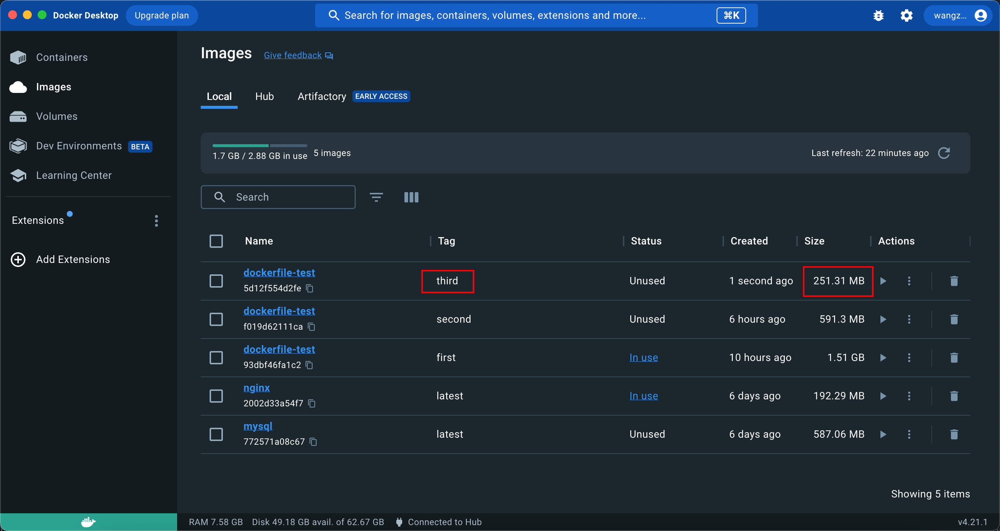

- 从图上能看到，镜像体积比没有用多阶段构建的时候小了 `250 M`。