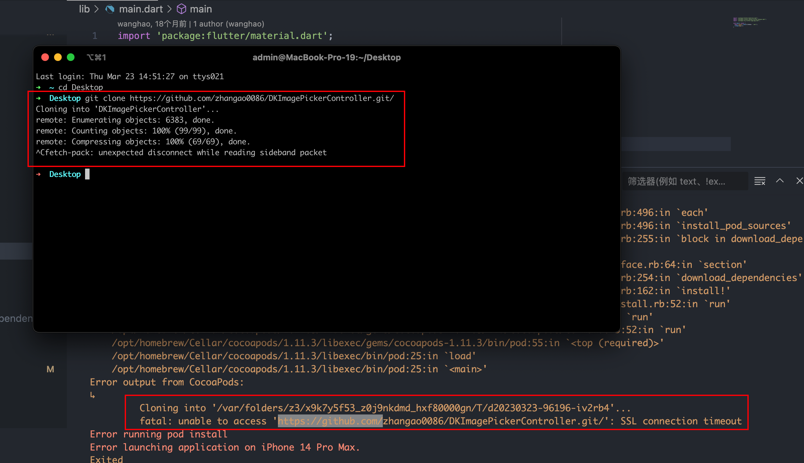

# 2023

## 2023-1-3

### 批量删除本地分支

```bash
git branch | grep "feature/jing" | xargs git branch -D
```

### 批量删除远程分支

```bash
git branch -r | grep  'cluster_manage' | sed 's/origin\///g' | xargs -I {} git push origin :{}
```

## 2023-1-12

### husky 新版差异

**.husky 4.x 版本之前支持在 package.json 中配置**

**.husky 4.x 版本之后不支持在 package.json 中配置了，新版操作如下：**

- 需要在 scripts 标签中加入如下命令：

```json
"scripts": {
    "prepare": "husky install",
},
```

- 然后执行下这个脚本

```bash
pnpm prepare
```

- 执行完会在根目录下生成一个 .husky 文件夹
- 之后就是你需要添加什么钩子函数自己加就行，比如：

```bash
pnpm husky add .husky/commit-msg 'pnpm commitlint --edit "$1"'
```

## 2023-2-20

### git 配置别名

```bash
git config --global alias.co checkout
git config --global alias.br branch
git config --global alias.ci commit
git config --global alias.st status
```

### git 查看别名

```bash
git config --list | grep alias
```

## 2023-3-1

- 打开新页面

```js
/**
 * 打开新页面
 * @param {String} url
 */
export function openNewPage(url) {
  const link = document.createElement('a');
  link.setAttribute('href', url);
  link.setAttribute('target', '_blank');
  link.style.display = 'none';
  // 触发点击
  document.body.appendChild(link);
  link.click();
  // 然后移除
  document.body.removeChild(link);
}
```

## 2023-3-8

### reactive 定义的数组响应式失效问题？

- https://blog.csdn.net/Star_ZXT/article/details/122919797

## 2023-3-11

### MySQL 忘记 root 密码怎么修改

- https://cloud.tencent.com/developer/article/1970134

## 2023-3-23

### 给终端设置代理

```bash
export https_proxy=http://127.0.0.1:7890 http_proxy=http://127.0.0.1:7890 all_proxy=socks5://127.0.0.1:7890
```

### 跑 flutter 项目遇到的问题

- `brew install cocoapods` 问题，只能硬装试了好多次，后面发现可能是终端网络有问题。

- 装完 `cocoapods` 之后，进到 ios 目录下，执行 `pod install 报错`



- 看着是访问不了 github 但是终端又能拉代码，真的奇怪。最后请教了 皓哥 说可能是网络的问题，先在终端设置网络代理，如下：，这样可以让终端走我们的 vpn 代理。

```bash
export https_proxy=http://127.0.0.1:7890 http_proxy=http://127.0.0.1:7890 all_proxy=socks5://127.0.0.1:7890
```

- 设置完还是报错，还需要在 `Podfile` 文件最顶部加一行设置【设置装包的源，我猜的】，最后再执行 `pod install` 就能把包装好了。

```js
source 'https://github.com/CocoaPods/Specs.git'
```

- pod 终端出现这个 [!] CocoaPods did not set the base configuration of your project because your project already has a custom config set. In order for CocoaPods integration to work at all, please either set the base configurations of the target `Runner` to `Target Support Files/Pods-Runner/Pods-Runner.profile.xcconfig` or include the `Target Support Files/Pods-Runner/Pods-Runner.profile.xcconfig` in your build configuration (`Flutter/Release.xcconfig`). 提示代表啥意思？

```js
这个提示意味着 CocoaPods 没有设置您的项目的基本配置，因为您的项目已经有了自定义配置。这可能会导致 CocoaPods 集成无法正常工作。解决这个问题的方法有两种：

1. 将 `Target Support Files/Pods-Runner/Pods-Runner.profile.xcconfig` 设置为 `Runner` 目标的基本配置。您可以通过打开 Xcode，选择 `Runner` 目标，然后选择 `Build Settings` 标签，在 `User-Defined` 部分中找到 `COCOAPODS_PARALLEL_CODE_SIGN` 和 `OTHER_LDFLAGS` 等选项，将它们设置为 `$(inherited)`。
2. 将 `Target Support Files/Pods-Runner/Pods-Runner.profile.xcconfig` 包含在您的构建配置中。您可以在 `Flutter/Release.xcconfig` 文件中添加以下内容：`#include "Target Support Files/Pods-Runner/Pods-Runner.profile.xcconfig"`。

完成其中一种解决方法后，再次运行 `pod install`，然后重新构建您的项目即可。
```

## 2023-4-20

### 前端自己实现下载文件

- 使用 Blob 对象和 URL.createObjectURL()方法：将内容创建成 Blob 对象，然后使用 URL.createObjectURL()方法生成一个下载链接。例如：

```js
handleDownload(row) {
    var contents = row.fileContent;
    var blob = new Blob([contents], { type: 'text/plain' });
    var link = document.createElement('a');
    link.href = URL.createObjectURL(blob);
    link.download = 'example.txt';
    link.style.display = 'none';
    // 触发点击
    document.body.appendChild(link);
    link.click();
    // 然后移除
    document.body.removeChild(link);
},
```

## 2023-5-11

### CSS3 四个自适应关键字

- CSS3 四个自适应关键字——fill-available、max-content、min-content、fit-content

- https://www.cnblogs.com/xiaohuochai/p/7210540.html

## 2023-5-26

### git bisect

[利用好 git bisect 这把利器，帮助你快速定位疑难 bug](https://segmentfault.com/a/1190000042019014)

## 2023-7-21

### elementui tree 查询数据过滤显示当前节点的全部 children 子节点

```js
filterNode(value, data, node) {
  if (!value) return true;
  return (
      node.data.name.indexOf(value) !== -1 ||
      (node.parent.data.name && node.parent.data.name.indexOf(value) !== -1)
  );
},
```
