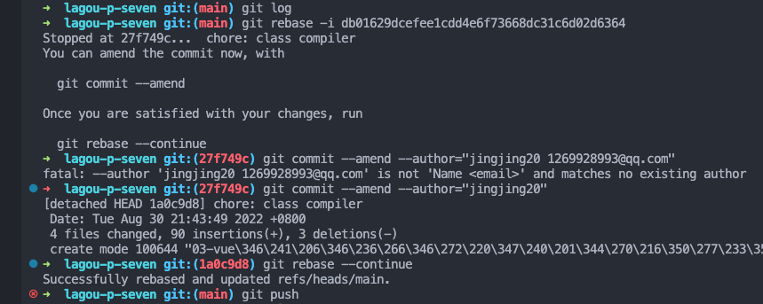

# 常用 Git 命令

## git config

查看仓库的用户名

- git config user.name

查看仓库的邮箱

- git config user.email

### git config --global

设置全局 git 用户信息

- git config --global user.name 'jingjing20'
- git config --global user.email '1269928993@qq.com'

### git config --local

设置某个仓库 git 用户信息

- git config --local user.name 'jingjing20'
- git config --local user.email '1269928993@qq.com'

::: danger 优先级
local > global
:::

## git reset

### git add / git commit 后想撤销怎么办？

```js
git reset --soft HEAD~1
```

- 这样就成功的撤销了你的 `commit`
- 注意，仅仅是撤回 `commit` 操作，您写的代码仍然保留。
- `HEAD~1` 中的 1 代表撤销一次 `commit`

> 参数的意义如下：

**_--mixed_**

- 不删除工作空间改动代码，撤销 `commit`，并且撤销 `git add .` 操作。
- 这个为默认参数，`git reset --mixed HEAD~1` 和 `git reset HEAD~1` 效果是一样的。

**_--soft_**

- 不删除工作空间改动代码，撤销 `commit`，不撤销 `git add .`

**_--hard_**

- 删除工作空间改动代码，撤销 `commit`，撤销 `git add .`
- 注意完成这个操作后，就恢复到了上一次的 `commit` 状态。

### 只是想改 commit 的描述信息？

如果 commit 注释写错了，只是想改一下注释，只需要 `git commit --amend`，此时会进入默认 `vim` 编辑器，修改注释完毕后保存就好了。

## git log VS git reflog

- 假设一个场景如下：
  **在我实习的时候，我本地的某个开发分支 A 被误删了， A 分支里面的代码没有 `push` 到远程，我该如何找回之前 A 的提交记录和代码呢？**

::: details 答案

- `git reflog` 可以查看所有分支的所有操作记录（包括已经被删除的 `commit` 记录和 `reset` 的操作）
- 例如执行 `git reset --hard HEAD~1`，退回到上一个版本，用 `git log` 则是看不出来被删除的`commitid`
- 用 `git reflog` 则可以看到被删除的 `commitid`，我们就可以买后悔药，恢复到被删除的那个版本。

:::

## git cherry-pick

- 在公司多人协作开发项目的时候，将代码从一个分支转移到另一个分支是常见需求，这时分两种情况。
- 一种情况是，你需要另一个分支的所有代码变动，那么就采用合并（git merge）。
- 另一种情况是，你只需要部分代码变动（某几个提交），这时可以采用 git cherry-pick。
- `git cherry-pick` 命令的作用，就是将指定的提交（commit）应用于其他分支。
  我在实习过程中有一次写完代码发现自己写代码的分支错了、、、改动又有点多，不想重新切换分支写一遍。我就直接在当前分支提交了代码，然后到正确的功能分支上用 `git log` 查到那次代码提交的 `commitHash`，然后用`git cherry-pick <commitHash>` 这个命令把这次提交的代码合入当前正确的功能分支。

更多用法参考阮一峰大神的文章: https://www.ruanyifeng.com/blog/2020/04/git-cherry-pick.html

## git stash 用法解析

### 应用场景

- 1、当正在`dev`分支上开发某个项目，这时项目中出现一个`bug`，需要紧急修复，但是正在开发的内容只是完成一半，还不想提交，这时可以用`git stash`命令将修改的内容保存至堆栈区，然后顺利切换到`hotfix`分支进行`bug`修复，修复完成后，再次切回到`dev`分支，从堆栈中恢复刚刚保存的内容。
- 2、由于你的疏忽，本应该在`dev`分支开发的内容，却在`master`上进行了开发，需要重新切回到`dev`分支上进行开发，可以用`git stash`将内容保存至堆栈中，切回到`dev`分支后，再次恢复内容即可。
  总的来说，`git stash`命令的作用就是将目前还不想提交的但是已经修改的内容进行保存至堆栈中，后续可以在某个分支上恢复出堆栈中的内容。这也就是说，stash 中的内容不仅仅可以恢复到原先开发的分支，也可以恢复到其他任意指定的分支上。`git stash`作用的范围包括工作区和暂存区中的内容，也就是说没有提交的内容都会保存至堆栈中。

### 常用命令

- 1、git stash
  能够将所有未提交的修改（工作区和暂存区）保存至堆栈中，用于后续恢复当前工作目录。
- 2、git stash save
  作用等同于 git stash，区别是可以加一些注释，如下：

```js
git stash的效果：

Saved working directory and index state WIP on master: 5feb75c update 2021-4-27

git stash save “jingjing”的效果：

Saved working directory and index state On master: jingjing

```

- 3、git stash list 查看当前 stash 中的内容

- 4、git stash pop 将当前 stash 中的内容弹出，并应用到当前分支对应的工作目录上。注意：该命令将堆栈中最近保存的内容删除（栈是先进后出）

- 5、git stash apply 将堆栈中的内容应用到当前目录，不同于 git stash pop，该命令不会将内容从堆栈中删除，也就说该命令能够将堆栈的内容多次应用到工作目录中，适应于多个分支的情况。还可以使用 git stash apply + stash 名字（如 stash@{jingjing}）指定恢复哪个 stash 到当前的工作目录。

- 6、git stash drop + 名称
  从堆栈中移除某个指定的 stash

- 7、git stash clear
  清除堆栈中的所有内容

## git branch

- 修改本地分支名

```js
git branch -m oldBranch newBranch    //修改本地分支名
```

- 删除本地分支

```js
git branch -D branchName    //删除本地分支
```

- 删除远程分支

```js
git push --delete origin oldBranch   //删除远程分支
```

- 将本地新分支名 push 到远程分支

```js
git push --set-upstream origin newBranch  //将本地新分支名 push 到远程分支（会在远程仓库新建新分支名的分支）
```

## git merge

- git merge 后还没提交又不想 merge 这次的代码

```js
git merge --abort
```

## git commit

### `Git` 修改某次 `commit` 的用户和邮箱地址及评注信息

**基于以下提交 log **

```bash
commit 1a0c9d8cfe0ca7151519aae4dd6d57188064a5c1 (HEAD -> main, origin/main, origin/HEAD)
Author: wangzhihao <1269928993@qq.com>
Date:   Tue Aug 30 21:43:49 2022 +0800

    chore: class compiler

commit db01629dcefee1cdd4e6f73668dc31c6d02d6364
Author: jingjing20 <1269928993@qq.com>
Date:   Mon Aug 29 13:18:01 2022 +0800

    update: class observer  init

commit e0cf83404fc909a8f340fe9375498788423f44fb
Author: jingjing20 <1269928993@qq.com>
Date:   Sun Aug 28 00:24:12 2022 +0800

    updata: 初始化 mini-vue
```

**操作步骤**

- 1、找到要修改的 `commit` ，本例中的 `1a0c9d8cfe0ca7151519aae4dd6d57188064a5c1` 。
- 2、执行 git rebase -i <要修改的 commitId 的前一个 commitid>，这里的 `db01629dcefee1cdd4e6f73668dc31c6d02d6364`。这里即执行如下命令：

```bash
git rebase -i <db01629dcefee1cdd4e6f73668dc31c6d02d6364>
```

- 3、在 `rebase` 的交互模式下，将要修改的 `commit` 状态由 `pick ` 修改为 `edit`。
- 4、修改后，保存退出`rebase`交互模式，我们会停在该`commit`下（下图中的 `Stopped at 27f749c...  chore: class compiler`），并执行修复操作。



- 我们可以进行不同的修改

  ```js
  改作者和邮件地址：git commit --amend --author=“Author Name email@address.com”
  改日期时间：git commit --amend --date=“Thu, 07 Apr 2005 22:13:13 +0200”
  改commit评注：git commit --amend -m “New Commit Message”
  ```

- 修改完后执行` git rebase --continue`

- 最后将修改强制推送到远程仓库 `git push origin master --force`

### 根据某个 <span style="color: #00FF00">特殊字符查询历史 commit</span>

要查询 Git 历史的 commit 信息中是否包含特定字符，您可以使用 `git log` 命令结合 `--grep` 选项。以下是如何执行这个查询的步骤：

```shell
git log --grep="特定字符"
```

- 在上述命令中，将 "特定字符" 替换为您要搜索的实际字符串。执行这个命令后，Git 将显示包含指定字符的所有 commit 信息。

- 如果要进一步筛选结果，您可以添加其他选项。例如，您可以使用 `--author` 选项来筛选特定作者的提交，或使用 `--since` 和 `--until` 选项来限定日期范围。

- 1. 查询 commit 中包含字符串 "bug" 的信息：

```shell
git log --grep="bug"
```

- 2. 查询 commit 中包含字符串 "feature" 的信息，并限制日期范围：

```shell
git log --grep="feature" --since="2022-01-01" --until="2022-12-31"
```

- 3. 查询 commit 中包含字符串 "fix" 并由特定作者提交的信息：

```shell
git log --grep="fix" --author="John Doe"
```

## git 批量删除分支

### 批量删除本地分支

- 直接命令行执行

```bash
git branch | grep "feature/jing" | xargs git branch -D
```

- 封装成脚本

```bash

#!/bin/bash

# 获取所有分支（排除主分支）
branches=$(git branch | grep -v "main\|master")

# 循环删除每个分支
for branch in $branches; do
    git branch -d $branch
done


```

### 批量删除远程分支

- 直接命令行执行

```bash
git branch -r | grep  'cluster_manage' | sed 's/origin\///g' | xargs -I {} git push origin :{}
```

- 封装成脚本

```bash

#!/bin/bash

# 获取所有远程分支（排除主分支）
branches=$(git branch -r | grep -v "origin/main\|origin/master")

# 循环删除每个远程分支
for branch in $branches; do
    remote_branch=$(echo $branch | sed 's/origin\///')
    git push origin --delete $remote_branch
done


```
