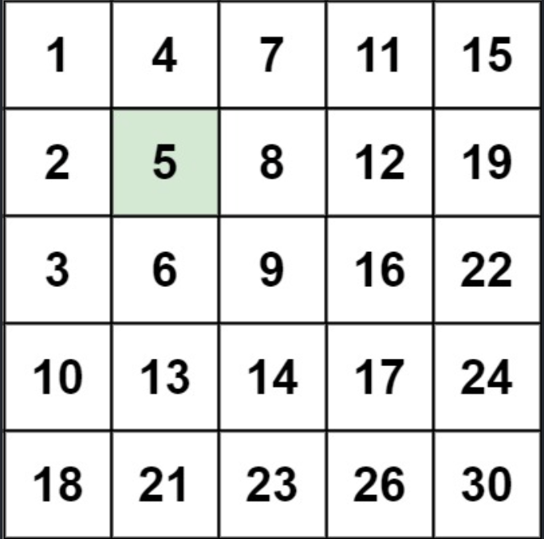

# 240.搜索二维矩阵 II

[https://leetcode-cn.com/problems/search-a-2d-matrix-ii/](https://leetcode-cn.com/problems/search-a-2d-matrix-ii/)

## 题目描述

- 编写一个高效的算法来搜索 m x n 矩阵 matrix 中的一个目标值 target 。该矩阵具有以下特性：
- 每行的元素从左到右升序排列。
- 每列的元素从上到下升序排列。



::: info

输入：
matrix = [[1,4,7,11,15],[2,5,8,12,19],[3,6,9,16,22],[10,13,14,17,24],[18,21,23,26,30]]
target = 5
输出：true

:::

## 思路

- 利用题目的特性， `每行的元素从左到右升序排列。每列的元素从上到下升序排列。`
- 从左下角开始搜索
- 如果当前值比目标值大，就向上移动
- 如果比目标值小，就向右移动

## 代码

```js
/**
 * @param {number[][]} matrix
 * @param {number} target
 * @return {boolean}
 */
var searchMatrix = function (matrix, target) {
  let i = matrix.length - 1,
    j = 0;
  while (i >= 0 && j < matrix[0].length) {
    if (matrix[i][j] > target) i--;
    else if (matrix[i][j] < target) j++;
    else return true;
  }
  return false;
};
```
