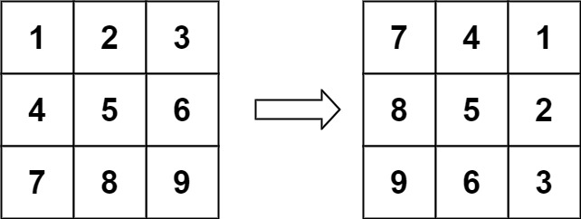

# 48.旋转数组

## 题目描述

- 给定一个 n × n 的二维矩阵 matrix 表示一个图像。请你将图像顺时针旋转 90 度。

- 你必须在 原地 旋转图像，这意味着你需要直接修改输入的二维矩阵。请不要 使用另一个矩阵来旋转图像。



## 思路

- 先进行矩阵的转置，即将矩阵的行和列进行交换。
- 然后反转每一行。

## 代码

```js
/**
 * @param {number[][]} matrix
 * @return {void} Do not return anything, modify matrix in-place instead.
 */
var rotate = function (matrix) {
  const n = matrix.length;
  // 先进行矩阵的转置
  for (let i = 0; i < n; i++) {
    for (let j = i + 1; j < n; j++) {
      // 交换 matrix[i][j] 和 matrix[j][i]
      [matrix[i][j], matrix[j][i]] = [matrix[j][i], matrix[i][j]];
    }
  }
  // 再反转每一行
  for (let i = 0; i < n; i++) {
    matrix[i].reverse();
  }
  return matrix;
};
```
