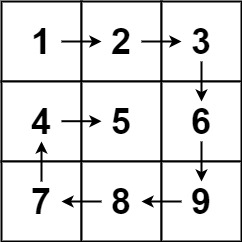

# 54. 螺旋矩阵

## 题目描述

- 给你一个 m 行 n 列的矩阵 matrix ，请按照 顺时针螺旋顺序 ，返回矩阵中的所有元素。



## 思路

- 没有什么特别的方法，直接按照图上的规律进行矩阵的遍历即可
- 控制好遍历的下标即可

## 代码

```js
/**
 * @param {number[][]} matrix
 * @return {number[]}
 */
var spiralOrder = function (matrix) {
  let rows = matrix.length,
    cols = matrix[0].length;
  let t = 0,
    r = cols - 1,
    b = rows - 1,
    l = 0,
    size = rows * cols;
  let res = [];
  while (res.length !== size) {
    for (let i = l; i <= r; i++) res.push(matrix[t][i]);
    t++;
    for (let i = t; i <= b; i++) res.push(matrix[i][r]);
    r--;
    if (res.length === size) break;
    for (let i = r; i >= l; i--) res.push(matrix[b][i]);
    b--;
    for (let i = b; i >= t; i--) res.push(matrix[i][l]);
    l++;
  }
  return res;
};

const matrix = [
  [1, 2, 3],
  [4, 5, 6],
  [7, 8, 9]
];

console.log(spiralOrder(matrix));
// 输出：[1,2,3,6,9,8,7,4,5]
```
