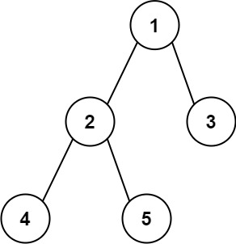

# 543.二叉树的直径

## 题目描述

- 给你一棵二叉树的根节点，返回该树的 直径 。

- 二叉树的 直径 是指树中任意两个节点之间最长路径的 长度 。这条路径可能经过也可能不经过根节点 root 。

- 两节点之间路径的 长度 由它们之间边数表示。



::: info 示例

输入：root = [1,2,3,4,5]
输出：3
解释：3 ，取路径 [4,2,1,3] 或 [5,2,1,3] 的长度。

:::

## 思路

::: info 思路

- 就是求左右两边子树的深度之和

:::

## 代码

```js
/**
 * @param {TreeNode} root
 * @return {number}
 */
var diameterOfBinaryTree = function (root) {
  let maxDiameter = 0;
  const dfs = (root) => {
    // 访问到空节点了，返回0
    if (root == null) return 0;
    // 左子树为根的子树的的深度
    let leftMax = dfs(root.left);
    let rightMax = dfs(root.right);
    maxDiameter = Math.max(maxDiameter, leftMax + rightMax);
    // 返回该节点为根的子树的的深度
    return Math.max(leftMax, rightMax) + 1;
  };
  dfs(root);
  return maxDiameter;
};
```
