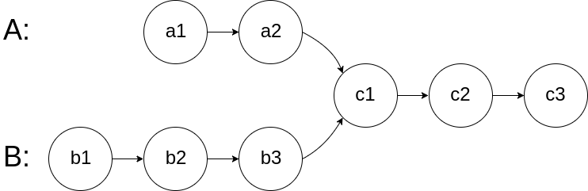

# 160.相交链表

## 题目描述

- 给你两个单链表的头节点 headA 和 headB ，请你找出并返回两个单链表相交的起始节点。如果两个链表不存在相交节点，返回 null 。
- 图示两个链表在节点 c1 开始相交：



- 注意，函数返回结果后，链表必须 保持其原始结构。

## 思路

::: info 详解

- 为什么把链表连起来，就可以得到相交的部分。

- 首先是两个链表（约定，值相同代表同一节点，0 代表空节点）
A 表：[1, 2, 3, 7, 8, 9]
B 表：[4, 5, 7, 8, 9]

- 连接两个链表（表与表之间用 0 隔开）
AB 表：[1, 2, 3, 7, 8, 9, 0, 4, 5, 7, 8, 9, 0]
BA 表：[4, 5, 7, 8, 9, 0, 1, 2, 3, 7, 8, 9, 0]

- 观察连接后的两个表，可以发现相交的部分整齐的排列在末尾，
只需要逐个比较这两张表的节点，就能找到相交的起始位置。

- 如果没有相交会如何？会陷入死循环吗？
A 表：[1, 2, 3]
B 表：[4, 5]

- 连接两个链表（表与表之间用 0 隔开）
AB 表：[1, 2, 3, 0, 4, 5, 0]
BA 表：[4, 5, 0, 1, 2, 3, 0]

- 观察连接后的两个表，可以发现末尾相交的部分必然为空，
参照上面的逻辑，返回首个相同的节点，为空是符合题意的。

- 如果连接两表时，不用 0 隔开，表不相交时，就会陷入死循环。

- 但是写代码时，不可能往链表中插入空节点，所以就用一个指针，模拟遍历两个相交表的过程，
当指针指向空时，重新指向另一个链表的头节点，否则就指向下一个节点。

:::

## 代码

```js
/**
 * Definition for singly-linked list.
 * function ListNode(val) {
 *     this.val = val;
 *     this.next = null;
 * }
 */

/**
 * @param {ListNode} headA
 * @param {ListNode} headB
 * @return {ListNode}
 */
var getIntersectionNode = function (headA, headB) {
  let A = headA,
    B = headB;
  while (A !== B) {
    A = A !== null ? A.next : headB;
    B = B !== null ? B.next : headA;
  }
  return A;
};
```
