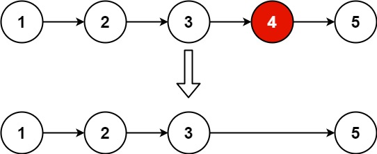

# 19.删除链表的倒数第 N 个结点

## 题目描述

- 给你一个链表，删除链表的倒数第 n 个结点，并且返回链表的头结点。



::: info 示例

输入：head = [1,2,3,4,5], n = 2
输出：[1,2,3,5]

:::

## 思路

::: info 思路

- 链表题一般都要定义一个哑结点 dummyHead 指向 真实头结点 head
- 定义快慢指针 fast slow ，当 n 不为 0 时，向右移动右指针 fast
- 然后快慢指针同时移动，直到 fast.next === null 时， 慢指针 slow.next 就是要删除的节点
- 执行 slow.next = slow.next.next 删除 slow.next 节点，返回 dummyHead.next

:::

## 代码

```js
/**
 * Definition for singly-linked list.
 * function ListNode(val, next) {
 *     this.val = (val===undefined ? 0 : val)
 *     this.next = (next===undefined ? null : next)
 * }
 */
/**
 * @param {ListNode} head
 * @param {number} n
 * @return {ListNode}
 */
var removeNthFromEnd = function (head, n) {
  let dummyHead = new ListNode(0);
  dummyHead.next = head;
  let fast = dummyHead;
  let slow = dummyHead;
  while (n--) {
    fast = fast.next;
  }
  while (fast.next !== null) {
    fast = fast.next;
    slow = slow.next;
  }
  slow.next = slow.next.next;
  return dummyHead.next;
};
```
