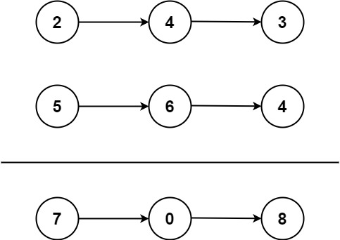

# 2.两数相加

## 题目描述

- 给你两个 非空 的链表，表示两个非负的整数。它们每位数字都是按照 逆序 的方式存储的，并且每个节点只能存储 一位 数字。

- 请你将两个数相加，并以相同形式返回一个表示和的链表。

- 你可以假设除了数字 0 之外，这两个数都不会以 0 开头。



::: info 示例

输入：l1 = [2,4,3], l2 = [5,6,4]
输出：[7,0,8]
解释：342 + 465 = 807

:::

## 思路

::: info 思路

- 通过模拟手动相加的过程，从头到尾遍历两个链表，逐位相加，同时考虑进位的情况。
- 最后，如果最高位有进位，还需要在结果链表中添加一个新的节点。
- 时间复杂度是 `O(max(m, n))`，其中 `m` 和 `n` 分别是两个链表的长度。

:::

## 代码

```js
/**
 * Definition for singly-linked list.
 * function ListNode(val, next) {
 *     this.val = (val===undefined ? 0 : val)
 *     this.next = (next===undefined ? null : next)
 * }
 */
/**
 * @l1aram {ListNode} l1
 * @l1aram {ListNode} l2
 * @return {ListNode}
 */
var addTwoNumbers = function (l1, l2) {
  // 创建一个虚拟头结点
  const dummyHead = new ListNode(0);
  let current = dummyHead;
  let carry = 0; // 进位

  // 遍历两个链表
  while (l1 !== null || l2 !== null) {
    // 获取当前节点的值，并将空链表的值默认为0
    const x = l1 !== null ? l1.val : 0;
    const y = l2 !== null ? l2.val : 0;

    // 计算当前位的和，包括进位
    const sum = x + y + carry;

    // 更新进位
    carry = Math.floor(sum / 10);

    // 创建新节点，并将其加入链表
    current.next = new ListNode(sum % 10);
    current = current.next;

    // 移动到下一个节点
    if (l1 !== null) l1 = l1.next;
    if (l2 !== null) l2 = l2.next;
  }

  // 处理最后可能的进位
  if (carry > 0) {
    current.next = new ListNode(carry);
  }

  // 返回结果链表的头结点
  return dummyHead.next;
};
```
