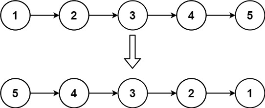

# 206.反转链表

## 题目描述

- 给你单链表的头节点 head ，请你反转链表，并返回反转后的链表。

## 示例



## 思路

::: info 思路

- 如果链表为空或链表只有一个节点，则无需反转，直接返回头节点
- 定义一个前驱节点 `prev` 指向 `null` 再定义一个 `cur` 指向 `head`
- 当 `cur` 不为空时，定义一个 `next` 指向 `cur` 的下一个节点
- 交换 `cur` 和 `prev`
- 将 `cur` 指向 `next`
- 当 `cur` 为空时 返回 `prev` 就可以
- 具体交换规则见代码

:::

## 代码

```js
/**
 * Definition for singly-linked list.
 * function ListNode(val) {
 *     this.val = val;
 *     this.next = null;
 * }
 */
/**
 * @param {ListNode} head
 * @return {ListNode}
 */
var reverseList = function (head) {
  if (head === null || head.next === null) return head;
  let prev = null; // 定义一个前驱节点
  let cur = head; // 当前节点
  while (cur) {
    let next = cur.next; // 定义一个后继节点
    cur.next = prev;
    prev = cur;
    cur = next;
  }
  return prev;
};
```
