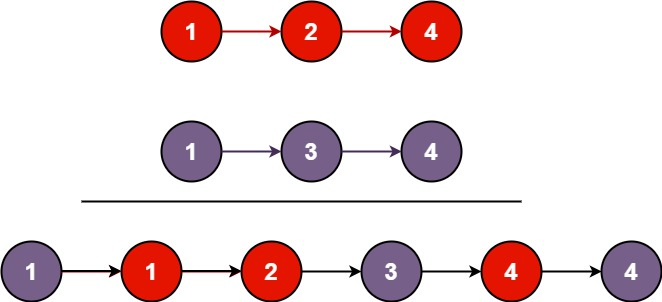

# 21.合并两个有序链表

## 题目描述

- 将两个升序链表合并为一个新的 升序 链表并返回。新链表是通过拼接给定的两个链表的所有节点组成的。



::: info 示例

输入：l1 = [1,2,4], l2 = [1,3,4]
输出：[1,1,2,3,4,4]

:::

## 思路

::: info 思路

- 比较两个有序链表的当前节点的值，逐个选择较小的值连接到新链表上。
- 然后，移动到下一个节点，直到其中一个链表为空。
- 最后，处理其中一个链表还有剩余节点的情况

:::

## 代码

```js
/**
 * Definition for singly-linked list.
 * function ListNode(val, next) {
 *     this.val = (val===undefined ? 0 : val)
 *     this.next = (next===undefined ? null : next)
 * }
 */
/**
 * @param {ListNode} list1
 * @param {ListNode} list2
 * @return {ListNode}
 */
var mergeTwoLists = function (list1, list2) {
  // 创建一个虚拟头结点
  const dummyHead = new ListNode(0);
  let current = dummyHead;
  // 遍历两个有序链表
  while (l1 !== null && l2 !== null) {
    // 比较两个链表当前节点的值
    if (l1.val < l2.val) {
      current.next = l1;
      l1 = l1.next;
    } else {
      current.next = l2;
      l2 = l2.next;
    }
    // 移动到下一个节点
    current = current.next;
  }
  // 处理其中一个链表还有剩余节点的情况
  if (l1 !== null) {
    current.next = l1;
  } else {
    current.next = l2;
  }
  // 返回合并后的链表头结点
  return dummyHead.next;
};
```
