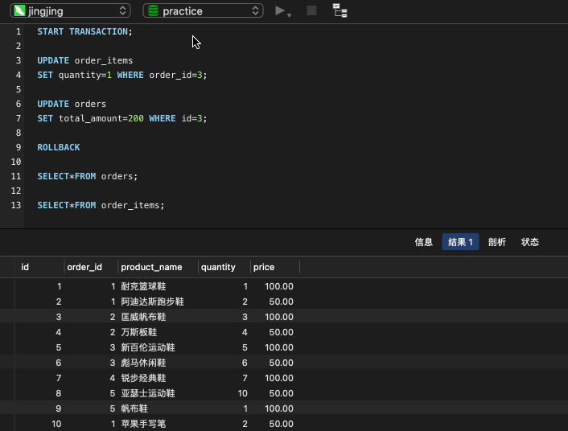

# nest 小册 mysql 练习

## 常用查询

### 准备练习数据表

```sql
-- 创建 customers 表，用于存储客户信息
CREATE TABLE IF NOT EXISTS `customers` (
 `id` int(11) NOT NULL AUTO_INCREMENT COMMENT '客户ID，自增长',
 `name` varchar(255) NOT NULL COMMENT '客户姓名，非空',
 PRIMARY KEY (`id`)
) ENGINE=InnoDB DEFAULT CHARSET=utf8mb4 COMMENT='客户信息表';

-- 创建 orders 表，用于存储订单信息
CREATE TABLE IF NOT EXISTS `orders` (
 `id` int(11) NOT NULL AUTO_INCREMENT COMMENT '订单ID，自增长',
 `customer_id` int(11) NOT NULL COMMENT '客户ID，非空',
 `order_date` date NOT NULL COMMENT '订单日期，非空',
 `total_amount` decimal(10,2) NOT NULL COMMENT '订单总金额，非空',
 PRIMARY KEY (`id`),
 FOREIGN KEY (`customer_id`) REFERENCES `customers` (`id`) ON DELETE CASCADE ON UPDATE CASCADE
) ENGINE=InnoDB DEFAULT CHARSET=utf8mb4 COMMENT='订单信息表';

-- 创建 order_items 表，用于存储订单商品信息
CREATE TABLE IF NOT EXISTS `order_items` (
 `id` int(11) NOT NULL AUTO_INCREMENT COMMENT '商品ID，自增长',
 `order_id` int(11) NOT NULL COMMENT '订单ID，非空',
 `product_name` varchar(255) NOT NULL COMMENT '商品名称，非空',
 `quantity` int(11) NOT NULL COMMENT '商品数量，非空',
 `price` decimal(10,2) NOT NULL COMMENT '商品单价，非空',
 PRIMARY KEY (`id`),
 FOREIGN KEY (`order_id`) REFERENCES `orders` (`id`) ON DELETE CASCADE ON UPDATE CASCADE
) ENGINE=InnoDB DEFAULT CHARSET=utf8mb4 COMMENT='订单商品信息表';

```

### 往表里插入练习数据

```sql

-- 向 customers 表插入数据
INSERT INTO `customers` (`name`)
  	VALUES
		('张丽娜'),('李明'),('王磊'),('赵静'),('钱伟'),
		('孙芳'),('周涛'),('吴洋'),('郑红'),('刘华'),
		('陈明'),('杨丽'),('王磊'),('张伟'),('李娜'),
		('刘洋'),('陈静'),('杨阳'),('王丽'),('张强');

-- 向 orders 表插入数据
INSERT INTO `orders` (`customer_id`, `order_date`, `total_amount`)
    VALUES
        (1, '2022-01-01',100.00),(1, '2022-01-02',200.00),
        (2, '2022-01-03',300.00),(2, '2022-01-04',400.00),
        (3, '2022-01-05',500.00),(3, '2022-01-06',600.00),
        (4, '2022-01-07',700.00),(4, '2022-01-08',800.00),
        (5, '2022-01-09',900.00),(5, '2022-01-10',1000.00);

-- 向 order_items 表插入数据
INSERT INTO `order_items` (`order_id`, `product_name`, `quantity`, `price`)
    VALUES
        (1, '耐克篮球鞋',1,100.00),
        (1, '阿迪达斯跑步鞋',2,50.00),
        (2, '匡威帆布鞋',3,100.00),
        (2, '万斯板鞋',4,50.00),
        (3, '新百伦运动鞋',5,100.00),
        (3, '彪马休闲鞋',6,50.00),
        (4, '锐步经典鞋',7,100.00),
        (5, '亚瑟士运动鞋',10,50.00),
        (5, '帆布鞋',1,100.00),
        (1, '苹果手写笔',2,50.00),
        (2, '电脑包',3,100.00),
        (3, '苹果手机',4,50.00),
        (4, '苹果耳机',5,100.00),
        (5, '苹果平板',7,100.00);

```

### 练习 1: 查询每个客户的订单总金额

::: info 思路

客户的订单存在订单表里，每个客户的订单可以有多个，所以这里需要用 `JOIN ON` 关联两个表，然后用 `GROUP BY` 根据客户 `id` 分组，再通过 `SUM` 函数计算价格总和。

:::

```sql
SELECT customers.name, SUM(orders.total_amount) AS total_amount
	FROM customers
    JOIN orders ON customers.id = orders.customer_id
    GROUP BY customers.id
```

- 执行下查询语句，可以看到每个客户的订单总金额


#### 可以加个排序

- 排序的时候，可以用 `ASC` 或者 `DESC` 来指定升序或降序，如果不指定，默认是升序。

```sql
SELECT customers.name, SUM(orders.total_amount) AS total_amount
	FROM customers
    JOIN orders ON customers.id = orders.customer_id
    GROUP BY customers.id
	ORDER BY total_amount DESC
```


#### 也可以加个查询数量限制

```sql
SELECT customers.name, SUM(orders.total_amount) AS total_amount
	FROM customers
	JOIN orders ON customers.id = orders.customer_id
	GROUP BY customers.id
	ORDER BY total_amount DESC
	LIMIT 3
```


### 练习 2: 查询每个客户的订单总金额，并计算其占比

- 每个客户的总金额的需求上面实现了，这里只需要算占比
- 可以通过一个子查询来计算全部订单的总金额，然后再相除就可以了

```sql
SELECT customers.name, SUM(orders.total_amount) AS total_amount,
	SUM(orders.total_amount) / (SELECT SUM(total_amount) FROM orders) AS percentage
    FROM customers
    INNER JOIN orders ON customers.id = orders.customer_id
    GROUP BY customers.id;
```


#### 查询优化

- 这里每次都算一遍总金额性能不好，可以先算出总金额，然后把数值传入。

```sql
-- 计算总订单金额
SELECT SUM(total_amount) AS total_order_amount FROM orders INTO @total_amount;

-- 使用计算得到的总订单金额进行查询
SELECT customers.name,
	SUM(orders.total_amount) AS total_amount,
	SUM(orders.total_amount) / @total_amount AS percentage
FROM customers
INNER JOIN orders ON customers.id = orders.customer_id
GROUP BY customers.id;

-- 清除变量
SET @total_amount = NULL;

```

### 练习 3：查询每个客户的订单总金额，并列出每个订单的商品清单

- 这里在总金额的基础上，多了订单项的查询，需要多关联一个表：`order_items`

```sql
SELECT customers.name, orders.order_date, orders.total_amount,
	order_items.product_name, order_items.quantity, order_items.price
    FROM customers
    JOIN orders ON customers.id = orders.customer_id
    JOIN order_items ON orders.id = order_items.order_id
    ORDER BY customers.name, orders.order_date;
```

- 内连接 3 个表，同时按照名字和下单日期排序。
- 多个字段排序的时候，可以用 `,` 分隔，也可以用 `AND` 连接。
- 这里用的是 `,` 分隔，先按照名字排序，如果名字相同，再按照下单日期排序。


#### 可以过滤某个客户的订单

- 比如只查询 `张丽娜` 的订单

```sql
SELECT customers.name, orders.order_date, orders.total_amount,
	order_items.product_name, order_items.quantity, order_items.price
	FROM customers
	JOIN orders ON customers.id = orders.customer_id
	JOIN order_items ON orders.id = order_items.order_id
	WHERE customers.name = '张丽娜'
	ORDER BY customers.name, orders.order_date;
```

#### 可以过滤某个时间段的订单

- 比如查询 2022 年 1 月 1 日到 2022 年 1 月 3 日的订单

```sql
SELECT customers.name, orders.order_date, orders.total_amount,
	order_items.product_name, order_items.quantity, order_items.price
	FROM customers
	JOIN orders ON customers.id = orders.customer_id
	JOIN order_items ON orders.id = order_items.order_id
	WHERE orders.order_date BETWEEN '2022-01-01' AND '2022-01-03'
	ORDER BY customers.name, orders.order_date;
```

- 因为这里的 `order_date` 是 `date` 类型，所以指定范围也只是用 `2022-01-01` 这种格式的。如果是 `datetime`，那就要用 `2022-01-01 10:10:00` 这种格式了。
- `WHERE` 过滤的时候，可以用 `AND` 或者 `OR` 来连接多个条件，也可以用 `IN` 来过滤多个值。
- 还可以模糊匹配等等，这里不再赘述。详见上一篇文章：[mysql 必知必会阅读笔记](./mysql-bizhibihui.md)

### 练习 4：查询每个客户的订单总金额，并计算商品数量，只包含商品名称包含“鞋”的商品，商品名用-连接：

- 查询订单总金额和商品数量都需要用 group by 根据 customer.id 分组
- 过滤出只包含鞋的商品
- 把分组的多条商品名连接起来需要用 GROUP_CONCAT 函数。

```sql
SELECT
	c.name AS customer_name,
	SUM(o.total_amount) AS total_amount,
	COUNT(oi.id) AS total_quantity,
	GROUP_CONCAT(oi.product_name SEPARATOR '-') AS product_names
    FROM customers c
    JOIN orders o ON c.id = o.customer_id
    JOIN order_items oi ON o.id = oi.order_id
    WHERE oi.product_name LIKE '%鞋%'
    GROUP BY c.name
    ORDER BY total_amount DESC
```

- GROUP_CONCAT 函数是用于 group by 分组后，把多个值连接成一个字符串的。

### 练习 5：将张丽娜的订单总金额打九折

- 这里用户名为王磊的用户不止一条，所以用 `IN` 来指定一个集合。

```sql
UPDATE orders o SET o.total_amount = o.total_amount * 0.9
    WHERE o.customer_id IN (
        SELECT id FROM customers WHERE name = '张丽娜'
    );
```

## mysql 中的事务

::: info 事务的概念
当涉及到数据库操作时，事务是一个非常重要的概念，它确保了数据的一致性和完整性。在 `MySQL` 数据库中，事务是一组数据库操作，被视为一个单独的工作单元。事务内的操作要么全部成功执行，要么全部不执行。如果事务在执行过程中发生错误，所有已经执行的操作都将被撤销，数据库状态回到事务开始前的状态。
:::

### 什么是事务？

事务是一组数据库操作，要么全部成功地执行，要么全部不执行。事务具有以下四个关键属性，通常被称为 `ACID` 属性：

- **原子性 `Atomicity`**：事务被视为一个原子操作，要么全部执行，要么全部回滚。如果事务在执行过程中发生错误，所有已经执行的操作都将被撤销，数据库状态回到事务开始前的状态。

- **一致性 `Consistency`**：事务将数据库从一个一致状态转移到另一个一致状态。这意味着事务在执行前后，数据库中的约束和规则都得到了保持。

- **隔离性 `Isolation`**：并发事务的执行是相互隔离的，即一个事务的执行不应该受到其他事务的影响。数据库系统必须确保事务在执行期间不会互相干扰。

- **持久性 `Durability`**：一旦事务被提交，其结果将永久保存在数据库中，即使发生系统故障也不会丢失。

#### 事务隔离级别

`MySQL` 支持不同的事务隔离级别，用于控制并发事务之间的可见性和影响。常见的事务隔离级别包括：

- **读未提交 `Read Uncommitted`**：允许一个事务读取另一个事务未提交的数据。最低的隔离级别，可能导致脏读、不可重复读和幻读问题。

- **读已提交 `Read Committed`**：一个事务只能读取其他已提交事务的数据。解决了脏读问题，但仍可能出现不可重复读和幻读问题。

- **可重复读 `Repeatable Read`**：保证在同一事务中多次读取相同数据时，得到的结果是一致的。解决了不可重复读问题，但仍可能出现幻读问题。

- **串行化 `Serializable`**：最高的隔离级别，确保每个事务都像顺序执行一样。解决了幻读问题，但会导致并发性能下降。

#### 事务的使用方法

在 `MySQL` 中，可以使用以下语句来管理事务：

- **开始事务**：使用 `START TRANSACTION` 或 `BEGIN` 语句开始一个新的事务。

- **提交事务**：使用 `COMMIT` 语句将已执行的事务更改永久保存到数据库。

- **回滚事务**：使用 `ROLLBACK` 语句撤消事务中的所有更改，回到事务开始前的状态。

- **设置保存点**：使用 `SAVEPOINT` 命令在事务中创建一个保存点，可以在需要时回滚到该点。

#### 事务管理和优化

以下是一些关于事务管理和优化的提示：

- **尽量缩短事务持续时间**：长时间的事务可能导致锁定资源，影响并发性能。

- **选择适当的隔离级别**：根据应用需求选择合适的隔离级别，权衡并发性能和数据的一致性。

- **使用事务批处理**：将多个操作合并到一个事务中，减少事务的开销，提高性能。

- **避免长时间的只读事务**：长时间的只读事务可能阻塞其他事务的写操作。

- **使用索引**：为经常涉及到的字段创建索引，减少锁的竞争。

- **定期清理过期数据**：删除不再需要的数据，减少事务的冲突。

### 实操一下

还是基于上文中的数据库和数据表的数据来测试一下事务相关的问题

#### 回滚所有 sql

- 首先开启一个事务
- 然后执行两条 `DML` 语句，分别更新 `order_items` 表和 `orders` 表的数据

```sql
-- 开启事务
START TRANSACTION;

-- 更新 order_items 表的数据
UPDATE order_items SET quantity = 1 WHERE order_id = 3;

-- 更新 orders 表的数据
UPDATE orders SET total_amount = 200 WHERE id = 3;
```

- 执行 `DML` 语句之后分别查询一下这两个表的数据，能从结果中看到数据已经被改变了
- 其实现在真实数据库的数据还是没有改变的，因为这个事务还没提交
- 我们也可以执行一下 `ROLLBACK` 撤销此次事务
- 撤销之后可以再执行一下查询，会发现查出来的数据又回到了执行 `DML` 语句之前的原始数据



- 如果确定需要修改，也可以执行一下 `COMMIT` 语句，执行完 `COMMIT` 语句后数据就真正被修改，不能再回滚了。

#### 回滚部分 sql

- 上面的操作会把当前执行的 `sql` 全部回滚，我们有时候希望回滚到某一个阶段怎么操作呢？
- 上面的理论知识中提到了，要实现这样的效果，可以借助 `SAVEPOINT` 命令
- `SAVEPOINT` 命令在事务中创建一个保存点，可以在需要时回滚到该点。

```sql

START TRANSACTION;

SAVEPOINT aaa;

UPDATE order_items SET quantity = 1 WHERE order_id = 3;

SAVEPOINT bbb;

UPDATE orders SET total_amount = 200 WHERE id = 3;

SAVEPOINT ccc;

UPDATE orders SET total_amount = 900 WHERE id = 6;


```

- 上面的 sql 中设置了三个保存点，分别是 `aaa`、`bbb`、`ccc`，每个保存点都是在执行 `DML` 语句之前设置的，所以每个保存点都是在执行 `DML` 语句之前的状态。
- 我们想回滚到某个保存点只要执行 `ROLLBACK TO SAVEPOINT xxx;`

::: info @@autocommit

在 MySQL 数据库中，`@@autocommit` 是一个系统变量，用于控制事务的自动提交行为。事务是一组数据库操作，要么全部成功地执行，要么全部回滚，以保证数据的一致性和完整性。`@@autocommit` 变量决定了每个 SQL 语句是否被视为一个单独的事务，并在执行完成后自动提交，还是需要手动执行 `COMMIT` 或 `ROLLBACK` 语句来结束事务。

默认情况下，`@@autocommit` 的值为 1，表示自动提交模式开启，即每个 SQL 语句都被视为一个单独的事务，并在执行完成后自动提交。你可以通过修改 `@@autocommit` 的值来切换自动提交模式和手动提交模式。

下面是一些关于 `@@autocommit` 的使用方法和示例：

- 查看当前 @@autocommit 的值：

```sql
SELECT @@autocommit;
```

- 关闭自动提交模式（手动提交模式）：

```sql
SET @@autocommit = 0;
```

在手动提交模式下，你需要在执行一系列的 SQL 语句后使用 `COMMIT` 语句来提交事务，或使用 `ROLLBACK` 语句来回滚事务。

- 打开自动提交模式（自动提交模式）：

```sql
SET @@autocommit = 1;
```

在自动提交模式下，每个 SQL 语句将被视为一个独立的事务，执行后立即提交。

- 在手动提交模式下执行事务：

```sql
SET @@autocommit = 0;

-- 一系列 SQL 语句

COMMIT; -- 手动提交事务
```

使用手动提交模式时，你可以在一系列 SQL 语句执行完成后显式地使用 `COMMIT` 来提交事务。

总之，`@@autocommit` 是一个重要的系统变量，它控制了事务的自动提交行为。通过适当地设置它，你可以选择是让每个 SQL 语句自动提交，还是将它们组合成更大的事务，以便在完成一系列操作后进行手动提交。

:::


- 我在本地测试过了，和上面说的不一样，暂时不知道原因