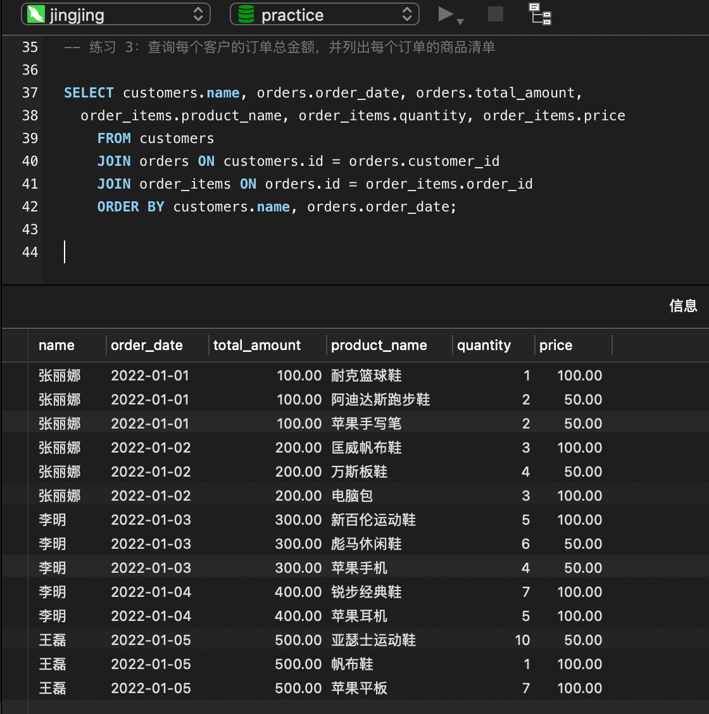

# nest 小册 mysql 练习

## 常用查询

### 准备练习数据表

```sql
-- 创建 customers 表，用于存储客户信息
CREATE TABLE IF NOT EXISTS `customers` (
 `id` int(11) NOT NULL AUTO_INCREMENT COMMENT '客户ID，自增长',
 `name` varchar(255) NOT NULL COMMENT '客户姓名，非空',
 PRIMARY KEY (`id`)
) ENGINE=InnoDB DEFAULT CHARSET=utf8mb4 COMMENT='客户信息表';

-- 创建 orders 表，用于存储订单信息
CREATE TABLE IF NOT EXISTS `orders` (
 `id` int(11) NOT NULL AUTO_INCREMENT COMMENT '订单ID，自增长',
 `customer_id` int(11) NOT NULL COMMENT '客户ID，非空',
 `order_date` date NOT NULL COMMENT '订单日期，非空',
 `total_amount` decimal(10,2) NOT NULL COMMENT '订单总金额，非空',
 PRIMARY KEY (`id`),
 FOREIGN KEY (`customer_id`) REFERENCES `customers` (`id`) ON DELETE CASCADE ON UPDATE CASCADE
) ENGINE=InnoDB DEFAULT CHARSET=utf8mb4 COMMENT='订单信息表';

-- 创建 order_items 表，用于存储订单商品信息
CREATE TABLE IF NOT EXISTS `order_items` (
 `id` int(11) NOT NULL AUTO_INCREMENT COMMENT '商品ID，自增长',
 `order_id` int(11) NOT NULL COMMENT '订单ID，非空',
 `product_name` varchar(255) NOT NULL COMMENT '商品名称，非空',
 `quantity` int(11) NOT NULL COMMENT '商品数量，非空',
 `price` decimal(10,2) NOT NULL COMMENT '商品单价，非空',
 PRIMARY KEY (`id`),
 FOREIGN KEY (`order_id`) REFERENCES `orders` (`id`) ON DELETE CASCADE ON UPDATE CASCADE
) ENGINE=InnoDB DEFAULT CHARSET=utf8mb4 COMMENT='订单商品信息表';

```

### 往表里插入练习数据

```sql

-- 向 customers 表插入数据
INSERT INTO `customers` (`name`)
  	VALUES
		('张丽娜'),('李明'),('王磊'),('赵静'),('钱伟'),
		('孙芳'),('周涛'),('吴洋'),('郑红'),('刘华'),
		('陈明'),('杨丽'),('王磊'),('张伟'),('李娜'),
		('刘洋'),('陈静'),('杨阳'),('王丽'),('张强');

-- 向 orders 表插入数据
INSERT INTO `orders` (`customer_id`, `order_date`, `total_amount`)
    VALUES
        (1, '2022-01-01',100.00),(1, '2022-01-02',200.00),
        (2, '2022-01-03',300.00),(2, '2022-01-04',400.00),
        (3, '2022-01-05',500.00),(3, '2022-01-06',600.00),
        (4, '2022-01-07',700.00),(4, '2022-01-08',800.00),
        (5, '2022-01-09',900.00),(5, '2022-01-10',1000.00);

-- 向 order_items 表插入数据
INSERT INTO `order_items` (`order_id`, `product_name`, `quantity`, `price`)
    VALUES
        (1, '耐克篮球鞋',1,100.00),
        (1, '阿迪达斯跑步鞋',2,50.00),
        (2, '匡威帆布鞋',3,100.00),
        (2, '万斯板鞋',4,50.00),
        (3, '新百伦运动鞋',5,100.00),
        (3, '彪马休闲鞋',6,50.00),
        (4, '锐步经典鞋',7,100.00),
        (5, '亚瑟士运动鞋',10,50.00),
        (5, '帆布鞋',1,100.00),
        (1, '苹果手写笔',2,50.00),
        (2, '电脑包',3,100.00),
        (3, '苹果手机',4,50.00),
        (4, '苹果耳机',5,100.00),
        (5, '苹果平板',7,100.00);

```

### 练习 1: 查询每个客户的订单总金额

::: info 思路

客户的订单存在订单表里，每个客户的订单可以有多个，所以这里需要用 `JOIN ON` 关联两个表，然后用 `GROUP BY` 根据客户 `id` 分组，再通过 `SUM` 函数计算价格总和。

:::

```sql
SELECT customers.name, SUM(orders.total_amount) AS total_amount
	FROM customers
    JOIN orders ON customers.id = orders.customer_id
    GROUP BY customers.id
```

- 执行下查询语句，可以看到每个客户的订单总金额


#### 可以加个排序

- 排序的时候，可以用 `ASC` 或者 `DESC` 来指定升序或降序，如果不指定，默认是升序。

```sql
SELECT customers.name, SUM(orders.total_amount) AS total_amount
	FROM customers
    JOIN orders ON customers.id = orders.customer_id
    GROUP BY customers.id
	ORDER BY total_amount DESC
```


#### 也可以加个查询数量限制

```sql
SELECT customers.name, SUM(orders.total_amount) AS total_amount
	FROM customers
	JOIN orders ON customers.id = orders.customer_id
	GROUP BY customers.id
	ORDER BY total_amount DESC
	LIMIT 3
```


### 练习 2: 查询每个客户的订单总金额，并计算其占比

- 每个客户的总金额的需求上面实现了，这里只需要算占比
- 可以通过一个子查询来计算全部订单的总金额，然后再相除就可以了

```sql
SELECT customers.name, SUM(orders.total_amount) AS total_amount,
	SUM(orders.total_amount) / (SELECT SUM(total_amount) FROM orders) AS percentage
    FROM customers
    INNER JOIN orders ON customers.id = orders.customer_id
    GROUP BY customers.id;
```


#### 查询优化

- 这里每次都算一遍总金额性能不好，可以先算出总金额，然后把数值传入。

```sql
-- 计算总订单金额
SELECT SUM(total_amount) AS total_order_amount FROM orders INTO @total_amount;

-- 使用计算得到的总订单金额进行查询
SELECT customers.name,
	SUM(orders.total_amount) AS total_amount,
	SUM(orders.total_amount) / @total_amount AS percentage
FROM customers
INNER JOIN orders ON customers.id = orders.customer_id
GROUP BY customers.id;

-- 清除变量
SET @total_amount = NULL;

```

### 练习 3：查询每个客户的订单总金额，并列出每个订单的商品清单

- 这里在总金额的基础上，多了订单项的查询，需要多关联一个表：`order_items`

```sql
SELECT customers.name, orders.order_date, orders.total_amount,
	order_items.product_name, order_items.quantity, order_items.price
    FROM customers
    JOIN orders ON customers.id = orders.customer_id
    JOIN order_items ON orders.id = order_items.order_id
    ORDER BY customers.name, orders.order_date;
```

- 内连接 3 个表，同时按照名字和下单日期排序。
- 多个字段排序的时候，可以用 `,` 分隔，也可以用 `AND` 连接。
- 这里用的是 `,` 分隔，先按照名字排序，如果名字相同，再按照下单日期排序。



#### 可以过滤某个客户的订单

- 比如只查询 `张丽娜` 的订单

```sql
SELECT customers.name, orders.order_date, orders.total_amount,
	order_items.product_name, order_items.quantity, order_items.price
	FROM customers
	JOIN orders ON customers.id = orders.customer_id
	JOIN order_items ON orders.id = order_items.order_id
	WHERE customers.name = '张丽娜'
	ORDER BY customers.name, orders.order_date;
```

#### 可以过滤某个时间段的订单

- 比如查询 2022 年 1 月 1 日到 2022 年 1 月 3 日的订单

```sql
SELECT customers.name, orders.order_date, orders.total_amount,
	order_items.product_name, order_items.quantity, order_items.price
	FROM customers
	JOIN orders ON customers.id = orders.customer_id
	JOIN order_items ON orders.id = order_items.order_id
	WHERE orders.order_date BETWEEN '2022-01-01' AND '2022-01-03'
	ORDER BY customers.name, orders.order_date;
```

- 因为这里的 `order_date` 是 `date` 类型，所以指定范围也只是用 `2022-01-01` 这种格式的。如果是 `datetime`，那就要用 `2022-01-01 10:10:00` 这种格式了。
- `WHERE` 过滤的时候，可以用 `AND` 或者 `OR` 来连接多个条件，也可以用 `IN` 来过滤多个值。
- 还可以模糊匹配等等，这里不再赘述。详见上一篇文章：[mysql 必知必会阅读笔记](./mysql-bizhibihui.md)

### 练习 4：查询每个客户的订单总金额，并计算商品数量，只包含商品名称包含“鞋”的商品，商品名用-连接：

- 查询订单总金额和商品数量都需要用 group by 根据 customer.id 分组
- 过滤出只包含鞋的商品
- 把分组的多条商品名连接起来需要用 GROUP_CONCAT 函数。

```sql
SELECT
	c.name AS customer_name,
	SUM(o.total_amount) AS total_amount,
	COUNT(oi.id) AS total_quantity,
	GROUP_CONCAT(oi.product_name SEPARATOR '-') AS product_names
    FROM customers c
    JOIN orders o ON c.id = o.customer_id
    JOIN order_items oi ON o.id = oi.order_id
    WHERE oi.product_name LIKE '%鞋%'
    GROUP BY c.name
    ORDER BY total_amount DESC
```

- GROUP_CONCAT 函数是用于 group by 分组后，把多个值连接成一个字符串的。

### 练习 5：将张丽娜的订单总金额打九折

- 这里需要用到 `CASE WHEN` 条件表达式，可以根据条件来返回不同的值。

```sql
SELECT customers.name, SUM(orders.total_amount) AS total_amount,
	CASE customers.name
		WHEN '张丽娜' THEN SUM(orders.total_amount) * 0.9
		ELSE SUM(orders.total_amount)
	END AS discounted_total_amount
	FROM customers
	INNER JOIN orders ON customers.id = orders.customer_id
	GROUP BY customers.id;
```

- 这里用 `CASE WHEN` 来判断客户名是否是 `张丽娜`，如果是，就返回总金额的 0.9 倍，否则返回原来的值。
- `CASE WHEN` 语法如下：

```sql
CASE
	WHEN condition1 THEN result1
	WHEN condition2 THEN result2
	...
	ELSE result
END
```

- `CASE WHEN` 语法可以有多个 `WHEN`，每个 `WHEN` 后面都可以跟一个 `THEN`，最后可以有一个 `ELSE`，表示当所有 `WHEN` 都不满足的时候，返回的值。
