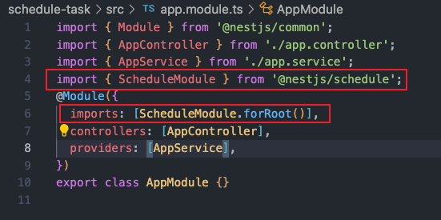
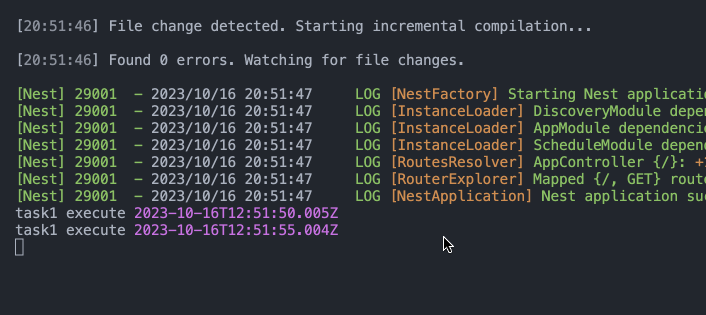
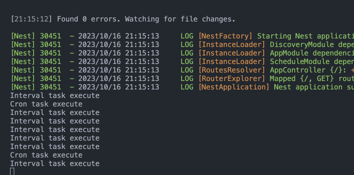
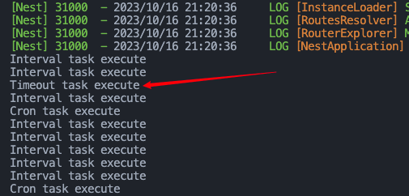

# nest 中的定时任务

## 准备工作

- 新建个 `nest` 项目

```sh
nest new schedule-task -p pnpm
```

- 然后安装相关的包

```sh
pnpm add @nestjs/schedule
```

- 在 `AppModule` 里引入 `ScheduleModule` 之后，就可以用它提供的方法在 `nest` 里面创建定时任务了。



## 创建定时任务

- 先新建一个 `service`

```sh
nest g service task --flat --no-spec
```

### @Cron

- 通过 `@Cron` 声明一个定时任务，可以实现写 `cron` 表达式的效果， `cron` 表达式的语法就不细写了。

```ts
import { Injectable } from '@nestjs/common';
import { Cron, CronExpression } from '@nestjs/schedule';

@Injectable()
export class TaskService {
  @Cron(CronExpression.EVERY_5_SECONDS)
  handleCron() {
    console.log('Cron task execute');
  }
}
```

- `EVERY_5_SECONDS` 代表的是每 5 秒执行一次定时任务

- 把服务跑起来后观察控制台输出



- 可以看到，任务每 5s 都会执行一次。

### @Interval

- 除了 `@Cron` 之外，你还可以用 `@Interval` 指定任务的执行间隔

- `Interval(name: string, timeout: number)` `name` 代表任务名 `timeout` 代表轮询时间间隔 单位是毫秒

```ts
import { Injectable } from '@nestjs/common';
import { Cron, CronExpression, Interval } from '@nestjs/schedule';

@Injectable()
export class TaskService {
  @Cron(CronExpression.EVERY_5_SECONDS)
  handleCron() {
    console.log('Cron task execute');
  }

  @Interval('task', 1000)
  handleInterval() {
    console.log('Interval task execute');
  }
}
```



### @Timeout

- 用 @Timeout 可以指定多长时间后执行这次定时任务，注意 **_<span style="color: #6A5ACD">只会执行一次</span>_**

```ts
import { Injectable } from '@nestjs/common';
import { Cron, CronExpression, Interval, Timeout } from '@nestjs/schedule';

@Injectable()
export class TaskService {
  @Cron(CronExpression.EVERY_5_SECONDS)
  handleCron() {
    console.log('Cron task execute');
  }

  @Interval('interval-task', 1000)
  handleInterval() {
    console.log('Interval task execute');
  }

  @Timeout('timeout-task', 3000)
  handleTimeout() {
    console.log('Timeout task execute');
  }
}
```


