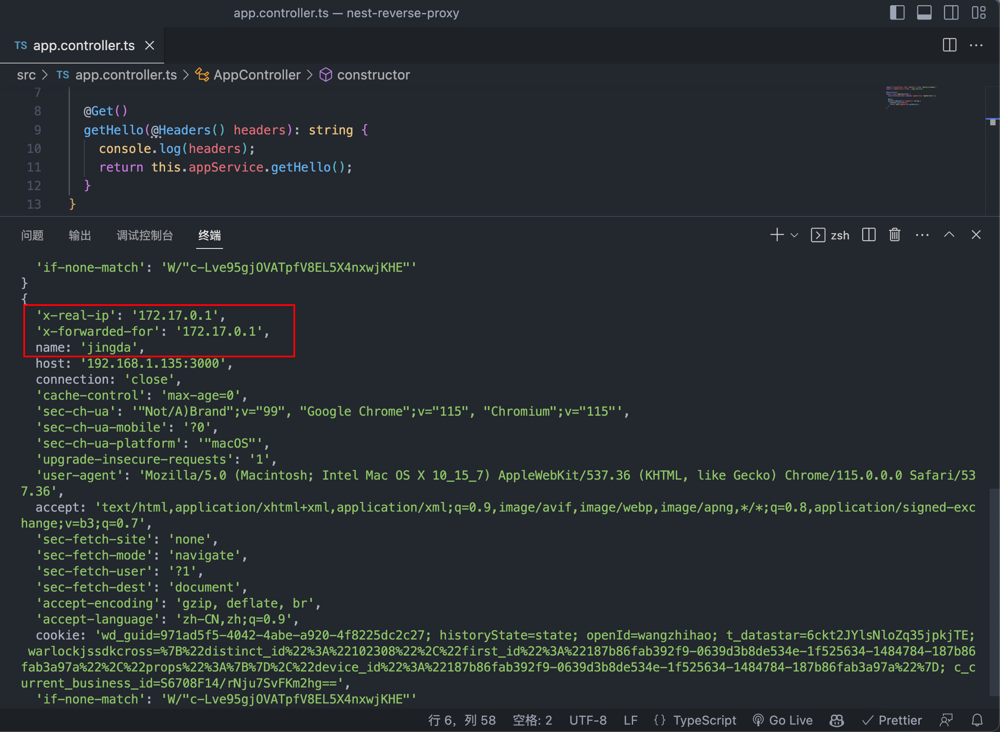

# 反向代理相关

## 什么是反向代理

简单来讲反向代理就是为服务端服务的，反向代理可以帮助服务器接收来自客户端的请求，帮助服务器做 <span style="color: #7B68EE">请求转发，负载均衡等</span> 功能。

## 反向代理的作用

::: info 负载均衡

- 负载均衡是指将请求分发到多个服务器上，从而达到多台服务器共同处理请求的目的，从而提高服务器的性能。

:::

::: info 增加安全性

- 反向代理可以隐藏服务器的真实 IP 地址，提高服务器的安全性。

:::

::: info 缓存

- 反向代理可以缓存静态资源，从而提高服务器的性能。

:::

## Nginx 实操反向代理

### 准备一个 nest 项目

```bash
nest new nest-reverse-proxy
```


- 给服务添加一个全局的前缀 /api

```ts
// main.ts
async function bootstrap() {
  const app = await NestFactory.create(AppModule);
  app.setGlobalPrefix('api');
  await app.listen(3000);
}
bootstrap();
```

- 访问一下 http://localhost:3000/api


### 准备一个 `nginx` 容器

- 用 `docker desktop` 跑一个 `nginx` 容器，容器名和端口映射如下图：


- 访问一下 http://localhost:81


### 改下 `nginx` 配置文件

- 修改一下 `default.conf` 配置文件，在里面添加一个路由配置。

```sh

server {
	listen       80;
	server_name  localhost;

	location / {
		root   /usr/share/nginx/html;
		index  index.html index.htm;
	}

	...

	location ^~ /api {
		proxy_pass http://[你本地的ip地址]:3000;
	}
}
```

- 这个路由是根据前缀匹配 `/api` 开头的 `url`， `^~` 是提高优先级用的。

- 重启一下 `nginx` 容器，访问一下 http://localhost:81/api


- 能看到 `nest` 项目的 `api` 路由正确响应了。

## 修改请求、响应的 header

- 在 `nginx` 配置文件中添加一个 `proxy_set_header` 配置。

```sh
location ^~ /api {
	proxy_pass http://[你本地的ip地址]:3000;
	proxy_set_header X-Real-IP $remote_addr;
	proxy_set_header X-Forwarded-For $proxy_add_x_forwarded_for;
	proxy_set_header name jingda;
}
```

- 重启一下 `nginx` 容器

- 在 `nest` 项目中添加一个 `api` 路由，用来测试请求和响应。

```ts
import { Controller, Get, Headers } from '@nestjs/common';
import { AppService } from './app.service';

@Controller()
export class AppController {
  constructor(private readonly appService: AppService) {}

  @Get()
  getHello(@Headers() headers): string {
    console.log(headers);
    return this.appService.getHello();
  }
}
```

- 重启一下 `nest` 项目，先用浏览器访问一下 `http://localhost:3000/api`


- 发现直接访问 `nest` 服务的话，是没有 `log` 出来添加的 `header` 的。

- 再用浏览器访问一下 `http://localhost:81/api` ，发现 `log` 出来了添加的 `header`。



## 实现负载均衡

- nginx 是一种常用的高性能 Web 服务器和反向代理服务器，它也支持负载均衡来分发流量到多个后端服务器。nginx 的负载均衡策略可以通过配置文件进行设置

::: info 常见的负载均衡策略

- 轮询（Round Robin）：默认的负载均衡策略，`nginx` 会依次将请求分发给每个后端服务器，循环进行，直到所有服务器都被轮询一遍。

- 加权轮询（Weighted Round Robin）：在轮询的基础上，为每个后端服务器分配一个权重值，根据权重值的比例来分发请求。权重值越高，分发的请求越多。

- IP 哈希（IP Hash）：基于客户端的 `IP` 地址，通过哈希算法将同一个 `IP` 地址的请求始终分发到同一个后端服务器，适用于需要保持会话的情况。

- 最少连接数（Least Connections）：将请求分发到当前连接数最少的后端服务器，从而实现负载均衡。适用于每个请求处理时间不同的情况。

- 加权最少连接数（Weighted Least Connections）：类似于加权轮询，但是根据后端服务器的连接数来分配权重，连接数越少，权重越高。

- URI 哈希（URI Hash）：基于请求的 `URI` 来进行哈希，相同 `URI` 的请求会被分发到同一个后端服务器，适用于缓存等场景。

- 随机（Random）：随机选择一个后端服务器进行请求分发，不同于轮询的有序方式。

- 基于响应时间（Least Time）：根据后端服务器的响应时间来进行负载均衡，将请求发送到响应时间最短的服务器。

以上只是一些常见的负载均衡策略，实际使用时可以根据具体需求选择合适的策略。在 nginx 的配置文件中，可以使用 `upstream` 块来定义后端服务器列表，并在 `location` 块中使用 `proxy_pass` 指令来实现负载均衡。
:::

- 因为场景复现原因，这里只实操一下前三个负载均衡策略

### 准备工作

- 准备两个 `nest` 项目
- 分别启动两个 `nest` 项目，端口分别为 `3000` 和 `3001`
- 在 `nest` 项目中的 `controlller` 中分别 log 一下端口号，用来区分两个项目

::: info 项目一

```ts
...
@Get()
getHello(): string {
	console.log('3000 port is running');
    return this.appService.getHello();
}
...

```

:::

::: info 项目二

```ts
...
@Get()
getHello(): string {
	console.log('3001 port is running');
    return this.appService.getHello();
}
...

```

:::


### 轮询（Round Robin）

- 现在有一个 nginx 服务器，两个【这里只是用两个来学习验证，实际数量远远不止】 nest 后端服务了
- 要是现在用户访问 nginx 服务器 `http://localhost:81/api` 的话，那么真实请求会被转发到哪个后端服务上呢？
- 这里就需要用到 `upstream` 配置了

```sh
upstream nest-server {
	server [你本地的ip地址]:3000;
	server [你本地的ip地址]:3001;
}
```

- 在 `upstream` 里配置它代理的目标服务器的所有实例。

- 下面 `proxy_pass` 通过 `upstream` 的名字来指定。

- 修改一下 `nginx` 配置文件

```sh
upstream nest-server {
	server [你本地的ip地址]:3000;
	server [你本地的ip地址]:3001;
}

server {
	listen       80;
	server_name  localhost;

	location / {
		root   /usr/share/nginx/html;
		index  index.html index.htm;
	}

	...

	location ^~ /api {
		proxy_pass http://nest-server;
		proxy_set_header X-Real-IP $remote_addr;
		proxy_set_header X-Forwarded-For $proxy_add_x_forwarded_for;
		proxy_set_header name jingda;
	}
}
```

- 重启一下 `nginx` 容器

- 然后访问一下 `http://localhost:81/api` 访问个 `5` 次看下效果


- 可以看到一个端口 3 次，一个端口 2 次。
- `nginx` 服务器会轮询的将请求转发到两个后端服务上。

### 加权轮询（Weighted Round Robin）

- 有时候我们希望某个后端服务的负载更轻一些，就可以给这个后端服务配置一个小一点的权重
- 某个性能高的服务器可以配置一个大一点的权重
- `weight` 默认为 1

```sh
upstream nest-server {
	server [你本地的ip地址]:3000 weight=1;
	server [你本地的ip地址]:3001 weight=2;
}
```

- 修改一下 `nginx` 配置文件，然后重启一下 `nginx` 容器
- 然后访问一下 `http://localhost:81/api` 访问个 `9` 次看下效果


- 看打印的日志来看，3000 端口和 3001 端口的访问频率就是 1:2 的比例，符合我们的预期。

### IP 哈希（IP Hash）

- `ip_hash` 的作用是将同一个 ip 的请求转发到同一个后端服务上，这样可以解决一些登录状态的问题。
- 修改一下 `nginx` 配置文件，然后重启一下 `nginx` 容器

```sh
upstream nest-server {
	ip_hash;
	server [你本地的ip地址]:3000 weight=1;
	server [你本地的ip地址]:3001 weight=2;
}
```

- 然后访问一下 `http://localhost:81/api` 访问个 `6` 次看下效果


- 可以看到一直请求到了一台服务器：3001 端口的服务器上。
