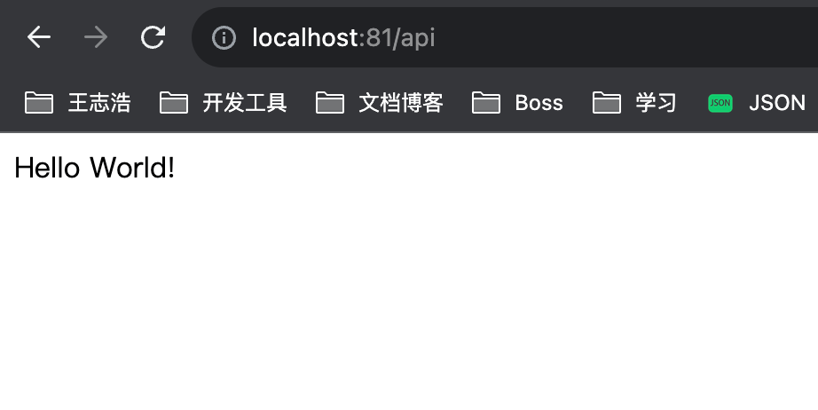

# 反向代理相关

## 什么是反向代理

简单来讲反向代理就是为服务端服务的，反向代理可以帮助服务器接收来自客户端的请求，帮助服务器做 <span style="color: #7B68EE">请求转发，负载均衡等</span> 功能。

## 反向代理的作用

::: info 负载均衡

- 负载均衡是指将请求分发到多个服务器上，从而达到多台服务器共同处理请求的目的，从而提高服务器的性能。

:::

::: info 增加安全性

- 反向代理可以隐藏服务器的真实 IP 地址，提高服务器的安全性。

:::

::: info 缓存

- 反向代理可以缓存静态资源，从而提高服务器的性能。

:::

## Nginx 实操反向代理

### 准备一个 nest 项目

```bash
nest new nest-reverse-proxy
```


- 给服务添加一个全局的前缀 /api

```ts
// main.ts
async function bootstrap() {
  const app = await NestFactory.create(AppModule);
  app.setGlobalPrefix('api');
  await app.listen(3000);
}
bootstrap();
```

- 访问一下 http://localhost:3000/api


### 准备一个 `nginx` 容器

- 用 `docker desktop` 跑一个 `nginx` 容器，容器名和端口映射如下图：


- 访问一下 http://localhost:81


### 改下 `nginx` 配置文件

- 修改一下 `default.conf` 配置文件，在里面添加一个路由配置。

```sh

server {
	listen       80;
	server_name  localhost;

	location / {
		root   /usr/share/nginx/html;
		index  index.html index.htm;
	}

	...

	location ^~ /api {
		proxy_pass http://[你本地的ip地址]:3000;
	}
}
```

- 这个路由是根据前缀匹配 `/api` 开头的 `url`， `^~` 是提高优先级用的。

- 重启一下 `nginx` 容器，访问一下 http://localhost:81/api



- 能看到 `nest` 项目的 `api` 路由正确响应了。

## 具体实例

### 修改请求、响应的 header

- 在 `nginx` 配置文件中添加一个 `proxy_set_header` 配置。

```sh
location ^~ /api {
	proxy_pass http://[你本地的ip地址]:3000;
	proxy_set_header X-Real-IP $remote_addr;
	proxy_set_header X-Forwarded-For $proxy_add_x_forwarded_for;
	proxy_set_header name jingda;
}
```

- 重启一下 `nginx` 容器

- 在 `nest` 项目中添加一个 `api` 路由，用来测试请求和响应。

```ts
import { Controller, Get, Headers } from '@nestjs/common';
import { AppService } from './app.service';

@Controller()
export class AppController {
  constructor(private readonly appService: AppService) {}

  @Get()
  getHello(@Headers() headers): string {
    console.log(headers);
    return this.appService.getHello();
  }
}

```

- 重启一下 `nest` 项目，先用浏览器访问一下 `http://localhost:3000/api`


- 发现直接访问 `nest` 服务的话，是没有 `log` 出来添加的 `header` 的。

- 再用浏览器访问一下 `http://localhost:81/api` ，发现 `log` 出来了添加的 `header`。


### 实现负载均衡