# 静态文件托管

## 安装 nginx

- 本地安装 `nginx` 的方式有很多种
- 我这里采用 `docker pull nginx` 镜像到本地，然后基于这个镜像跑一个容器就可以了。

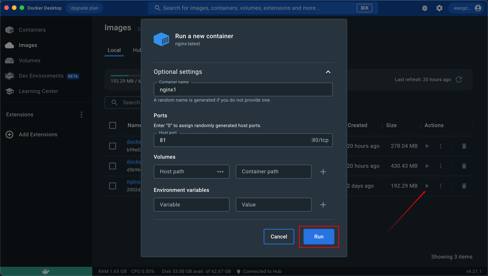

- 这里设置镜像名称 `nginx1` 本机端口设置为 `81`
- 打开浏览器访问 `http://localhost:81/` 就能看到欢迎页面


## nginx 的静态文件托管能力

- 现在的页面是默认的，我想用 `nginx` 来托管我的一些静态 `html` 页面怎么做呢？

- 首先我们要知道现在的配置文件和页面都存在哪里。

- 在 `docker desktop` 的 `files` 面板可以看到容器内的文件


- `/usr/share/nginx/html/index.html` 这个文件内容和浏览器看到的一模一样

- 这个目录就是保存静态文件的目录，那我们在这个目录下放我们自己的 `html` 就行了。


- 这里可以直接上传文件，当然也可以采用 `docker cp` 等命令
- 打开浏览器，访问对应的文件就能看到刚上传的文件是能正常访问的

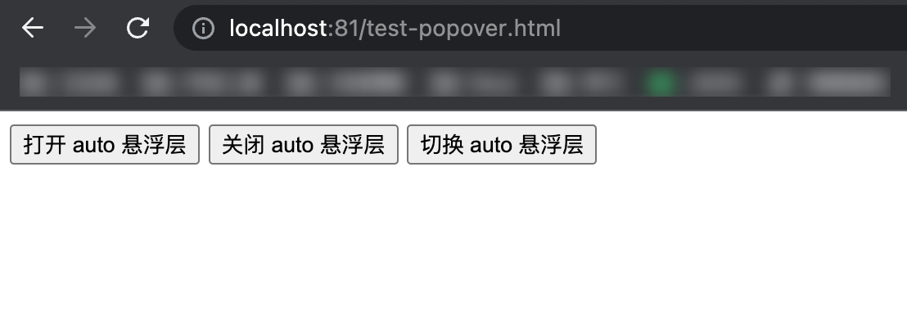

## nginx.conf

- 只要放到 `/usr/share/nginx/html` 下的文件，都可以通过被访问到。
- 可是为什么呢？这是因为 `nginx` 的默认配置。
- 我们看下 `nginx` 配置文件 也就是 `/etc/nginx/nginx.conf`
- 把文件复制出来看看具体内容

```sh
user  nginx;
worker_processes  auto;

error_log  /var/log/nginx/error.log notice;
pid        /var/run/nginx.pid;


events {
    worker_connections  1024;
}


http {
    include       /etc/nginx/mime.types;
    default_type  application/octet-stream;

    log_format  main  '$remote_addr - $remote_user [$time_local] "$request" '
                      '$status $body_bytes_sent "$http_referer" '
                      '"$http_user_agent" "$http_x_forwarded_for"';

    access_log  /var/log/nginx/access.log  main;

    sendfile        on;
    #tcp_nopush     on;

    keepalive_timeout  65;

    #gzip  on;

    include /etc/nginx/conf.d/*.conf;
}

```

- 这个 `nginx.conf` 叫做主配置文件，里面一般做一些全局的配置 比如错误日志的目录等等。
- 可以看到 `http` 下面有个 `include` 引入了 `/etc/nginx/conf.d/*.conf` 的配置。
- 一般具体的路由配置都是在这些子配置文件里。

## default.conf

- 打开 conf.d 目录，下面只有 `default.conf` 这一个默认的配置文件
- 内容如下：

```sh

server {
    listen       80;
    listen  [::]:80;
    server_name  localhost;

    #access_log  /var/log/nginx/host.access.log  main;

    location / {
        root   /usr/share/nginx/html;
        index  index.html index.htm;
    }

    #error_page  404              /404.html;

    # redirect server error pages to the static page /50x.html
    #
    error_page   500 502 503 504  /50x.html;
    location = /50x.html {
        root   /usr/share/nginx/html;
    }

    # proxy the PHP scripts to Apache listening on 127.0.0.1:80
    #
    #location ~ \.php$ {
    #    proxy_pass   http://127.0.0.1;
    #}

    # pass the PHP scripts to FastCGI server listening on 127.0.0.1:9000
    #
    #location ~ \.php$ {
    #    root           html;
    #    fastcgi_pass   127.0.0.1:9000;
    #    fastcgi_index  index.php;
    #    fastcgi_param  SCRIPT_FILENAME  /scripts$fastcgi_script_name;
    #    include        fastcgi_params;
    #}

    # deny access to .htaccess files, if Apache's document root
    # concurs with nginx's one
    #
    #location ~ /\.ht {
    #    deny  all;
    #}
}

```

- 这里面配置了 `localhost:80` 虚拟主机下的所有路由。

- 虚拟主机是什么呢？

- 就是可以用一台 `nginx` 服务器来为多个域名和端口的提供服务。

- 只要多加几个 `server` 配置就可以。

- 这里我们就配置 `localhost:80` 这一个虚拟主机。

- 下面的 `location` 就是路由配置。

- 比如这个配置：

```sh
location / {
	root   /usr/share/nginx/html;
	index  index.html index.htm;
}
```

- 它就配置了 `/` 下的所有路由，都是在 `root` 指定的目录查找。

- 所以 `http://localhost/test-popover.html` 就是从 `/usr/share/nginx/html/test-popover.html` 找的。

- `location` 支持的语法有挺多，我们分别试一下
- 在 `default.conf` 中添加下面几个匹配规则

```sh
location = /111/ {
    default_type text/plain;
    return 200 "111 success";
}

location /222 {
    default_type text/plain;
    return 200 $uri;
}

location ~ ^/jing/hao.*\.html$ {
    default_type text/plain;
    return 200 $uri;
}

location ~* ^/hao/Jing.*\.html$ {
    default_type text/plain;
    return 200 $uri;
}
```

- 然后在容器内的 terminal 执行：

```sh
nginx -s reload
```

- 这命令是重新加载配置文件。

### 精确匹配

```sh
location = /111/ {
    default_type text/plain;
    return 200 "111 success";
}
```

- `location` 和路径之间加了个 `=`，代表精准匹配
- 也就是只有 <font color="#32CD32">**完全相同的**</font> `url` 才会匹配这个路由。

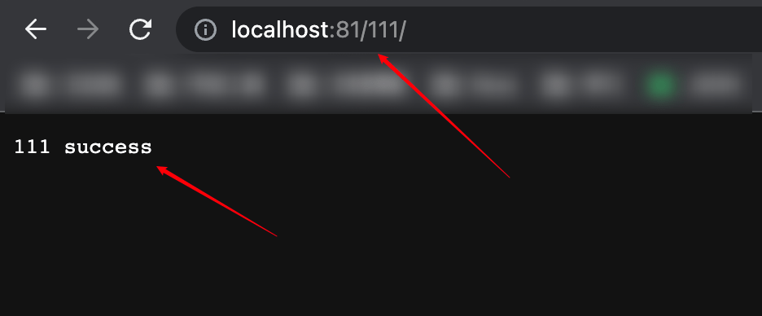

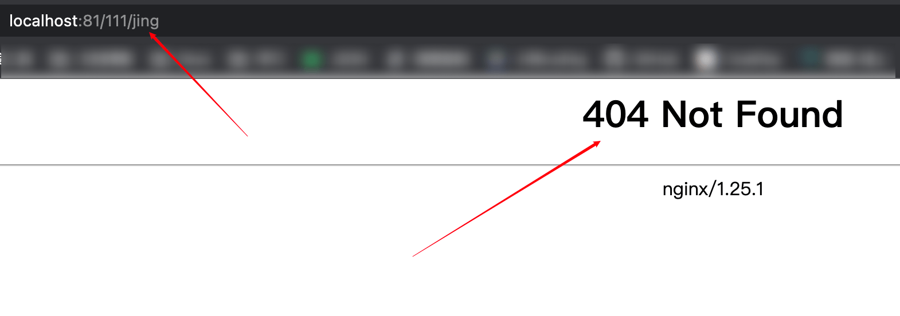

### 前缀匹配

```sh
location /222 {
    default_type text/plain;
    return 200 $uri;
}
```

- 不带 `=` 代表根据 <font color="#32CD32">**前缀匹配**</font>，后面可以是任意路径。
- 这里的 `$uri` 是取 <font color="#7B68EE">**当前路径**</font>。

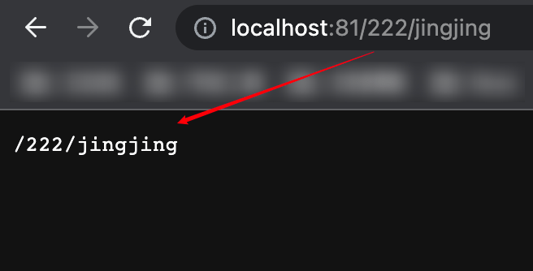

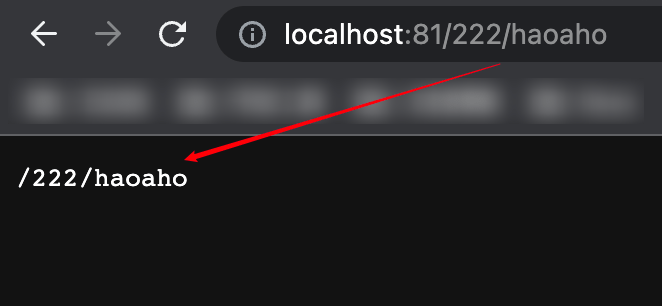

### 正则匹配[区分大小写]

```sh
location ~ ^/jing/hao.*\.html$ {
    default_type text/plain;
    return 200 $uri;
}
```

- 如果想支持正则匹配，就可以在 `location` 后面加个 `~`
- 这里的正则语法不难看懂，就是 `/jing/hao` 开头，然后中间是任意字符，最后 `.html` 结尾的 `url`

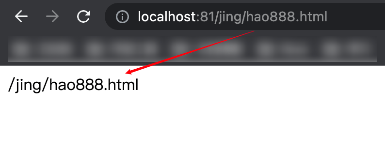


- 但是正则匹配是区分大小写的，比如这样访问就会 404


### 正则匹配[不区分大小写]

```sh
location ~* ^/hao/Jing.*\.html$ {
    default_type text/plain;
    return 200 $uri;
}
```

- 如果想让正则不区分大小写，可以再加个 `*`


### 优先级

- 在配置文件再加上这个配置，然后 reload 一下 nginx

```sh
location /hao {
    default_type text/plain;
    return 200 'xxxx';
}
```

- 现在配置文件中有两个以 `/hao` 开头的匹配规则：`~* ^/hao/Jing.*\.html$` 和 `/hao`
- 再次访问一个以 `/hao` 开头的 `url`，表现形式如下图：


- 如果想要提高 `/hao` 匹配规则的优先级，需要在 `location` 的后面添加 `^~`

```sh
location ^~ /hao {
    default_type text/plain;
    return 200 'xxxx';
}
```

- 修改一下 default.conf ，然后重启一下 nginx ，再次访问刚才的 url

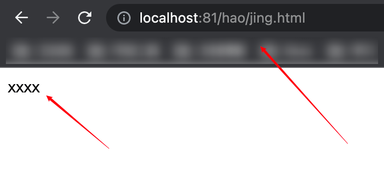

- 这次会发现优先匹配上了 `/hao` 这个规则

### location 配置总结

::: info location

- `location = /aaa` 是精确匹配 `/aaa` 的路由。

- `location /bbb` 是前缀匹配 `/bbb` 的路由。

- `location ~ /ccc.*.html` 是正则匹配。可以再加个 `*` 表示不区分大小写 `location ~* /ccc.*.html`

- `location ^~ /ddd` 是前缀匹配，但是优先级更高。

- 这 4 种语法的优先级是这样的：

- 精确匹配 > 高优先级前缀匹配 > 正则匹配 > 普通前缀匹配

:::

## alias vs root

::: tip
- `root` 和 `alias` 的区别就是 <font color="#7B68EE">**在匹配文件路径时是否包含匹配条件的路径**</font>
- `root` 会把匹配条件的路径一并拼接到文件路径的<font color="#7B68EE">后面</font> `alias` 不会。
:::

### 举个例子

```sh
location ^~ /hao {
    default_type text/plain;
    alias /usr/share/nginx/html;
}

location ^~ /hao {
    default_type text/plain;
    root /usr/share/nginx/html;
}
```

### alias

- 可以先这样改一下 `default.conf` 配置文件

```sh
location ^~ /hao {
    default_type text/plain;
    alias /usr/share/nginx/html;
}
```

- 再上传两个文件到 `/usr/share/nginx/html`

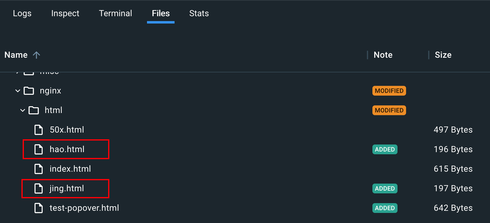

::: info

- 然后打开浏览器访问一下 `http://localhost:81/hao/jing.html`
- 因为现在采用的是 `alias`，访问 `http://localhost:81/hao/jing.html` 去 `nginx` 中查文件的时候不会把前缀 `/hao` 加上
- 即访问的真实路径是 <font color="#32CD32">`/usr/share/nginx/html/jing.html`</font>，是能正常请求到内容的。

:::


### root

- 可以再这样改一下 `default.conf` 配置文件

```sh
location ^~ /hao {
    default_type text/plain;
    root /usr/share/nginx/html;
}
```

::: info

- 然后打开浏览器访问一下 `http://localhost:81/hao/jing.html`
- 因为现在采用的是 `root`，访问 `http://localhost:81/hao/jing.html` 去 `nginx` 中查文件的时候会把前缀 `/hao` 加上
- 即访问的真实路径是 <font color="#32CD32">`/usr/share/nginx/html/hao/jing.html`</font>
- 这个路径不存在，所以是不能正常请求到内容的，返回的是 `404` 页面。

:::

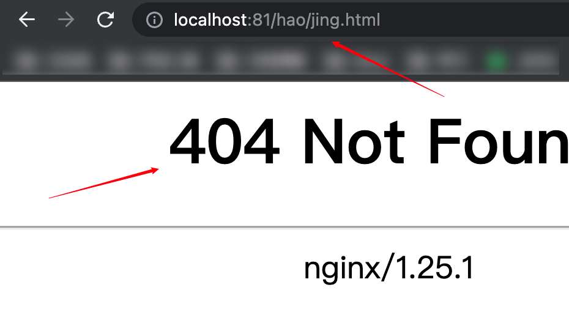

- 我们可以新建一个 `hao` 文件夹，里面放同样的两个 `html`文件，然后拷贝至容器中


- 终端重启一下 `nginx` ，访问 `http://localhost:81/hao/jing.html`
- 结果发现没有成功返回对应的 `html` ， 也没有 `404` ，而是提示 `403` 没有权限


- 是因为 `nginx` 默认的执行用户是 `nginx` ，上面 `nginx.conf` 里面第一行有写： `user  nginx;`
- 这里只需要把 `user` 改成 `root` 就可以了
- 改完 `nginx.conf` 重启 `nginx` 打开浏览器重新访问就能正常访问了

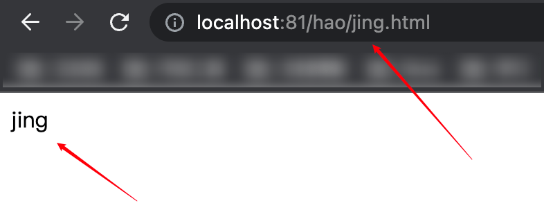

