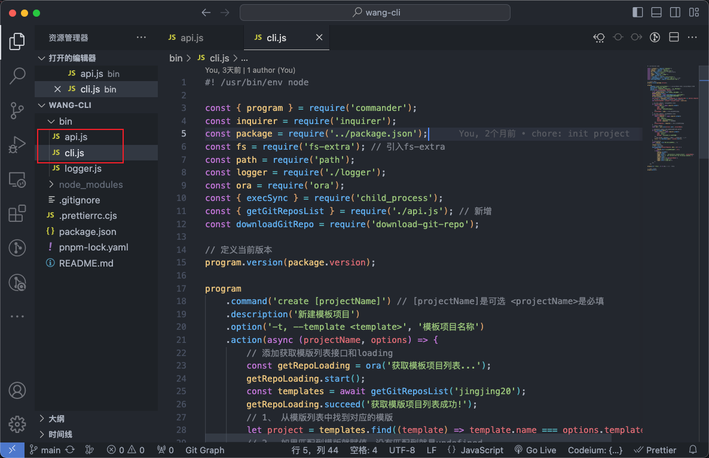

# 脚手架相关

## 模式一：使用平台提供 api 远端读取账户下所有仓库供用户选择模板

主要代码如图：



### 核心代码

#### cli.js

```js
#! /usr/bin/env node
const { program } = require('commander');
const inquirer = require('inquirer');
const package = require('../package.json');
const fs = require('fs-extra'); // 引入fs-extra
const path = require('path');
const logger = require('./logger');
const ora = require('ora');
const { execSync } = require('child_process');
const { getGitReposList } = require('./api.js'); // 新增
const downloadGitRepo = require('download-git-repo');

// 定义当前版本
program.version(package.version);

program
  .command('create [projectName]') // [projectName]是可选 <projectName>是必填
  .description('新建模板项目')
  .option('-t, --template <template>', '模板项目名称')
  .action(async (projectName, options) => {
    // 添加获取模版列表接口和loading
    const getRepoLoading = ora('获取模板项目列表...');
    getRepoLoading.start();
    const templates = await getGitReposList('jingjing20');
    getRepoLoading.succeed('获取模版项目列表成功!');
    // 1、 从模版列表中找到对应的模版
    let project = templates.find((template) => template.name === options.template);
    // 2、 如果匹配到模版就赋值，没有匹配到就是undefined
    let projectTemplate = project ? project.value : undefined;

    // 3、 如果用户没有传入名称就交互式输入
    if (!projectName) {
      const { name } = await inquirer.prompt({
        type: 'input',
        name: 'name',
        message: '请输入项目名称：'
      });
      projectName = name; // 赋值输入的项目名称
    }
    // 4、 如果用户没有传入模版就交互式输入
    if (!projectTemplate) {
      const { template } = await inquirer.prompt({
        type: 'list',
        name: 'template',
        message: '请选择模版项目：',
        choices: templates // 模版列表
      });
      projectTemplate = template; // 赋值选择的项目名称
    }
    // 获取目标文件夹
    const dest = path.join(process.cwd(), projectName);

    // 判断文件夹是否存在，存在就交互询问用户是否覆盖
    if (fs.existsSync(dest)) {
      const { force } = await inquirer.prompt({
        type: 'confirm',
        name: 'force',
        message: '目录已存在，是否覆盖？'
      });
      // 如果覆盖就删除文件夹继续往下执行，否的话就退出进程
      force ? fs.removeSync(dest) : process.exit(1);
    }
    // 定义loading
    const loading = ora('正在下载模版项目...');
    // 开始loading
    loading.start();
    // 5、开始下载模版
    downloadGitRepo(projectTemplate, dest, (err) => {
      if (err) {
        loading.fail('创建模版项目失败', err);
      } else {
        loading.succeed();
        console.log();
        logger.mixin(`🚀  Successfully created project`, projectName);
        logger.info('👉  Get started with the following commands:');
        console.log();
        logger.info(`$ cd ${projectName}`);
        logger.info('$ pnpm i');
        logger.info('$ pnpm dev');
      }
    });
  });

program.on('--help', () => {}); // 添加--help

// 定义使用方法
program.parse();
```

#### api.js

```js
// bin/api.js
const https = require('https');
const logger = require('./logger');

/** 获取用户git仓库列表信息 */
function getGitReposList(username) {
  return new Promise((resolve, reject) => {
    https
      .request(
        `https://api.github.com/users/${username}/repos`,
        {
          headers: {
            'User-Agent': username
          }
        },
        (res) => {
          let data = '';
          res.on('data', (chunk) => {
            data += chunk.toString();
          });
          res.on('end', () => {
            const list = JSON.parse(data);
            resolve(
              list.map((item) => ({
                // 组合成模版所需要的name，value结构
                name: item.name,
                value: `https://github.com:${username}/${item.name}`
              }))
            );
          });
          res.on('error', (err) => {
            reject(err);
          });
        }
      )
      .end();
  }).catch((err) => {
    logger.error(err);
  });
}

module.exports = {
  getGitReposList
};
```

#### 所有代码见仓库

- [wang-cli](https://github.com/jingjing20/wang-cli)

## 模式二：模板代码没放单独仓库，而是在某个仓库下面的文件夹里

- 先新建一个临时目录用于存放目标仓库，这样不会污染用户的文件夹。
- 然后把远端仓库下载到临时目录里面。
- 再进一步操作文件夹的 copy 就行了。
- 最后要把生成的临时目录删除。

```ts
import path from 'path';
import logger from '../shared/logger.js';
import inquirer from 'inquirer';
import fse from 'fs-extra';
// 优化下载过程
import ora from 'ora';
import { exec } from 'child_process';
import chalk from 'chalk';

interface CreateCommandOptions {
  name?: string;
}

const sourceDirectory = path.join(process.cwd(), `/wangzhihao-cli-temp-${new Date().getTime().toString()}/`); // 临时存放目录
const relativePath = '@@@@@@@@@@';

export async function createTemplate(options: CreateCommandOptions) {
  logger.title('\n📦 Create a template project! \n');
  let projectName: string;
  if (options.name) {
    projectName = options.name;
  } else {
    const { name } = await inquirer.prompt({
      type: 'input',
      name: 'name',
      message: '请输入项目名称：'
    });
    projectName = name; // 赋值输入的项目名称
  }

  // 创建临时目录
  await fse.mkdir(sourceDirectory, { recursive: true });
  // 目标目录路径
  const targetDirectory = process.cwd() + '/' + projectName;

  // 定义loading
  const spinner = ora({
    text: '正在拉取远端模版项目...',
    spinner: 'arrow3'
  }).start();

  await new Promise<void>((resolve) => {
    exec(
      'git clone -b feature/### git 地址',
      {
        cwd: sourceDirectory // path to where you want to save the file
      },
      (error: any, stdout: string, stderr: string) => {
        if (error) {
          // 删除临时目录
          fse.remove(sourceDirectory);
          logger.info(stderr);
          spinner.fail(
            chalk.hex('#ff9800')(
              '很抱歉，您可能目前没有访问 Git 仓库的权限。请向仓库管理员申请访问权限。'
            )
          );
          logger.greyinfo('仓库地址：');
        } else {
          resolve();
        }
      }
    );
  }).then(async () => {
    try {
      // 从模板项目拷贝所有文件到目标目录下
      await fse.copySync(sourceDirectory + relativePath, targetDirectory);
      spinner.succeed('拉取模板成功');
      console.log();
      logger.mixin(`🚀  Successfully created project`, projectName);
      logger.greyinfo('👉  Get started with the following commands:');
      console.log();
      logger.greyinfo(`$ cd ${projectName}`);
      logger.greyinfo('$ pnpm i');
      logger.greyinfo('$ pnpm dev');
    } catch (error: any) {
      logger.error(error);
    }
  });

  // 删除临时目录
  fse.remove(sourceDirectory);
}
```
