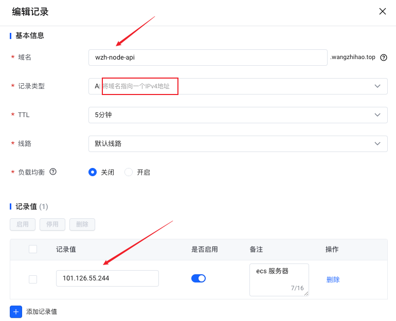
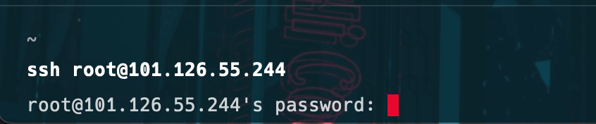
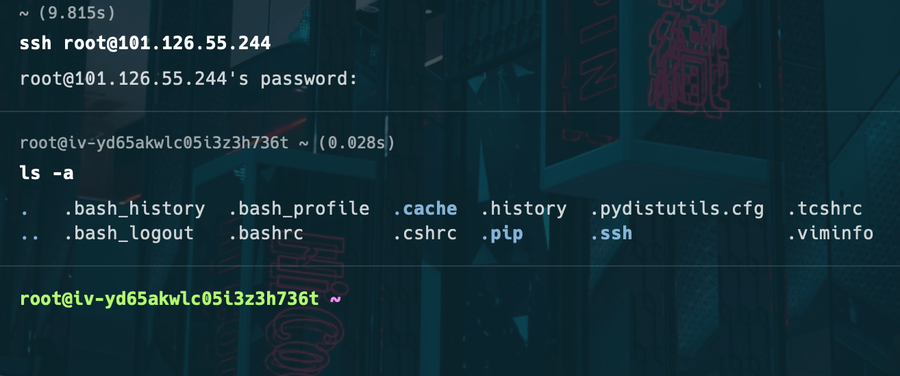
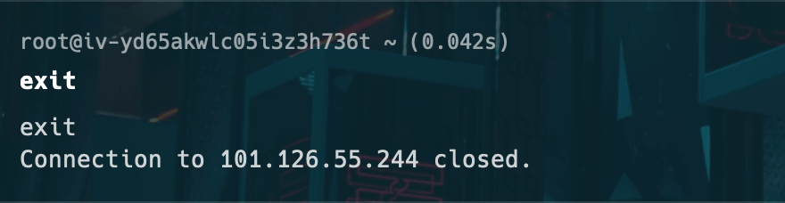
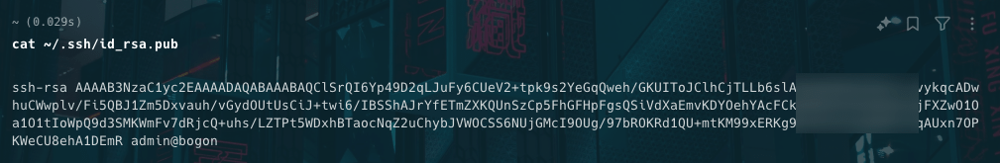
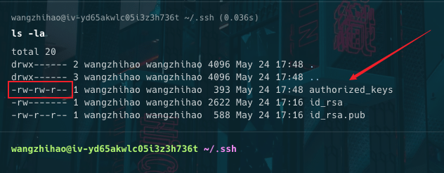
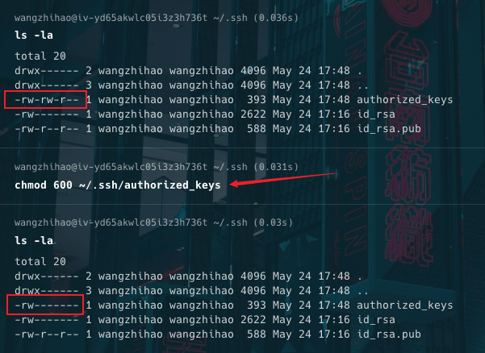

# 从零开始搭建域名服务器

## 购买、域名解析

- 购买域名

- 购买 ecs 实例

- 域名解析到服务器的公网 ip



- 记录值就是域名解析到 ecs 实例的公网 ip 地址

- 之后就可以通过域名访问 ecs 实例了

## 远程登录到服务器

- 使用 ssh 远程链接



- 执行命令

```shell
ssh root@101.126.55.244
```

- 101.126.55.244 是 ecs 实例的公网 ip 地址

- 输入密码之后就能登录到服务器了



## 退出服务器

- 输入 exit 退出服务器



## 创建新用户、设置密码、添加权限

```sh
# 连接到远程服务器
ssh your_username@remote_server_ip

# 创建新用户
useradd newuser

# 设置用户密码
passwd newuser
# 输入并确认新密码

# 确认创建了主目录（如果需要）
mkdir /home/newuser
chown newuser:newuser /home/newuser

# 将用户添加到 wheel 组
gpasswd -a newuser wheel

# 退出 root 会话
exit

# 退出 SSH 会话
exit

```

- `useradd` 命令在默认情况下不会创建用户的主目录。
- 为了确保新用户有一个主目录，你需要手动创建它并设置适当的权限。

### 为什么需要创建主目录

- **用户主目录**：每个用户通常都有一个自己的主目录，用来存储个人文件、配置和数据。主目录通常位于 `/home/username`。

- **权限设置**：设置主目录的所有者和组为新用户，以确保新用户对其主目录有完全控制权限。

### 创建主目录并设置权限

假设你使用的 `useradd` 命令没有自动创建主目录，你可以手动执行以下步骤：

**手动创建主目录**：

```sh
mkdir /home/newuser
```

**设置主目录的所有者和组**：

```sh
chown newuser:newuser /home/newuser
```

## 为用户生成密钥对

- 用 `wangzhihao` 用户登录到远程服务器

- 执行命令

```sh
ssh-keygen
```

- 之后一路回车就可以了，这个命令会生成一个 `.ssh` 目录
- 里面有 `id_rsa` 和 `id_rsa.pub` 两个文件。分别是私钥和公钥。

## 用密钥的方式验证登录步骤

- 获取本地电脑的公钥



- 在远程服务器上执行下面的命令

```sh
vi ~/.ssh/authorized_keys
```

- 将本地的公钥粘贴到远程服务器上的 `authorized_keys` 文件中，保存退出。



- 看图上的权限 `rw-rw-r--` 的含义是：

  - 文件所有者拥有读、写权限、
  - 组也拥有读、写权限、
  - 其他用户拥有读权限。


- `chmod 600 ~/.ssh/authorized_keys` 命令是用来设置 `authorized_keys` 文件的权限，以确保其安全性。

```sh
chmod 600 ~/.ssh/authorized_keys
```



- 以下是该命令和相关步骤的详细解释：

**权限设置的重要性**

::: info 📢
`~/.ssh/authorized_keys` 文件包含了允许通过 SSH 密钥登录的公钥。为了防止未经授权的访问，这个文件的权限必须严格控制。
:::

- `600` 权限表示：
  - 文件所有者可以读和写（rw-）。
  - 文件所有者所属的组不能读写（---）。
  - 其他用户不能读写（---）。

## lunix 命令

### ls -la

`ls -la` 是一个用于列出目录内容的命令，包含隐藏文件，并以详细格式显示文件和目录的信息。具体来说：

- `ls`：列出目录内容。
- `-l`：以长格式显示，包括文件类型、权限、硬链接数、所有者、组、文件大小和修改时间。
- `-a`：显示所有文件，包括以 `.` 开头的隐藏文件。

下面是一个示例，说明如何使用 `ls -la` 以及输出的含义：

```sh
ls -la
```

假设你在主目录运行 `ls -la`，输出可能如下所示：

```sh
total 48
drwxr-xr-x  6 user user 4096 May 24 14:01 .
drwxr-xr-x  3 root root 4096 May 23 10:20 ..
-rw-r--r--  1 user user  220 May 23 10:20 .bash_logout
-rw-r--r--  1 user user 3771 May 23 10:20 .bashrc
drwx------ 12 user user 4096 May 24 13:58 .cache
drwxrwxr-x  3 user user 4096 May 23 10:20 .local
-rw-r--r--  1 user user  807 May 23 10:20 .profile
drwxrwxr-x  2 user user 4096 May 24 14:01 Documents
drwxrwxr-x  2 user user 4096 May 24 14:00 Downloads
```

### 输出解释

- `total 48`: 目录中所有文件的总块数。
- `drwxr-xr-x  6 user user 4096 May 24 14:01 .`:

  - `d`: 表示这是一个目录。
  - `rwxr-xr-x`: 权限字符串。第一个字符表示文件类型，接下来的九个字符分为三组，分别表示**所有者、组、其他用户**的权限。
    - `r`: 读权限。
    - `w`: 写权限。
    - `x`: 执行权限。
  - `6`: 硬链接数。
  - `user`: 文件所有者。
  - `user`: 文件所属组。
  - `4096`: 文件大小（字节）。
  - `May 24 14:01`: 最后修改时间。
  - `.`: 文件名（当前目录）。

- `drwxr-xr-x  3 root root 4096 May 23 10:20 ..`: 上级目录。

- `-rw-r--r--  1 user user  220 May 23 10:20 .bash_logout`:
  - `-`: 表示这是一个普通文件。

### 示例解释

- `.bash_logout`, `.bashrc`, `.profile`: 隐藏配置文件，以 `.` 开头。
- `Documents`, `Downloads`: 普通目录。

使用 `ls -la` 可以全面了解目录的结构和文件的详细信息，包括隐藏文件和权限设置，非常有助于系统管理和文件管理。
