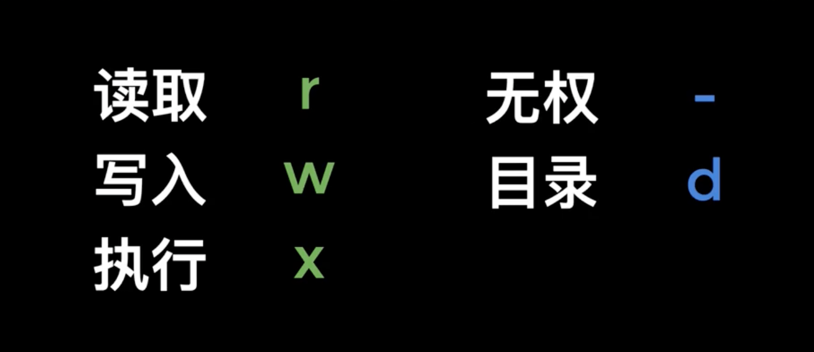
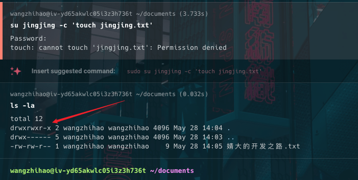
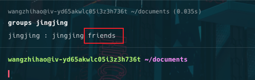
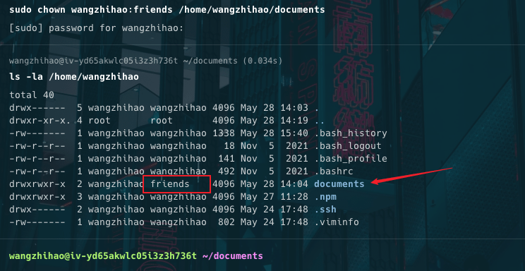
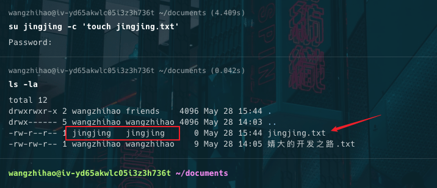
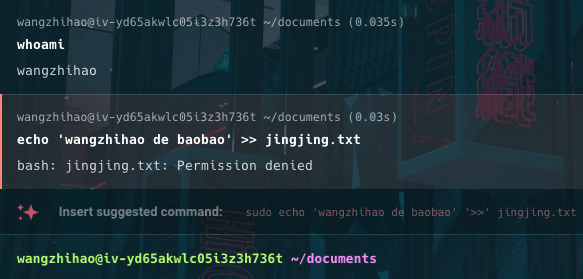
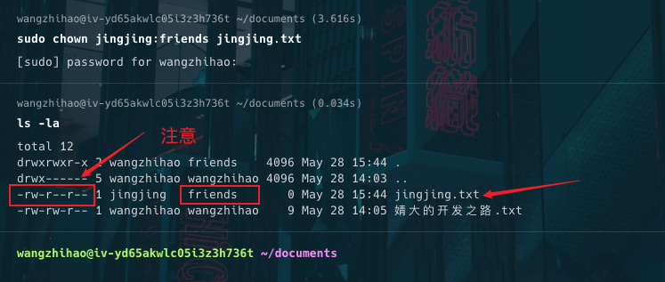
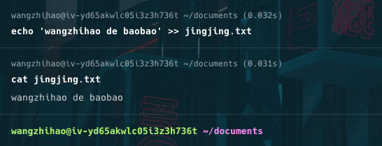

# 文件、目录、用户、权限相关

## 文件目录权限

::: info 文件和目录的权限

- 在 `Linux` 系统中，文件和目录的权限管理是保障系统安全和用户数据安全的关键部分。
- <span style="color:#8470FF">**文件和目录的权限定义了哪些用户或用户组可以读、写或执行文件和目录**</span>

:::

### 基本概念

### 文件类型

- **普通文件**：-
- **目录**：d
- **符号链接**：l
- **块设备文件**：b
- **字符设备文件**：c
- **管道文件**：p
- **套接字文件**：s

### 权限类型



- **读权限（r）**：可以查看文件内容或列出目录内容。
- **写权限（w）**：可以修改文件内容或在目录中创建、删除文件。
- **执行权限（x）**：可以运行可执行文件或进入目录。

### 权限表示


- 文件和目录的权限使用 `10` 个字符表示
- 第一个字符表示文件还是目录
- 后 `9` 个字符分为三组，每组三个字符，分别表示文件所有者、所属组和其他用户的权限。

```
-rwxr-xr--
```

- 第一个字符表示文件类型。
- 接下来的三个字符表示文件所有者的权限（rwx）。
- 中间的三个字符表示所属组的权限（r-x）。
- 最后三个字符表示其他用户的权限（r--）。

### 更改权限

### 使用 `chmod` 命令

`chmod` 命令用于更改文件和目录的权限。

- **数字表示法**：

  - 读（r） = 4
  - 写（w） = 2
  - 执行（x） = 1

  例如，设置文件权限为 `rwxr-xr--`：

  ```sh
  chmod 754 filename
  ```

- **符号表示法**：

  - `u`：所有者
  - `g`：所属组
  - `o`：其他用户
  - `a`：所有用户

  例如，添加所有者的写权限：

  ```sh
  chmod u+w filename
  ```

### 使用 `chown` 命令

`chown` 命令用于更改文件和目录的所有者和所属组。

- 更改所有者：

```sh
  chown new_owner filename
```

- 更改所属组：

```sh
  chown :new_group filename
```

- 更改所有者和所属组：

```sh
  chown new_owner:new_group filename
```

### 使用 `chgrp` 命令

`chgrp` 命令用于更改文件和目录的所属组。

- 更改所属组：

```sh
chgrp new_group filename
```

### 实操一波

### 修改资源的拥有权

- 我在自己的服务器实操了一波
- 下图是我在 `wangzhihao` 用户的 `documents` 目录下尝试使用 `su jingjing -c 'touch jingjing.txt'` 命令以 `jingjing` 用户创建文件 `jingjing.txt`
- 命令执行不成功，报没有权限的错误了。

::: warning 报错原因

- 可以通过 `ls -la` 查看 `documents` 目录的权限，可以看到 `documents` 目录的权限为：`drwxrwxr-x`。

- 这个含义是：所有者拥有 `documents` 目录的 `rwx` 权限，所属组拥有 `documents` 目录的 `rwx` 权限，其他用户拥有 `documents` 目录的 `r-x` 权限。


- `jingjing` 这个用户属于其他用户，只有 `r-x` <span style="color:#8470FF">【读取和执行，没有写入】</span>权限，所以执行 `su jingjing -c 'touch jingjing.txt'` 就会报错了

:::



- 使用 `groups jingjing` 查看 `jingjing` 用户的所属组，可以看到 `jingjing` 用户属于 `friends` 组。



- 上面我们知道 `documents` 的所属组也拥有 `documents` 目录的 `rwx` 权限，所以我们只要将 `documents` 目录的所属组改成 `friends` 就可以了。

::: tip 使用 `chown` 命令

```sh
sudo chown wangzhihao:friends /home/wangzhihao/documents
```



- 可以看到 `documents` 目录的所属组变成了 `friends` 了。

- 现在可以再次尝执行 `su jingjing -c 'touch jingjing.txt'` 命令了，这次命令执行成功了，在 `documents` 目录下成功创建了 `jingjing.txt` 文件，同时注意 `jingjing.txt` 文件的所有者和所属组都是 `jingjing` 用户。


:::

### 修改资源的权限

- 在上一节的基础上继续实操



- 当前用户是 `wangzhihao` ，想往 `jingjing.txt` 文件中写入一些内容，但是报错了。
- 原因是 `jingjing.txt` 文件的所有者、所属组都属于用户 `jingjing`，同时文件的权限描述符为： `-rw-r--r--`
- 所以 `wangzhihao` 用户没有权限写入 `documents` 目录下的 `jingjing.txt` 文件。
- 要使 `wangzhihao` 用户拥有 `jingjing.txt` 文件的写入权限有两种办法：
	- 1、直接修改 `jingjing.txt` 文件的权限描述符，使其对其他用户开放可写入 `w` 权限
	- 2、修改 `jingjing.txt` 文件的所属组，再对所属组开放可写入 `w` 权限

- 这里采用第二种方式，更安全一些。

```sh
sudo chown jingjing:friends jingjing.txt

ls -la
```



- 可以看到 `jingjing.txt` 文件的所属组变成了 `friends` 了
- 同时注意 `jingjing.txt` 文件的权限描述符为： `-rw-r--r--`，代表目前 所属组 还是只有读取权限 `r` ，没有 `w` 权限，现在想往里写入内容，还是会报错的。
- 执行命令：

```sh
sudo chmod g=rw jingjing.txt

ls -la
```
- `g=rw` 含义见上文 符号表示法


- 可以看到 `jingjing.txt` 文件的权限描述符变成了 `-rw-rw-r--` 了
- 现在所属组就可以往里写入内容了。



### 总结

Linux 文件和目录权限通过 `r`、`w`、`x` 三种权限的组合，以及所有者、所属组和其他用户三类角色进行管理。使用 `chmod`、`chown` 和 `chgrp` 命令可以方便地管理文件和目录的权限和所有权，确保系统的安全和多用户环境下的数据安全。

## 用户管理 useradd

`useradd` 是一个用于在 Linux 系统中创建新用户帐户的命令。通过 `useradd`，系统管理员可以添加新用户，并设置其初始属性，如主目录、用户 ID、组等。

### 基本语法

```sh
useradd [选项] 用户名
```

### 常用选项

### 指定用户主目录

```sh
useradd -d 主目录路径 用户名
```

例如，为用户 `username` 指定主目录为 `/home/username`：

```sh
useradd -d /home/username username
```

### 创建主目录

```sh
useradd -m 用户名
```

这会在默认的 `/home` 目录下创建一个新的主目录。

### 指定用户 ID (UID)

```sh
useradd -u UID 用户名
```

例如，创建一个 UID 为 2000 的用户：

```sh
useradd -u 2000 username
```

### 指定用户组

```sh
useradd -g 组名 用户名
```

例如，创建用户并将其初始组设置为 `groupname`：

```sh
useradd -g groupname username
```

### 添加到附加组

```sh
useradd -G 组名 用户名
```

例如，将用户添加到附加组 `group1` 和 `group2`：

```sh
useradd -G group1,group2 username
```

### 指定用户登录 Shell

```sh
useradd -s shell 用户名
```

例如，将用户的默认登录 Shell 设置为 `/bin/bash`：

```sh
useradd -s /bin/bash username
```

### 设置帐户到期日期

```sh
useradd -e YYYY-MM-DD 用户名
```

例如，创建一个帐户到期日期为 2024-12-31 的用户：

```sh
useradd -e 2024-12-31 username
```

### 设置用户描述信息

```sh
useradd -c "用户描述" 用户名
```

例如，添加用户并设置描述信息为 "John Doe":

```sh
useradd -c "John Doe" username
```

### 示例

- **创建一个用户 `john` 并创建默认主目录**：

  ```sh
  useradd -m john
  ```

- **创建用户 `jane` 并指定主目录为 `/home/jane`**：

  ```sh
  useradd -d /home/jane -m jane
  ```

- **创建用户 `bob` 并指定 UID 为 2001**：

  ```sh
  useradd -u 2001 bob
  ```

- **创建用户 `alice` 并指定其初始组为 `developers`**：

  ```sh
  useradd -g developers alice
  ```

- **创建用户 `carol` 并将其添加到附加组 `sudo` 和 `docker`**：

  ```sh
  useradd -G sudo,docker carol
  ```

- **创建用户 `dave` 并指定其登录 Shell 为 `/bin/zsh`**：

  ```sh
  useradd -s /bin/zsh dave
  ```

- **创建用户 `eve` 并设置其帐户到期日期为 2024-12-31**：

  ```sh
  useradd -e 2024-12-31 eve
  ```

- **创建用户 `frank` 并设置描述信息为 "Frank Miller"**：
  ```sh
  useradd -c "Frank Miller" frank
  ```

### 总结

`useradd` 命令是 Linux 系统中添加新用户帐户的基本工具。通过使用 `useradd` 的各种选项，可以灵活地配置新用户的属性，包括主目录、用户 ID、组、登录 Shell 和帐户到期日期等。掌握 `useradd` 命令有助于有效地管理系统用户，确保系统的灵活性和安全性。

## 用户管理 usermod

`usermod` 是一个用于修改现有用户帐户属性的命令。在 Linux 系统中，用户管理是系统管理的重要部分，`usermod` 命令可以帮助系统管理员更改用户信息、权限和组等。

### 基本语法

```sh
usermod [选项] 用户名
```

### 常用选项

### 更改用户登录名

```sh
usermod -l 新用户名 旧用户名
```

### 更改用户主目录

```sh
usermod -d 新主目录 -m 用户名
```

`-d` 选项用于指定新的主目录路径，`-m` 选项将当前主目录的内容移动到新主目录。

### 更改用户 ID (UID)

```sh
usermod -u 新UID 用户名
```

### 更改用户初始组

```sh
usermod -g 新组 用户名
```

### 添加用户到新的附加组

```sh
usermod -aG 组名 用户名
```

`-a` 选项用于追加用户到附加组，而不从现有组中移除。`-G` 选项用于指定附加组。

### 锁定用户帐户

```sh
usermod -L 用户名
```

锁定后，用户将无法登录系统。

### 解锁用户帐户

```sh
usermod -U 用户名
```

解锁用户帐户以允许用户登录系统。

### 修改用户登录 Shell

```sh
usermod -s 新Shell 用户名
```

例如，将用户的登录 Shell 更改为 `/bin/bash`：

```sh
usermod -s /bin/bash 用户名
```

### 更改用户到期日期

```sh
usermod -e YYYY-MM-DD 用户名
```

指定用户帐户的到期日期。

### 删除用户密码

```sh
usermod -p '*' 用户名
```

这会删除用户的密码，使用户无法登录。

### 示例

- **更改用户登录名**：将用户 `oldname` 的登录名更改为 `newname`

```sh
  usermod -l newname oldname
```

- **更改用户主目录**：将用户 `username` 的主目录更改为 `/home/newhome` 并移动当前主目录内容

```sh
  usermod -d /home/newhome -m username
```

- **更改用户 ID**：将用户 `username` 的 UID 更改为 2000

```sh
  usermod -u 2000 username
```

- **更改用户初始组**：将用户 `username` 的初始组更改为 `newgroup`

```sh
  usermod -g newgroup username
```

- **添加用户到附加组**：将用户 `username` 添加到 `group1` 和 `group2`

```sh
  usermod -aG group1,group2 username
```

- **锁定用户帐户**：锁定用户 `username`

```sh
  usermod -L username
```

- **解锁用户帐户**：解锁用户 `username`

```sh
  usermod -U username
```

- **更改用户登录 Shell**：将用户 `username` 的登录 Shell 更改为 `/bin/bash`

```sh
  usermod -s /bin/bash username
```

- **更改用户到期日期**：将用户 `username` 的帐户到期日期设置为 2024-12-31

```sh
  usermod -e 2024-12-31 username
```

### 总结

`usermod` 命令是 Linux 系统中强大的用户管理工具，能够修改用户的各种属性，包括登录名、主目录、用户 ID、组和登录 Shell 等。熟练使用 `usermod` 可以有效地管理系统用户，确保系统的灵活性和安全性。
