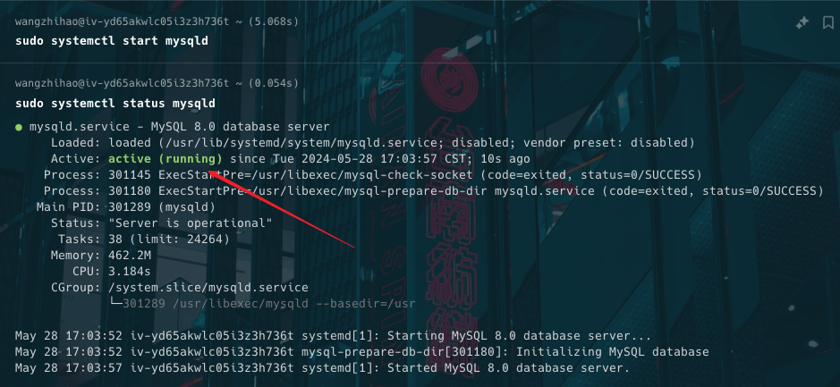
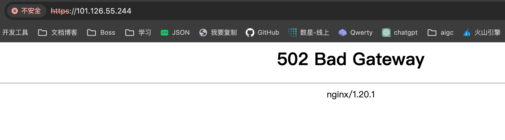
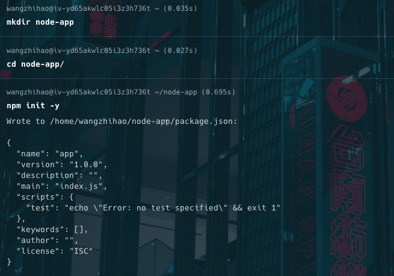

# 生产环境搭建

## 安装 Node.js

```sh
sudo dnf install nodejs -y
```

## 安装 MySQL

### 安装启动、开机自启动

```sh
sudo dnf install mysql-server -y
```

- 安装完之后在服务器启动一下 `mysql` 服务。

```sh
sudo systemctl start mysqld
```

::: info 为什么 `start` 后面接的是 `mysqld`
在命令 `sudo systemctl start mysqld` 中，`mysqld` 是 MySQL 数据库服务器的服务名称，通常这个服务名称是由软件包维护者或系统管理员定义的。具体来说，`mysqld` 中的 `d` 通常代表 "daemon"（守护进程）。

守护进程是一种在后台运行的进程，通常不与用户直接交互。它们通常提供各种系统服务，如数据库、网络、日志记录等。为了区分普通的命令行工具和后台服务，许多 Unix 和 Linux 系统的后台服务名称习惯性地以 `d` 结尾。

具体到 `mysqld`：

- `mysql`：指的是 MySQL 数据库。
- `d`：表示这是一个守护进程（daemon）。

因此，`mysqld` 是指 MySQL 数据库服务器的守护进程，它是负责处理数据库请求并管理 MySQL 数据库的后台服务。

使用 `systemctl` 来启动 `mysqld` 服务意味着告诉系统初始化并运行 MySQL 数据库的后台进程，以便数据库服务可以开始接受连接和处理查询。
:::

- 查看一下 `mysqld` 是否启动成功。

```sh
sudo systemctl status mysqld
```



- 设置 `mysqld` 服务开机启动

```sh
sudo systemctl enable mysqld
```

::: info 相关知识补充

运行 `sudo systemctl enable mysqld` 的作用是将 `MySQL` 数据库服务器设置为在系统启动时自动启动。让我们逐个解释这个命令的每个部分：

**`sudo`**：

- 这是一种在 `Unix` 和 `Linux` 系统上以超级用户（root）权限运行命令的方法。因为启用或配置系统服务需要管理员权限，所以使用 `sudo` 来提升权限。

**`systemctl`**：

- 这是一个用于与 `systemd` 系统和服务管理器交互的命令行工具。`systemd` 是许多 `Linux` 发行版默认的初始化系统，用于启动和管理系统服务和资源。

**`enable`**：

- 这是 `systemctl` 的一个子命令，用于启用某个服务，以便它在系统启动时自动运行。启用服务会创建适当的符号链接，使服务在系统引导过程中启动。

**`mysqld`**：

- 这是 `MySQL` 数据库服务器的服务名称，指代 `MySQL` 守护进程。

当你运行 `sudo systemctl enable mysqld` 时，`systemd` 会为 `MySQL` 服务创建启动时所需的符号链接。具体来说，这个命令会在系统的 `multi-user.target`（类似于传统的运行级别 3）和 `graphical.target`（类似于传统的运行级别 5）下创建符号链接，这样每次系统启动时，`mysqld` 服务都会自动启动。

- 总结

`sudo systemctl enable mysqld` 的主要目的是确保 `MySQL` 数据库服务器在每次系统启动时自动启动，从而确保数据库服务在系统启动后立即可用。

:::

### MySQL 安全配置

- 安装完 MySQL 服务之后，可以做⼀点安全相关的配置

```sh
sudo mysql_secure_installation
```

- 执⾏上⾯的命令会问我们⼀系列的问题，一路 `yes` 就可以
- 中间有个选择密码强度的设置，可以根据实际情况进行设置，一般选中等强度就行了
- 不过我还是低估了这个密码强度，一直提示密码不合格，后来用 `openssl` 命令生成一个密码，然后输入就行了。
- 这个密码可要记住了，这是 `mysql` `root` 用户的密码。

```sh
openssl rand -base64 32
```

### 创建新⽤户与数据仓库

- 在 MySQL 数据服务⾥，可以创建⼀个普通的⽤户，然后专门再给它分配⼀个可以管理的数据仓库。

::: warning 注意 📢

- 之前在执⾏安全配置的时候，我们禁⽌让 root ⽤户可以远程登录到 MySQL 数据服务
- 所以现在只能在本地登录，也就是我们先得⽤ SSH 登录到云服务器，然后再登录 MySQL 服务

```sh
ssh root@101.126.55.244

sudo mysql -u root -p
```

- 输入刚用 `openssl` 生成的密码，登录成功后就可以创建新的⽤户了。

:::

::: info 创建新用户

```sh
CREATE USER 'xb2_node_operator'@'%'
IDENTIFIED BY '5tq6SuVqm.....................';
```

- ⽤ CREATE USER 创建建⼀个叫 xb2_node_operator 的⽤户
- 在 @ 符号的后⾯可以设置⽤户的主机，这⾥⽤的是 %，表⽰任何主机都可以。
- IDENTIFIED BY 的后⾯是为这个⽤户设置的登录密码。

- 如果你只想让这个⽤户在本地主机上登录，创建⽤户的时候设置的主机可以是 localhost，暂时先让⽤户的主机是 %，因为后⾯我们需要⽤数据库客户端远程连接数据服务。

- MySQL 服务运⾏的那台机器叫本地主机（localhost），其它的地⽅都叫远程。如果你想远程登录到 MySQL 服务，创建这个⽤户的时候要设置主机的地址。

- ⽐如 MySQL 服务可能在⼀台单独的云服务器上，另外还有⼀台应⽤服务器运⾏应⽤，在应⽤服务器上要连接使⽤ MySQL 服务，在创建⽤户的时候给他设置的主机可以是这台应⽤服务器的 IP 地址。

- 如果运⾏ MySQL 的服务器与应⽤服务器在同⼀内⽹，可以把⽤户的主机设置成应⽤服务器的内⽹ IP，这样连接的速度会更快⼀些。

- 限制⽤户的主机是为了安全，因为如果⽤户不限制主机，任何⼈都可以试图使⽤这个⽤户远程连接我们的 MySQL 服务，虽然他们没有这个⽤户的密码，但是可以⽤⼀些⽅法猜到。

- 在部署应⽤的前期，我是⽤⼀个在我本地电脑上的数据库客户端连接到在我服务器上运⾏的 MySQL 服务，这样在创建⽤户的时候，⽤户的主机要设置成 %，表⽰不做限制，⽤户在哪⾥连接都可以。

- 应⽤部署完成以后，可以修改这个⽤户的主机，只让他可以在本地主机连接 MySQL，因为应⽤与 MySQL 在同⼀台云服务器上。

:::

::: info 创建数据仓库

- 创建一个名为 xb2_node 的数据仓库

```sh
CREATE DATABASE xb2_node;
```

- 分配⽤户权限管理指定数据仓库

```sh
GRANT ALL PRIVILEGES ON xb2_node.* TO 'xb2_node_operator'@'%';
```

- GRANT 可以分配权限
- ALL PRIVILEGES 表⽰全部的权限
- ON 的后⾯加上⼀个数据库
- xb2_node.\* 表⽰ xb2_node 这个数据仓库⾥的所有的数据表格
- TO 的后⾯设置⼀下要把权限给哪个⽤户

:::

## 安装 Docker

- 先通过 `dnf` 命令来配置 `Docker` 的官方存储库，以便能够安装 `Docker`

```sh
sudo dnf config-manager --add-repo=https://download.docker.com/linux/centos/docker-ce.repo
```

- 安装 `Docker`

```sh
sudo dnf install docker-ce -y
```


- 启动 Docker

```sh
sudo systemctl start docker
```

- 设置 Docker 开机自启动

```sh
sudo systemctl enable docker
```

- 好像暂时没用到 docker ，后面真没用到的话就卸载。

## 安装 Nginx

### 安装启动、开机自启动

```sh
sudo dnf install nginx -y
```

- 安装完之后在服务器启动一下 `nginx` 服务。

```sh
sudo systemctl start nginx
```

- 查看一下 `nginx` 是否启动成功。

```sh
sudo systemctl status nginx
```

- 设置 `nginx` 服务开机启动

```sh
sudo systemctl enable nginx
```

### 理解 NGINX 的配置⽂件

- 后面有时间再补详细内容

## 加密传输 HTTPS

::: info 加密传输

- 访问⽹站的时候，如果⽤ HTTP 协议，在地址栏上⾯会提⽰ “不安全”
- 为了让客户端与服务端之间可以安全的传输数据，现在推荐使⽤ HTTPS 协议
- 想要使⽤这种协议要在 Web 服务器上配置使⽤ SSL 证书
- 这种证书是⼀些权威机构颁发的，有些是付费的，⽽且不便宜
- 但是也有免费的 SSL 证书，⽐如 Let's Encrypt 就会给我们颁发免费的 SSL 证书

:::

### 用 Certbot 申请 Let’s Encrypt 签发的 SSL 证书

使用 Certbot 来申请 Let’s Encrypt 签发的 SSL 证书是一个比较直接的过程。下面是一个详细的步骤指南，适用于基于 CentOS 系统的服务器。

### 步骤 1: 安装 Certbot

- 安装 EPEL（Extra Packages for Enterprise Linux）存储库，因为 Certbot 在这个存储库中：

```sh
sudo dnf install epel-release
```

- 接下来，安装 Certbot 及其 Nginx 或 Apache 插件（根据你使用的 Web 服务器选择安装）：

- 对于 Nginx：

```sh
sudo dnf install certbot python3-certbot-nginx
```

- 对于 Apache：

```sh
sudo dnf install certbot python3-certbot-apache
```

### 步骤 2: 申请 SSL 证书

根据你的 Web 服务器，使用 Certbot 申请 SSL 证书。

- 对于 Nginx

1. **获取并安装证书**：

```sh
   sudo certbot --nginx
```

2. Certbot 会自动检测你的 Nginx 配置并询问你要为哪些域名申请证书。输入相应的域名，然后 Certbot 会处理剩下的步骤，包括编辑你的 Nginx 配置以使用新的 SSL 证书。

- 对于 Apache

1. **获取并安装证书**：

```sh
   sudo certbot --apache
```

2. Certbot 会自动检测你的 Apache 配置并询问你要为哪些域名申请证书。输入相应的域名，然后 Certbot 会处理剩下的步骤，包括编辑你的 Apache 配置以使用新的 SSL 证书。

### 步骤 3: 自动续订

Let’s Encrypt 的证书有效期为 90 天，因此你需要设置自动续订。幸运的是，Certbot 会默认添加续订任务到 `cron` 或 `systemd`。你可以手动验证续订过程是否正常工作：

```sh
sudo certbot renew --dry-run
```

这会模拟续订过程并确保一切正常。如果没有错误，你的证书将会在到期前自动续订。

### 步骤 4: 验证 SSL 证书

访问你的域名并检查 SSL 证书是否正确安装和配置。

::: warning 注意 📢

- 执行这个步骤之前，先在 nginx 配置文件 `/etc/nginx/nginx.conf` 中把 `server_name` 改成你的域名
- 这样 Certbot 才能自动检测你的 Nginx 配置并询问你要为哪些域名申请证书
- 输入相应的域名，然后 Certbot 会处理剩下的步骤，包括编辑你的 Nginx 配置以使用新的 SSL 证书。

:::

## 配置 Nginx 反向代理

- 客户端接口请求过来了，我想让运行在服务端的 node 应用程序去处理这些请求，这时候就需要配置一个反向代理

- 在 `/etc/nginx/conf.d` 里面新建一个 `wzh-node-api.wangzhihao.top.conf` 文件，这个目录下的 `.conf` 文件都会被 `Nginx` 读取，配置如下

```sh
server {
    listen 80;
    server_name wzh-node-api.wangzhihao.top;
    return 301 https://$host$request_uri;
}

server {
    listen 443 ssl http2;
    server_name wzh-node-api.wangzhihao.top;

    ssl_certificate /etc/letsencrypt/live/wzh-node-api.wangzhihao.top/fullchain.pem;
    ssl_certificate_key /etc/letsencrypt/live/wzh-node-api.wangzhihao.top/privkey.pem;
    include /etc/letsencrypt/options-ssl-nginx.conf;
    ssl_dhparam /etc/letsencrypt/ssl-dhparams.pem;

    location / {
        proxy_set_header  X-Forwarded-Host $host;
        proxy_set_header  X-Forwarded-Proto $scheme;
        proxy_set_header  X-Real-IP  $remote_addr;
        proxy_set_header  X-Forwarded-For $proxy_add_x_forwarded_for;
        proxy_set_header  Host $http_host;
        proxy_set_header  Upgrade $http_upgrade;
        proxy_set_header  Connection "upgrade";
        proxy_redirect    off;
        expires           off;
        sendfile          off;
        proxy_pass        http://127.0.0.1:3000;
    }
}
```

- 最重要的一行就是 `proxy_pass` `http://127.0.0.1:3000`;

- 这会让原本请求到 `wzh-node-api.wangzhihao.top` 的请求通过 `Nginx` 反向代理到 `http://127.0.0.1:3000`;

- 然后通过 `sudo systemctl restart nginx` 来重启 `Nginx`

- 这样就能让 `wzh-node-api.wangzhihao.top` 的请求通过 `Nginx` 反向代理到 `http://127.0.0.1:3000`



::: warning 注意 📢

- 现在访问我们的服务器地址会 502
- 这就说明反向代理成功了，因为目前我们的服务器上的 `http://127.0.0.1:3000` 暂时没有提供任何响应
- 截图显示的是 ip 不是域名，因为我的域名正在备案中，之后再处理。
  :::

## 使用 PM2 启动服务

::: info 注意 📢

- 在服务器如果直接⽤ `node` 命令运⾏应⽤，关掉终端的时候应⽤就会停⽌运⾏
- 所以我们需要找⼀种⽅法在后台运⾏ `Node.js` 应⽤。`PM2` 是⼀种专门管理 `Node.js` 应⽤的进程管理器，可以帮我们在后台运⾏ `Node.js` 应⽤，应⽤如果意外停⽌，它会帮我们重新启动应⽤。

:::

- 在服务器上安装 `PM2`

```sh
sudo npm install pm2 -g
```

- 在服务器根目录下新建一个 `node-app` 文件夹，进到里面执行 `npm init -y`



- 运行命令 `npm i express` 安装 `express`

- 运行命令 `sudo vi index.js` 新建一个 `index.js` 文件，内容如下：

```js
const express = require('express');
const app = express();
const port = 3000;
app.get('/', (req, res) => res.send('Hello World!'));
app.listen(port, () => console.log(`Example app listening on port ${port}!`));
```

- 此时 node-app 目录下文件如下：


::: info 使用 pm2 启动 服务 📢

```sh
pm2 start index.js --name node-app
```

- `--name` 能指定进程名字，这里是 `node-app`


- 启动成功之后，再次访问我们的服务器 ip 地址就能看到 `Hello World!` 了


:::

- 到这里我们整个服务器环境就搭建好了，接下来我们就可以尝试把自己本地开发的项目部署到生产环境了。

## 部署到生产环境

### 部署后端服务

- 我们需要把远程仓库的代码拉到服务器上，所以需要在服务器上安装 `git`

```sh
sudo dnf install git -y
```

- 然后把远程仓库的代码拉到服务器上

```sh
git clone git@github.com:jingjing20/snap-shots-node.git
```

::: info 注意 📢

- 直接这么执行 git clone 会报错没权限

- 我们需要把服务器上的 ssh 公钥添加到我们的远程仓库的 Deploy keys 再拉代码


:::

- 成功拉完代码之后，我们就可以在服务器上执行 `pnpm/npm install` 来安装依赖了

- 装完依赖之后如果有用到 env 文件的话，可以把 env 文件拷贝到服务器上或者新建一个 env 文件

- 然后执行 build 命令打包项目

- 成功之后就可以用 pm2 来启动项目了

```sh
pm2 start dist/main.js --name wzh-node
```


### 部署前端服务

## 后续问题记录

### nginx 问题

::: info 问题 📢

- 上传文件报错了


- 默认情况下，Nginx 限制客户端请求主体（例如文件上传）的最大大小为 1MB。
- 如果需要更改这个限制，可以通过调整 Nginx 配置文件中的 `client_max_body_size` 指令来实现。

:::

#### 配置 `client_max_body_size`

**打开 Nginx 配置文件**：

通常在 `/etc/nginx/nginx.conf` 或 `/etc/nginx/conf.d/default.conf`

```sh
sudo vi /etc/nginx/nginx.conf
```

**找到 `http {` 块**，在其中添加或修改 `client_max_body_size` 指令。例如，将文件上传限制增加到 512MB：

```nginx
http {
    ...
    client_max_body_size 512M;
    ...
}
```

- 再次上传应该就会成功了