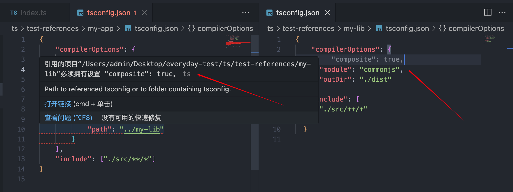
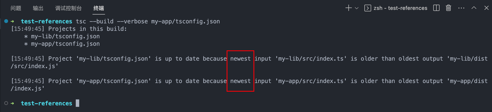
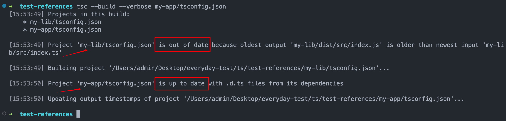

# tsconfig.json

## tsconfig.json 是什么？

- `tsconfig.json` 是 TypeScript 项目中的配置文件，用于配置 TypeScript 编译器的行为和设置。
- 在 TypeScript 项目中，`tsconfig.json` 文件是必须的，因为它告诉 TypeScript 编译器如何编译项目中的文件。
- 当一个目录中存在 tsconfig.json 文件，则认为该目录为 TypeScript 项目的根目录。
- 通常 tsconfig.json 文件配置主要包含两部分功能：
  - 1、指定待编译文件
  - 2、定义编译选项

## tsconfig 的顶层配置属性

### **compilerOptions**

- 这是最重要的属性之一，用于配置 TypeScript 编译器的选项。
- 你可以在这里设置编译的目标版本、模块系统、严格类型检查、输出目录等等。例如：

```json
"compilerOptions": {
    "target": "ES2020",
    "module": "CommonJS",
    "strict": true,
    "outDir": "./dist"
}
```

- 完整配置项可以上官网查看 [tsconfig](https://www.typescriptlang.org/tsconfig)

### **extends**

- 允许你继承另一个 TypeScript 配置文件的设置。这对于在多个项目之间共享通用配置非常有用。

```json
"extends": "./base-tsconfig.json"
```

### **include** 和 **exclude**

- 用于指定要编译的文件或目录的匹配模式。`include` 表示要包含的文件，`exclude` 表示要排除的文件。

```json
"include": ["src/**/*.ts"],
"exclude": ["node_modules"]
```

### **files**：

直接指定要编译的文件列表，而不是使用匹配模式。这在项目较小且文件较少时比较适用。

```json
"files": ["src/app.ts", "src/utils.ts"]
```

### **references**

用于配置项目之间的引用关系，例如基于项目的构建顺序。这在大型多模块项目中很有用。

#### 实例理解一下

- 假设文件结构如下：

```bash

./
├─my-lib
|   ├─tsconfig.json
|   ├─src
|   |  └index.ts
├─my-app
|   ├─tsconfig.json
|   ├─src
|   |  └index.ts

```

- my-lib 的 tsconfig.json 文件：

```json
{
  "compilerOptions": {
    "composite": true,
    "declaration": true,
    "outDir": "./dist"
  },
  "include": ["src/**/*.ts"]
}
```

- my-app 的 tsconfig.json 文件：

```json
{
  "compilerOptions": {
    "declaration": true,
    "outDir": "./dist"
  },
  "include": ["src/**/*.ts"],
  "references": [{ "path": "../my-lib" }]
}
```

::: warning 注意
my-lib 中的 composite 选项必须设置为 true，my-app 的 references 选项才生效。
:::



#### **composite** 配置项起到的作用

- `composite` 配置项是 TypeScript 编译器中的一个选项，用于开启一种增量编译和项目引用的优化机制。当你在 TypeScript 项目的 `tsconfig.json` 文件中将 `composite` 设置为 `true` 时，就启用了这种机制。

- `composite` 的作用主要有两个方面：

::: info `composite` 的作用

- 1、 **增量编译**：
  在启用 `composite` 的情况下，TypeScript 编译器会对项目中的源文件进行增量编译，而不是每次都重新编译所有文件。这意味着当你修改了一个文件时，编译器只会重新编译与该文件相关联的文件，而不是整个项目。这可以大大提高编译的速度，特别是在大型项目中。

- 2、 **项目引用**：
  `composite` 还允许你在项目间建立引用关系，通过使用 `references` 配置项。这意味着你可以告诉编译器一个项目依赖于另一个项目，并确保它们按正确的顺序进行编译。这对于管理复杂的多模块项目非常有用，可以避免编译顺序错误和类型问题。

:::

- `composite` 配置项设置为 `true` 之后，编译完后会生成一个 `tsconfig.tsbuildinfo` 文件，这个文件是 TypeScript 编译器在进行增量编译时的一个辅助文件，用于跟踪文件之间的依赖关系和编译状态，以便更高效地进行增量编译。

::: info `tsconfig.tsbuildinfo` 的作用

- 跟踪依赖关系：当你启用 composite 编译选项并在项目中使用项目引用时，编译器需要知道哪些文件依赖于其他文件，以便在发生更改时只重新编译相关的文件。`tsconfig.tsbuildinfo` 文件记录了文件之间的依赖关系，以便编译器可以在下一次编译时快速确定需要重新编译的文件。

- 增量编译状态：`tsconfig.tsbuildinfo` 文件还包含了先前编译的状态信息，例如每个文件的时间戳、版本号等。这些信息用于比较现有文件与上一次编译的版本，以确定哪些文件需要重新编译，哪些文件可以保持不变。

- 提高编译性能：借助 `tsconfig.tsbuildinfo` 文件，TypeScript 编译器可以在增量编译过程中更精确地确定需要重新编译的文件，从而避免不必要的重复编译，提高了编译的效率。

:::

#### **composite** VS **incremental**

- incremental 编译选项也是 TypeScript 中用于优化增量编译的一个配置项。它与 composite 编译选项有些类似，但是它们有一些区别。

::: info 不同之处

- **`incremental` 编译选项**：
  当你将 `incremental` 编译选项设置为 `true` 时，TypeScript 编译器会在增量编译过程中生成 `.tsbuildinfo` 文件，这个文件用于记录编译过程中的信息，包括文件之间的依赖关系、类型信息、编译状态等。这样，在下一次编译时，编译器可以使用这些信息来做增量的、更高效的编译。

- **`composite` 编译选项**：
  当你使用 `composite` 编译选项时，不仅会启用 `incremental` 编译，还会额外启用项目引用的机制，通过 `references` 配置项来管理项目之间的依赖关系。这意味着你可以告诉编译器哪些项目依赖于其他项目，并确保正确的编译顺序。`composite` 编译选项适用于大型多模块项目，可以更好地管理项目之间的关系。

:::

虽然 `incremental` 和 `composite` 都可以用于优化增量编译，但是 `composite` 更加强大，适用于管理项目之间的引用关系。如果你只是希望优化增量编译，可以将 `incremental` 设置为 `true`，而如果需要处理项目之间的依赖关系，可以结合使用 `composite` 和 `references` 配置。

#### 实例测试一下增量编译

- 还是以上面的 my-lib 和 my-app 为例，假设初始 my-lib 中的 index.ts 文件内容如下：

```ts
// my-lib/src/index.ts
export const calc = {
  add: (x: number, y: number): number => x + y
};
```

- 先编译一次

```bash
tsc --build --verbose my-app/tsconfig.json
```



- 如图所示因为之前已经编译过，同时文件没有变化，所以不会重新编译。这些功能都是通过 `tsconfig.tsbuildinfo` 文件来实现的。

- 修改 my-lib 中的 index.ts 文件：

```ts
// my-lib/src/index.ts
export const calc = {
  add: (x: number, y: number): number => x + y + 999
};
```

- 再编译一次

```bash
tsc --build --verbose my-app/tsconfig.json
```



- 如图所示，因为 my-lib 中的 index.ts 文件发生了变化，所以会重新编译 my-lib，但是 my-app 显示的是 `is up to date` 意思是 `已是最新`

- 这就是增量编译

### **excludeFiles**

指定一个数组，包含了应该从编译过程中排除的文件。

```json
"excludeFiles": [
    "src/temporary.ts"
]
```

### **compileOnSave**

是否在保存文件时自动触发编译。设置为 `true` 时，在保存文件时会自动重新编译。

```json
"compileOnSave": true
```

### **typeAcquisition** 【基本用不到】

- 用于自动获取 TypeScript 类型声明文件（`.d.ts` 文件）的设置。
- 配置 typeAcquisition 对象用于控制 TypeScript 的自动类型获取。
- 它并不会为您自动安装 @types 包。相反，它会在 Visual Studio 和 Visual Studio Code 等支持的编辑器和 IDE 中自动下载并导入类型定义。
- 然而，当您实际运行 TypeScript 编译器时（例如，通过运行 tsc 命令），编译器可能无法找到这些类型定义。要解决此问题，您需要手动安装相应的 @types 包。
- 比如说下面的配置：

```json
"typeAcquisition": {
    "enable": true,
    "include": ["lodash"]
}
```

- 这样可以让你不安装 `@types/lodash` 这个包就能在项目中正常使用 Typescript 的提示，但是当你运行项目的时候还是会报错，因为编译器找不到这个包，所以你还是需要安装 `@types/lodash` 这个包。
- 。。。。。。。。。

## 配置项暂存【网上找的】

```ts
{
  "include": [
    "./index.ts"
  ], //只编译的文件
  "exclude": [
    "./test.ts"
  ], //除了[]中的文件，编译其他所有文件
  // 编译过程中一些编译的属性或者编译的配置
  "compilerOptions": {
    /* Visit https://www.typescriptlang.org/tsconfig to read more about this file */
    /* Projects */
    "incremental": true,                       			/* 启用增量编译 */
    "composite": true,                                	/* 启用允许将类型脚脚本项目与项目引用一起使用的约束 */
    "tsBuildInfoFile": "./",                          	/* 指定.tsbuildinfo增量编译文件的文件夹。 */
    "disableSolutionSearching": true,                 	/* 在编辑时，选择一个项目退出多项目引用检查。 */
    "disableReferencedProjectLoad": true,             	/* 减少通过类型脚本自动加载的项目数量。 */

    /* Language and Environment */
    "target": "es2016",									/* 为发出的JavaScript设置JavaScript语言版本，并包含兼容的库声明 */
    "lib": [],                                        	/* 指定一组描述目标运行时环境的捆绑库声明文件 */
    "jsx": "preserve",                                	/* 指定生成的JSX代码 */
    "experimentalDecorators": true,                   	/* 为TC39第二阶段的草稿装饰器提供实验支持。 */
    "emitDecoratorMetadata": true,                    	/* 为源文件中的修饰声明的设计类型元数据 */
    "jsxFactory": "",                     			 	/* 指定针对ReactJSX发射时使用的JSX工厂函数，例如“React.createElement”或“h” */
    "jsxFragmentFactory": "",             /* 指定用于片段的JSX片段引用例如：React.Fragment' or 'Fragment. */
    "jsxImportSource": "",                /* 指定用于在使用`jsx时导入JSX工厂函数的模块说明符：反应-jsx*`.`  */
    "reactNamespace": "",                             /* 指定为`创建元素`调用的对象。这只适用于针对`，`JSX emit。*/
    "noLib": true,                                    /* 禁用包括任何库文件，包括默认的lib.d.ts。 */
    "useDefineForClassFields": true,                  /* emit ECMAScript-符合标准的类字段。 */

    /* Modules */
    "module": "commonjs", /* 指定所生成的模块代码。 */
    // "rootDir": "./",                                  /* 在源文件中指定根文件夹。 */
    // "moduleResolution": "node",                       /* 指定TypeScript如何从给定的模块指定符中查找文件。 */
    // "baseUrl": "./",                                  /* 指定要解析非相对模块名称的基本目录。 */
    // "paths": {},                                      /* 指定一组将导入重新映射到其他查找位置的条目。 */
    // "rootDirs": [],                                   /* 在解析模块时，允许将多个文件夹视为一个文件夹。*/
    // "typeRoots": [],                                  /* 指定多个类似于`./node_modules/@的`类型的文件夹。 */
    // "types": [],                                      /* 指定要在源文件中引用的类型包名。 */
    // "allowUmdGlobalAccess": true,                     /* 允许从模块访问UMD全局文件。 */
    // "resolveJsonModule": true,                        /* 启用导入.json文件 */
    // "noResolve": true,                                /* 不允许`import`，`require`或`reference`来扩展类型应该添加到项目的文件数量。*/

    /* JavaScript Support */
    // "allowJs": true,                                  /* 允许JavaScript文件成为您的程序的一部分。使用`检查JS`选项从这些文件中获取错误。 */
    // "checkJs": true,                                  /* 在已检查类型的JavaScript文件中启用错误报告。 */
    // "maxNodeModuleJsDepth": 1,                        /* 指定用于从`node_modules`中检查JavaScript文件的最大文件夹深度。仅适用于`允许的Js`。 */

    /* Emit */
    // "declaration": true,                              /* 从项目中的typeScript和JavaScript文件生成.d.ts文件。 */
    // "declarationMap": true,                           /* 为d.ts文件创建源集映射。 */
    // "emitDeclarationOnly": true,                      /* 只输出d.ts文件，而不输出JavaScript文件。 */
    // "sourceMap": true,                                /* 为发出的JavaScript文件创建源映射文件。 */
    // "outFile": "./",                                  /* 指定一个将所有输出捆绑到一个JavaScript文件中的文件。如果`声明`为true，则还指定一个捆绑所有.d.ts输出的文件。 */
    // "outDir": "./",                                   /* 为所有发出的文件指定一个输出文件夹。 */

    // "removeComments": true,                           /* 去除注释 */
    // "noEmit": true,                                   /* 从编译中禁用emit文件。 */
    // "importHelpers": true,                            /* 允许从每个项目的tslib中导入一次助手函数，而不是为每个文件包含它们。 */
    // "importsNotUsedAsValues": "remove",               /* 为仅用于类型的导入指定发射/检查行为 */
    // "downlevelIteration": true,                       /* Emit 更兼容，但冗长和性能较差的JavaScript的迭代。 */
    // "sourceRoot": "",                                 /* 为调试器指定根路径以查找引用源代码的位置。 */
    // "mapRoot": "",                                    /* 指定调试器应该定位映射文件的位置，而不是生成的位置。 */
    // "inlineSourceMap": true,                          /* 在发出的JavaScript中包含源源映射文件。*/
    // "inlineSources": true,                            /* 在发出的JavaScript中的源映射中包含源代码。 */
    // "emitBOM": true,                                  /* 在输出文件的开头发出UTF-8字节顺序标记(BOM)。 */
    // "newLine": "crlf",                                /* 设置发射文件的换行符。 */
    // "stripInternal": true,                            /* 禁用在其JSDoc注释中具有`@internal`的发射声明。 */
    // "noEmitHelpers": true,                            /* 禁用在编译输出中生成自定义助手函数。 */
    // "noEmitOnError": true,                            /* 如果报告了任何类型检查错误，则禁用发射文件。 */
    // "preserveConstEnums": true,                       /* 禁用擦除生成的代码中的`常数枚举`声明。 */
    // "declarationDir": "./",                           /* 为生成的声明文件的输出目录。 */
    // "preserveValueImports": true,                     /* 在JavaScript输出中保留未使用的导入值，否则将被删除。 */
    /* Interop Constraints */
    // "isolatedModules": true,                          /* 确保每个文件都可以安全地传输，而不依赖于其他导入。 */
    // "allowSyntheticDefaultImports": true,             /* 当模块没有默认导出时，允许“从y导入x”。 */
    "esModuleInterop": true, 							 /* 发出额外的JavaScript，以简化对导入CommonJS模块的支持。这使得`允许合成默认导入`以实现类型兼容性。    */
    // "preserveSymlinks": true,                         /* 禁用对符号链接到其实际路径的解析。这与节点中的同一标志相关联。 */

    /* Type Checking */
    "strict": true,                                   	 /* Enable all strict type-checking options. */ //strict为true,代表下面的都是true
    //不要求必须显示的设置any
    // "noImplicitAny": true,                            /*为隐含`任何`类型的表达式和声明启用错误报告  */
    //不强制进行null监测
    // "strictNullChecks": true,                         /* 在类型检查时，考虑`null`和`未定义`。 */
    // "strictFunctionTypes": true,                      /* 在分配函数时，请检查以确保参数和返回值与子类型兼容 */
    // "strictBindCallApply": true,                      /* 检查`绑定`、`调用`和`应用`方法的参数是否与原始函数匹配。 */
    // "strictPropertyInitialization": true,             /* 检查在构造函数中已声明但未设置的类属性。 */
    // "noImplicitThis": true,                           /* 当`this`具有类型`any`时，启用错误报告。*/
    // "useUnknownInCatchVariables": true,               /* 将catch子句变量类型化为“unknown”，而不是“any”。 */
    // "alwaysStrict": true,                             /* 确保始终发出“严格使用”信号。 */
    // "noUnusedLocals": true,                           /* 在未读取局部变量时启用错误报告。*/
    // "noUnusedParameters": true,                       /* 在未读取函数参数时引发错误 */
    // "exactOptionalPropertyTypes": true,               /* 将可选的属性类型解释为已写入的，而不是添加“未定义的”。*/
    // "noImplicitReturns": true,                        /* 为不在函数中显式返回的代码路径启用错误报告。 */
    // "noFallthroughCasesInSwitch": true,               /* 为开关语句中的故障情况启用错误报告。*/
    // "noUncheckedIndexedAccess": true,                 /* 在索引签名结果中包含“未定义的”*/
    // "noImplicitOverride": true,                       /* 确保在派生类中标记覆盖成员。 */
    // "noPropertyAccessFromIndexSignature": true,       /* 对使用索引类型声明的密钥强制使用索引访问器 */
    // "allowUnusedLabels": true,                        /* 禁用对未使用的标签的错误报告。 */
    // "allowUnreachableCode": true,                     /* 禁用对不可达代码的错误报告。 */
    /* Completeness */
    // "skipDefaultLibCheck": true,                      /* 跳过类型检查。d.ts类型脚本中包含的ts文件。 */
    // "skipLibCheck": true 							 /* 跳过类型检查所有。d.ts文件。 */
  }
}

```
