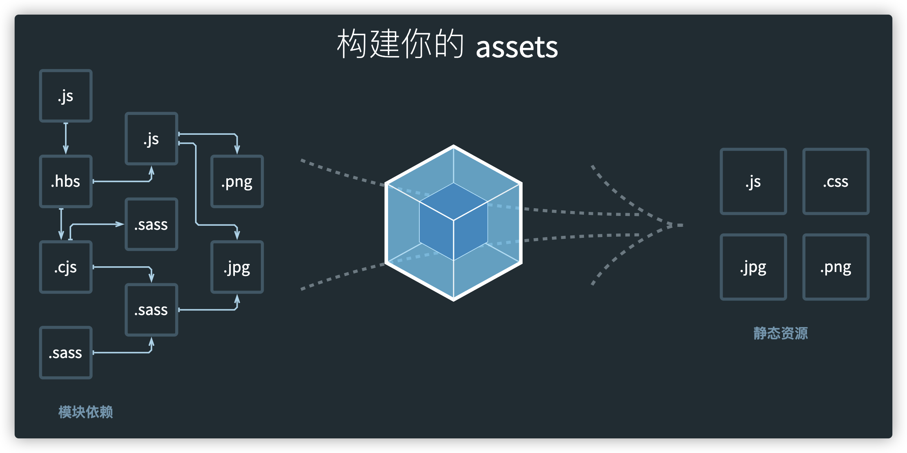

# webpack 基础

## `webpack` 的依赖关系图

> webpack 到底是如何对我们的项目进行打包的呢？

- 事实上 `webpack` 处理应用程序时，根据命令或已配置的文件找到入口。
- 然后从入口开始，遍历所有模块生成一个依赖关系图，这个依赖关系图会包含应用程序中所需的所有模块（js、css、图片、字体等资源）。
- 遍历图结构，打包所有模块（根据文件类型的不同使用不同的 `loader` 处理。

> 上述的例子：

- 1、安装了某个第三方库 `axios`，但是并没有使用，所以打包不会带进去，打包后总体积不会增大。
- 2、项目中创建的文件，没有被引用，最后打包不会在依赖图上，所以体积也不会增大。
- 3、假如有个 js 文件里面有函数，js 确实被引用了，但是函数未被执行，函数也不会被打包。
  其中涉及到`tree shaking`的概念。



## `loader 配置`

:::tip
`webpack` 默认只能处理 `JavaScript` 和 `JSON` 文件，这是 `webpack` 开箱可用的自带能力。<font style="color: red">loader</font> 让 `webpack` 能够去处理其他类型的文件，并将它们转换为有效模块，以供应用程序使用，以及被添加到依赖图中。
:::

> loader 相关配置属性：

- 1、`test` 属性，识别出哪些文件会被转换。
- 2、`use` 属性，定义出在进行转换时，应该使用哪个 `loader`。
- 3、`enforce` 属性
  - 对同一类后缀名类型的文件，我们其实是可以使用多个 `loader` 去处理的。
  - 而这个 `enforce` 属性就是指定 `loader` 种类的。
  - 可能的值有：`pre` | `post`。
  - `pre` 表示这个 `loader` 在所有的 `loader` 之前执行，`post` 表示这个 `loader` 在所有的 `loader` 执行后再执行。

> 简单实例如下: 所有的 `js` `vue` 文件都会在 `eslint-loader` 处理之后再交由其他 `loader` 继续处理。

```js
rules: [
  {
    test: /\.(js|vue)$/,
    use: 'eslint-loader',
    enforce: 'pre'
  },
  {
    test: /\.vue$/,
    use: [
      {
        loader: 'cache-loader'
      },
      {
        loader: 'thread-loader'
      },
      {
        loader: 'vue-loader',
        options: {
          compilerOptions: { preserveWhitespace: false, whitespace: 'condense' },
          cssModules: {
            localIdentName: '[path][name]---[local]---[hash:base64:5]',
            camelCase: true
          },
          loaders: {
            less: 'vue-style-loader!css-loader!less-loader'
          }
        }
      }
    ]
  }
];
```

## `css-loader`

- `css-loader` 中有 `importLoaders` 这个配置项，它代表在 `css-loader` 处理之前还有多少个其他 `loader` 处理它。
  > 比如说 `@import` 引入的样式文件，因为 `@import` 这个语法本身就可以直接被 `css-loader` 处理了，所以在 `index.css` 中通过 `@import` 引入 `xxx.css` 后，`xxx.css` 中的代码就不会再回过头被 `postcss-loader` 处理了。这样就会造成引入的样式文件没有得到 `postcss-loader` 的处理。详见[这里](https://juejin.cn/post/7000519839378833416)

```js
module.exports = {
  entry: './src/main.js',
  output: {
    filename: 'bundle.js',
    // 必须是一个绝对路径
    path: path.resolve(__dirname, './build')
  },
  module: {
    rules: [
      {
        // 规则使用正则表达式
        test: /\.css$/, // 匹配资源
        use: [
          // { loader: "css-loader" },
          // 注意: 编写顺序(从下往上, 从右往做, 从后往前)
          'style-loader',
          {
            loader: 'css-loader',
            options: {
              importLoaders: 1
            }
          },
          'postcss-loader'
        ]
      },
      {
        test: /\.less$/,
        use: [
          'style-loader',
          {
            loader: 'css-loader',
            options: {
              importLoaders: 2
            }
          },
          'postcss-loader',
          'less-loader'
        ]
      }
    ]
  }
};
```

上述代码块中的 `importLoaders` 对应的是一个数值，默认为 `0`，表示通过 `@import` 引入的资源在被 `css-loader` 处理之前不需要被 `css-loader` 之前的任何 `loader` 进行处理；如果数值为 1，则表示通过 `@import` 引入的资源在被 `css-loader` 处理之前会被 `css-loader` 之前的一个 loader 先进行处理（这里即 `postcss-loader`）；如果数值为 2，则表示通过 `@import` 引入的资源在被 `css-loader` 处理之前会被 `css-loader` 之前的两个 `loader` 先进行处理（这里即 `less-loader` 和 `postcss-loader`），以此类推。

## `style-loader` vs `vue-style-loader`

- `style-loader` 的作用就是将打包处理好的样式文件插入到 `head` 标签内的。（当然还有别的功能）
- `vue-style-loader` 也有将打包处理好的样式文件插入到 `head` 标签内的功能，同时具备 `ssr` 服务端渲染的功能，而这是 `style-loader` 不具备的。

## `browserslist`

> `Browserslist` 是什么？ `Browserslist` 是一个在不同的前端工具之间，共享目标浏览器和 `Node.js` 版本的配置。

- Autoprefixer
- Babel
- postcss-preset-env
- eslint-plugin-compat
- stylelint-no-unsupported-browser-features
- postcss-normalize
- obsolete-webpack-plugin
