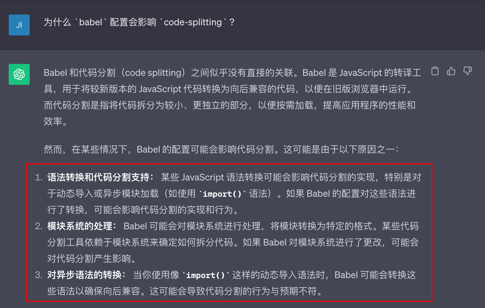

# code-splitting

> 记一次调整项目 babel 配置后 webpack 的 code-splitting 失效问题

## 问题产生背景

- 某天我们同事需要实现一个业务需求，引入了某个工具包 `xxx`
- 然后在使用这个工具包的时候发现有点问题
- 查阅文档说需要把项目中的 `babel` 的 `modules` 属性配置调整一下, 使用 `commonjs` 模式
- 同事调整完之后发现这个库确实好使了，业务需求实现了，产品很满意

## 爆雷

::: info

- 又是某个工作日的下午，我们老大发现我们的项目加载有点慢，打开控制台看了下发现我们的项目首页加载的 `js` 文件很大，压缩完的都有 `十多兆` ，源文件直接好 `几十兆`...然后就找我们沟通情况、排查问题、尽快解决问题。

- 然后我们小组几个铁子就立马开始排查问题产生的原因了...

:::

## 问题排查

### 本地复现

- 我先在本地执行 `build` 命令把项目构建成功之后
- 发现 `dist` 里面的 `js` 文件夹里面只有下图这些 `js` 文件
- `app.10721af9.js` 大小为 <span style="color:red">22MB...</span>
- `vendors.10721af9` 大小为 <span style="color:red">34MB...</span>


- 从上面的现象来看，很明显是 `webpack` 的 `code-splitting` 没生效导致的问题

- 项目中是在路由层面通过 [`import()`](https://webpack.js.org/api/module-methods/#dynamic-expressions-in-import) 和 [`webpackChunkName`](https://webpack.js.org/api/module-methods/#webpackchunkname) 来实现的 `code-splitting`

- [vue-router](https://router.vuejs.org/zh/guide/advanced/lazy-loading.html#%E6%8A%8A%E7%BB%84%E4%BB%B6%E6%8C%89%E7%BB%84%E5%88%86%E5%9D%97)

```js
component: () => import(/* webpackChunkName: "wangzhihao" */ '@/package/wangzhihao/index.vue');
```

### 排查 webpack

::: info 排查

在把有问题的项目中的 `webpack` 中 `code-splitting` 的相关使用方法和其他表现正常的项目对比下来，发现相关的 `webpack` 配置一模一样，所以关注点转移到 `@babel/preset-env` 的配置项 `modules` 上来。之前调整过 `babel` 配置文件的同事就想起来了。

:::

- 他调整的 `babel` 配置如图所示


### 排查 babel

- 我尝试把 `babel` 的 `modules` 属性还原为 `false`，然后 `build` 一下项目
- 构建出来的 `js` 文件完全按预期通过 `webpackChunkName` 实现了 `code-splitting` 问题就这样解决了...

## 问题复盘

### 为什么 `babel` 配置会影响 `code-splitting` ?

- 我一问巨佬 `chatgpt` 它的回答就给我明确的线索！太吊了



### 本质原因

::: tip

- 同事把 `babel` 中 `@babel/preset-env` 的配置 `modules` 值从 `false` 改为 `commonjs`
- `modules` 为 `commonjs` 时， `@babel/preset-env` 会将 `es module` 转换成 `commonjs`
- 结果就是把项目中写的 `import()` 转换成了 `require()`
- 然而 `webpack` 处理 `require()` 就是正常的模块打包加载，不会编译成动态加载的模块，进而导致 `code-splitting` 失效

:::

## babel modules 不同编译效果

### modules 为 false


### modules 为 commonjs


## 参考资料

[babel issue](https://github.com/babel/babel/issues/10273#issuecomment-517838332)

[babel-preset-env modules](https://www.babeljs.cn/docs/babel-preset-env#modules)
